<a id="sheet"></a>
<!-- [跳转到第一节](#sheet) -->

# 引脚定义图

在PA0的默认复用功能这里的TIM2_CH1_ETR 这个表示 TIM2 的CH1和 ETR 都复用了这个引脚

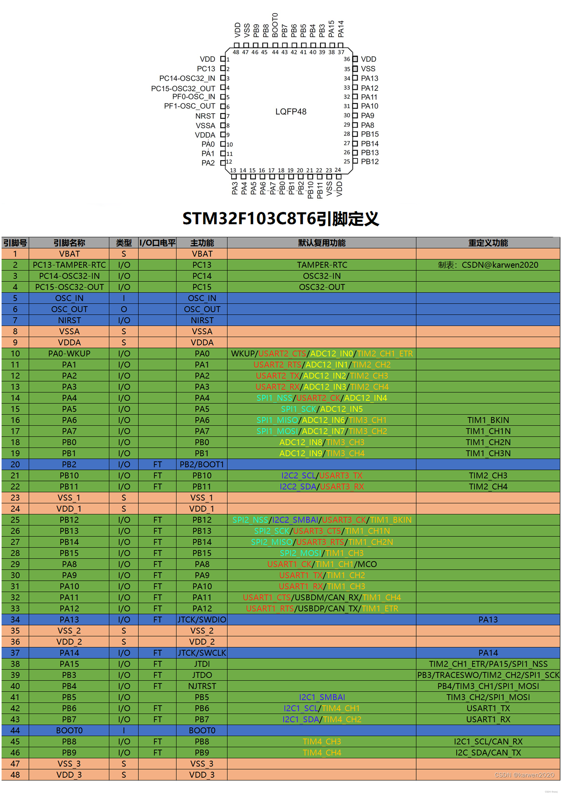


# 1. GPIO

GPIO是通用输入输出端口（General-purpose input/output）的英文简写，是所有的微控制器必不可
少的外设之一，可以由STM32直接驱动从而实现与外部设备通信、控制以及采集和捕获的功能。
STM32单片机的GPIO被分为很多组，每组有16个引脚，不同型号的MCU的GPIO个数是不同的，
比如STM32F103C8T6只有PA、PB以及个别PC引脚而STM32F103ZET6拥有PA~PG的全部112个引
脚。所有的GPIO都有基本的输入输出功能，同时GPIO还可以作为其它的外设功能引脚。

在STM32中，所有GPIO都是挂载在APB2外设总线上的。GPIO命名结构是GPIOA、GPIOB、
GPIOC ... 每个GPIO都有16个引脚 0-15

作为STM32最基本的外设，GPIO最基本的输出功能是由STM32控制 引脚输出高低电平，比如可以把GPIO接LED灯来控制其亮灭，也可以接继电器或者三极管，通过继电器或三极管来控制外部大功率电路的通断。

GPIO最基本的输入功能是检测外部电平变化，比如把GPIO引脚连接到按键电路，通过电平的高低变化来识别按键是否被按下。

## 1.1 GPIO 结构框图

**对于GPIO来说，它只能读取引脚的高低电平，要么是高电平，要么是低电平**

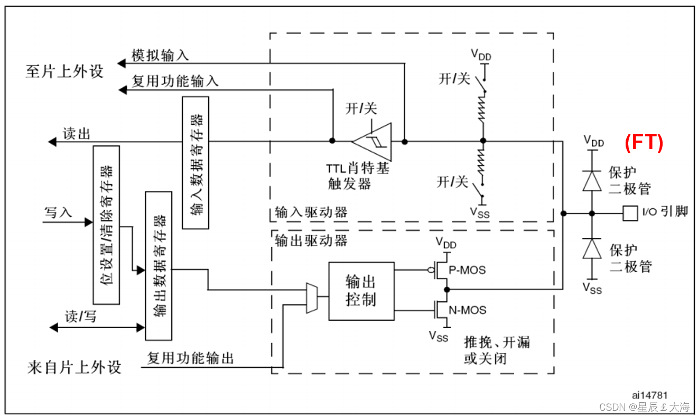

FT标识代表可以容忍5V电压，不同的引脚对电压的容忍值不同，需要在芯片数据手册上查找，如下：

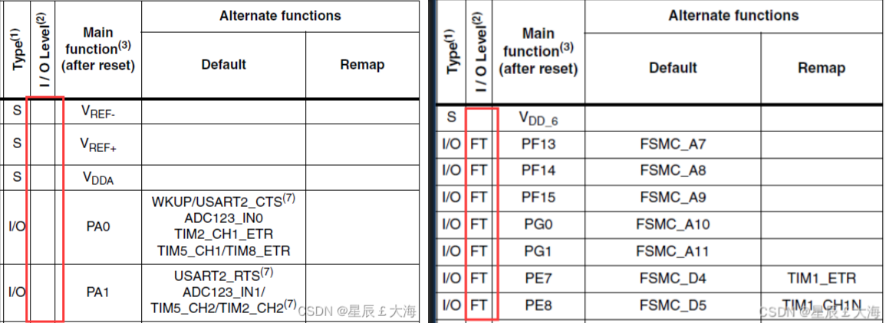

## 1.2 GPIO 输入输出模式

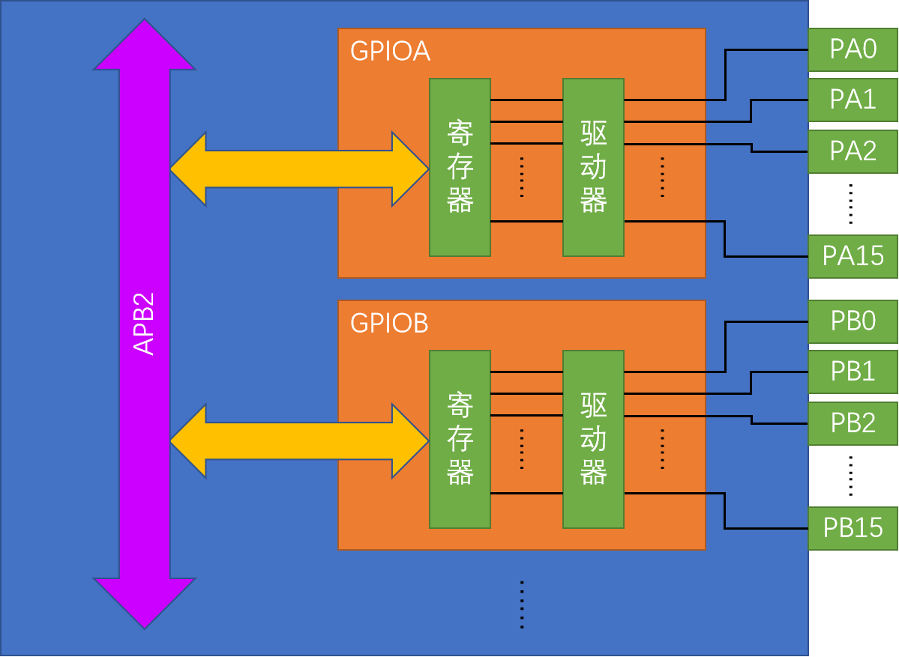
STM32的GPIO共有8种工作模式，分别是输入模式的模拟输入、上拉输入、下拉输入和浮空输入以及输出模式的推挽输出、开漏输出、推挽复用输出和开漏复用输出

| 模式名称     | 性质     | 特征                                               |
| ------------ | -------- | -------------------------------------------------- |
| 浮空输入     | 数字输入 | 可读取引脚电平，若引脚悬空，则电平不稳定           |
| 上拉输入     | 数字输入 | 可读取引脚电平，内部连接上拉电阻，悬空时默认高电平 |
| 下拉输入     | 数字输入 | 可读取引脚电平，内部连接下拉电阻，悬空时默认低电平 |
| 模拟输入     | 数字输入 | GPIO无效，引脚直接接入内部ADC                      |
| 开漏输出     | 数字输入 | 可输出引脚电平，高电平为高阻态，低电平接VSS        |
| 推挽输出     | 数字输出 | 可输出引脚电平，高电平接VDD，低电平接VSS           |
| 复用开漏输出 | 数字输出 | 由片上外设控制，高电平为高阻态，低电平接VSS        |
| 复用推挽输出 | 数字输出 | 由片上外设控制，高电平接VDD，低电平接VSS           |

:facepunch:

推挽输出可以输出强高低电平（高电平为3.3V），一般用来连接数字器件。在STM32的应用中，除了必须用开漏模式的场合，我们都习惯使用推挽输出模式。

开漏输出只可输出强低电平，高电平需要靠外部电阻拉高。输出端相当于三极管的集电极；要得到高电平状态需要上拉电阻才行。适合于做电流型的驱动，其吸收电流的能力相对强（一般20ma以内）。开漏输出一般应用在I2C、SMBUS通讯等需要“线与”功能的总线电路中。除此之外，还用在电平不匹配的场合，如需要输出5伏的高电平，就可以在外部接一个上拉电阻，上拉电源为5伏，并且把GPIO设置为开漏模式，当输出高阻态时，由上拉电阻和电源向外输出5伏电平。


### 1.2.1 浮空输入模式

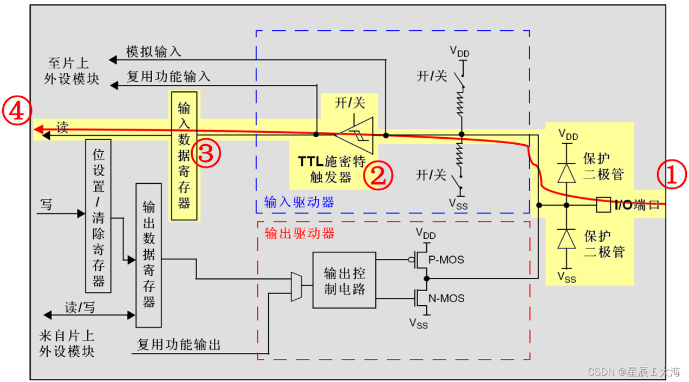

GPIO作为输入功能的浮空输入时，电信号使由外部流向内部的，从结构图的右侧往左侧看，信号流经顺序是①端口——②施密特触发器——③输入数据寄存器——④读取

电平不确定

### 1.2.2 上拉输入模式
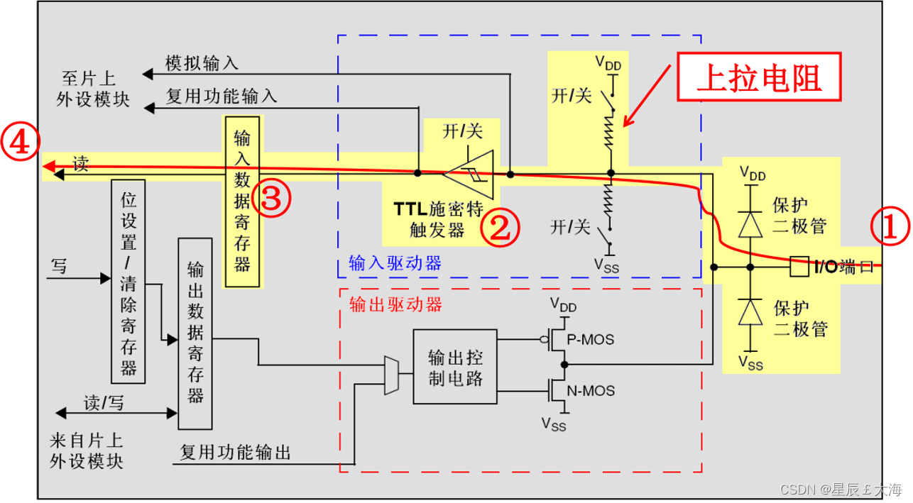

上拉输入和浮空输入的区别就是在第①和第②之间多了一个上拉电阻，这样GPIO在没有连接外部部件时的默认电平是高电平，其它流程和原来一样。

### 1.2.3 下拉输入模式
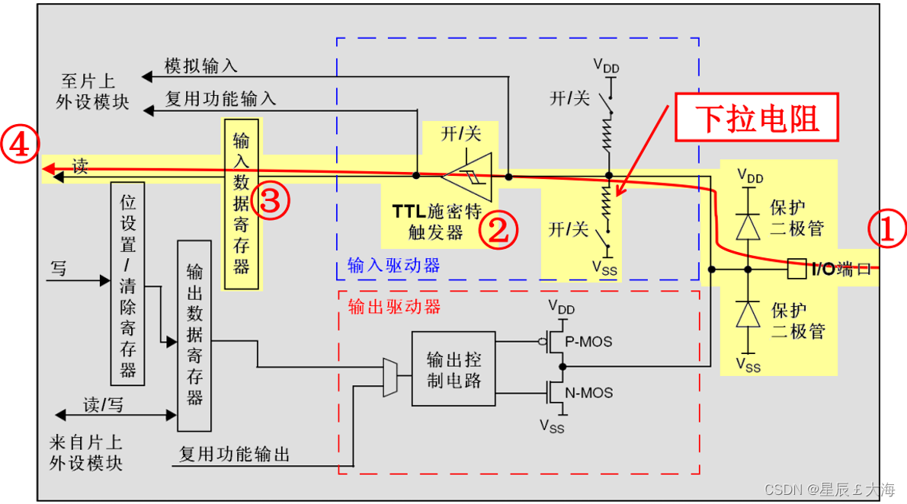

下拉输入和浮空输入的区别就是在第①和第②之间多了一个下拉电阻，这样GPIO在没有连接外部部件时的默认电平是低电平，其它流程和原来一样。

### 1.2.4 模拟输入模式
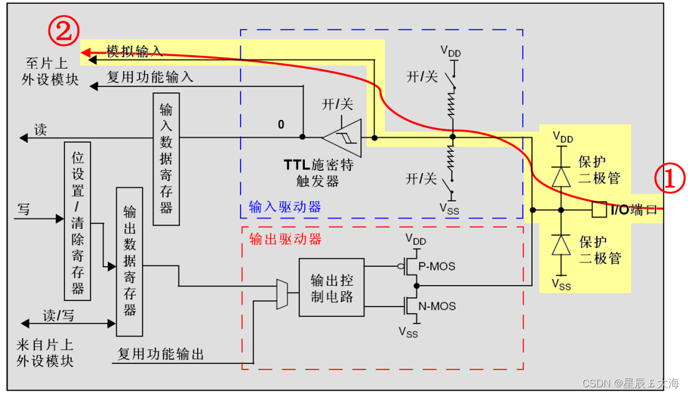

模拟输入模式和其它三种输入模式不同，它的外部电平信号没有流入输入数据寄存器，而是直接流入模拟输入部分。模拟输入一般是用来 **ADC读取和转换** 的。

### 1.2.5 开漏输出模式
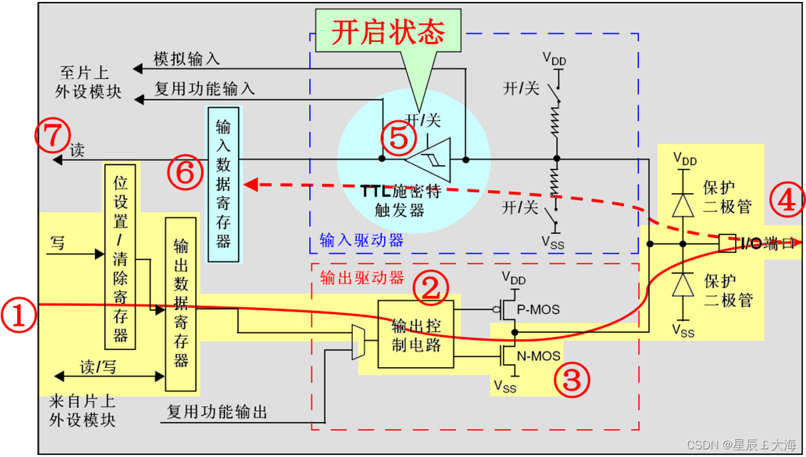

GPIO 的输出模式比输入模式复杂，首先看开漏输出模式，电平信号由STM32内部流出引脚，因此流向是①写（包括位设置/清除寄存器、输出数据寄存器）——②输出控制电路——③N-MOS管——④I/O端口

位设置/清除寄存器写入的值会映射到输出数据寄存器，最终到达输出控制电路，如果写入的是1，则N-MOS管关闭，由于N-MOS管截止，所以最后输出的电平不会由写入的1来决定，因此此时的输出为高阻态（类似浮空状态），真正的输出电压由外部的上下拉电阻来决定。它具有“线与”特性，也就是说，若有很多个开漏模式引脚连接到一起时，只有当所有引脚都输出高阻态，才由上拉电阻提供高电平，此电平的电压为外部上拉电阻所接的电源的电压。若其中一个引脚为低电平，那线路就相当于短路接地，使得整条线路都为低电平0伏。若写入0，则N-MOS管处于开启状态，输出电流被拉到VSS，因此可以输出强低电平。输出的电平信号可以被输入数据寄存器读取。

### 1.2.6 推挽输出

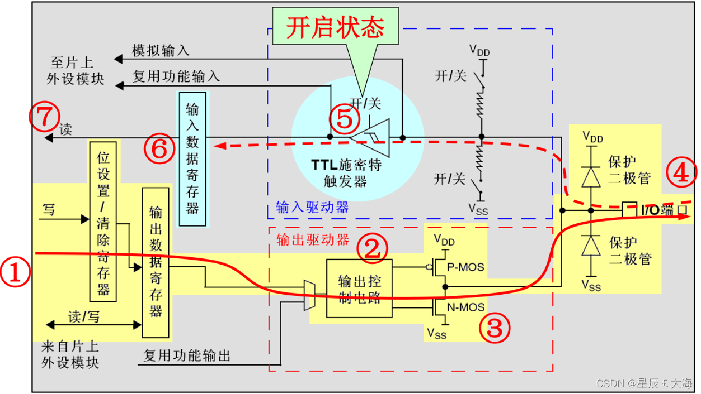

推挽输出模式和开漏输出模式有一定的区别，其控制输出的寄存器是一样的，但是②部分的写1有效，即输出控制电路输出1的时候，P-MOS管导通，N-MOS管截止，这样I/O口电平就会被P-MOS管拉高，输出强高电平；相反，当输出控制电路输出0时，P-MOS管截止，N-MOS管导通，I/O端口电平被N-MOS管拉低，输出强低电平。同样，输出的电平信号可以被输入数据寄存器读取。


### 1.2.7 复用开漏输出模式

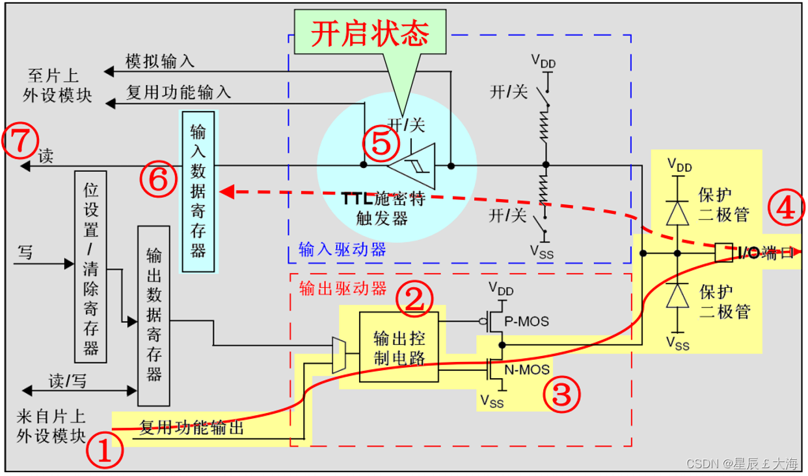

复用开漏输出和开漏输出的区别在于信号来源，复用的来源不是内部直接通过输出数据寄存器写的，而是由复用功能的外设决定的。

### 1.2.8 复用推挽输出模式

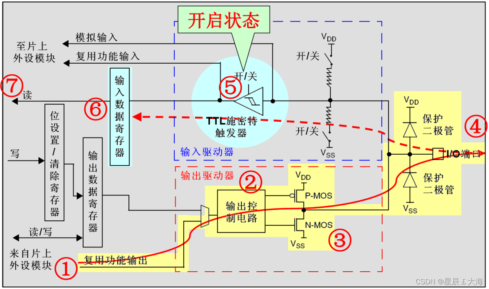

 推挽复用输出和推挽输出的区别在于信号来源，其信号来源是由复用功能相关的通信通道来控制。

## 1.3 代码操作GPIO

第一步开启RCC外设时钟
```c
RCC_APB2PeriphClockCmd(RCC_APB2Periph_GPIOC, ENABLE);
```

第二步: GPIO_Init初始化GPIO
```c
GPIO_InitTypeDef GPIO_InitStructure;
GPIO_InitStructure.GPIO_Pin = GPIO_Pin_13;
GPIO_InitStructure.GPIO_Speed = GPIO_Speed_50MHz;
// 通用推挽输出模式
GPIO_InitStructure.GPIO_Mode = GPIO_Mode_Out_PP;
// 第二步 初始化GPIO
GPIO_Init(GPIOC, &GPIO_InitStructure);
```

第三步：使用输入/输出函数控制GPIO口
```c
// 第三步 把指定端口设置为高电平
GPIO_SetBits(GPIOC, GPIO_Pin_13);
GPIO_WriteBit(GPIOC, GPIO_Pin_13, Bit_RESET); // 高电平
GPIO_WriteBit(GPIOC, GPIO_Pin_13, Bit_SET); // 低电平
```

完整代码：
```c
#include "stm32f10x.h" // Device header
int main(void)
{
    // 第一步 开启GPIO C外设时钟
    RCC_APB2PeriphClockCmd(RCC_APB2Periph_GPIOC, ENABLE);
    GPIO_InitTypeDef GPIO_InitStructure;
    GPIO_InitStructure.GPIO_Pin = GPIO_Pin_13;
    GPIO_InitStructure.GPIO_Speed = GPIO_Speed_50MHz;
    // 通用推挽输出模式
    GPIO_InitStructure.GPIO_Mode = GPIO_Mode_Out_PP;
    // 第二步 初始化GPIO
    GPIO_Init(GPIOC, &GPIO_InitStructure);
    // 第三步 把指定端口设置为高电平
    GPIO_SetBits(GPIOC, GPIO_Pin_13);
    // 把指定端口设置为低电平
    //GPIO_ResetBits(GPIOC, GPIO_Pin_13);
    while(1)
    {
        
    }
}
#include "stm32f10x.h" // Device header
int main(void)
{
    // 开启APB2 时钟
    RCC_APB2PeriphClockCmd(RCC_APB2Periph_GPIOC, ENABLE);
    GPIO_InitTypeDef GPIO_InitStrcture;
    GPIO_InitStrcture.GPIO_Mode = GPIO_Mode_Out_PP;
    GPIO_InitStrcture.GPIO_Pin = GPIO_Pin_13;
    GPIO_InitStrcture.GPIO_Speed = GPIO_Speed_50MHz;
    // 初始化GPIO
    GPIO_Init(GPIOC, &GPIO_InitStrcture);
    // 这两组功能是一样的
    //GPIO_Init(GPIOC, &GPIO_InitStructure);
    //GPIO_SetBits(GPIOC, GPIO_Pin_13);
    while(1)
    {
        // 高电平
        GPIO_WriteBit(GPIOC, GPIO_Pin_13, Bit_RESET);
        // 延时大致500ms
        for (uint32_t i = 0; i < 500; i++) {
            for (uint32_t j = 0; j < 2000; j++) {
                // 空循环，用于延时
            }
        }
        // 低电平
        GPIO_WriteBit(GPIOC, GPIO_Pin_13, Bit_SET);
        for (uint32_t i = 0; i < 500; i++) {
            for (uint32_t j = 0; j < 2000; j++) {
            // 空循环，用于延时
            }
        }
    }
}
```

# 2. 中断

- 中断：打断CPU执行正常的程序，转而处理紧急程序，然后返回原暂停的程序继续运行

- 中断优先级：当有多个中断源同时申请中断时，CPU会根据中断源的轻重缓急进行裁决，优先响应更加紧急的中断源

- 中断嵌套：当一个中断程序正在运行时，又有新的更高优先级的中断源申请中断，CPU再次暂停当前中断程序，转而去处理新的中断程序，处理完成后依次进行返回


stm32有68个可屏蔽中断通道，包含EXTI、TIM、ADC、USART、SPI、I2C、RTC等多个外设

使用 **NVIC** 统一管理中断，每个中断通道都拥有16个可编程的优先等级，可对优先级进行分组，进一步设置抢占优先级和响应优先级

## 2.1 NVIC基本结构

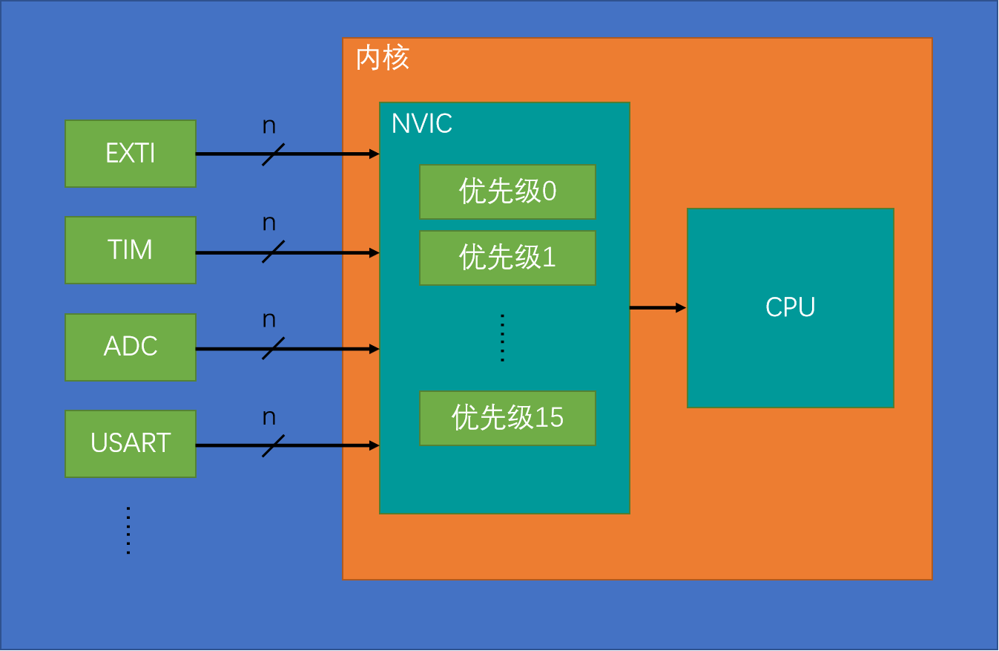

- 在stm32中，它是用来统一分配中断优先级和管理中断的
- 线上的斜杠n 表示一个外设可能占用n条中断通道，所以有条线（后面的结构图类似）
- NVIC是一个内核外设，是cpu的助手，因为stm32的中断非常多，如果所有的中断全部连接内
核，那么会有很多线设计也会很麻烦，并且如果很多中断同时请求，或者产生拥堵，这样就很卡，所以中断分配就交给别的外设
- NVIC只有一个输出口，NVIC根据每个中断的优先级分配中断的先后顺序

可以看到，外部中断，定时器中断，ADC外设中断等等都是由NVIC统一管理的

### 2.1.1 NVIC优先级分组
- NVIC的中断优先级由优先级寄存器的4位（0~15）决定，这4位可以进行切分，分为高n位的抢占优先级、低4-n位的响应优先级。

- 响应优先级高的可以优先排队，抢占优先级和响应优先级均相同的按中断号排队

**配置NVIC优先级的代码全局中只有一个，最好放在main.c 文件的开头**

<a id="nvicgrpou"></a>

| 分组方式 | 抢占优先级      | 响应优先级      |
| -------- | --------------- | --------------- |
| 分组0    | 0位，取值为0    | 4位，取值为0~15 |
| 分组1    | 1位，取值为0~1  | 3位，取值为0~7  |
| 分组2    | 2位，取值为0~3  | 2位，取值为0~3  |
| 分组3    | 3位，取值为0~7  | 1位，取值为0~1  |
| 分组4    | 4位，取值为0~15 | 0位，取值为0    |

抢占优先级高的可以进行中断嵌套。**分组方式是在程序里自己选择的**

## 2.2 AFIO


- AFIO主要用于引脚复用功能的选择和重定义

- 在STM32中，AFIO主要完成两个任务：复用功能引脚重映射、中断引脚选择

复用功能引脚重映射：

`STM32有许多的内置外设（如串口、ADC、DCA等等），这些外设的外部引脚都是和GPIO复用的。也就是说，一个GPIO如果可以复用为内置外设的功能引脚，那么当这个GPIO作为内置外设使用的时候，就叫复用。`

那么，什么时候端口是默认功能，什么时候端口是复用功能呢？

STM32 中的大部分 GPIO 都有复用功能，所以对于有复用功能的 I/O 引脚，还要开启其复用功能时钟。如 GPIO 的 pin4 可以用作 ADC1 的输入引脚，当我们把它作为 ADC1 使用时，需要开启 ADC1 的时钟。 这样解释可能会有的模糊。有点基础以后再看下面的解释。

### 端口复用的解释

什么时候端口是默认功能，什么时候端口是复用功能呢？
```
STM32时钟系统的配置除了初始化的时候在system_stm32f10x.c中的SystemInit函数中外，其他的配置主要在stm32f10x_rcc.c文件中， 所以GPIO等等外设的时钟使能函数都是在此文件中。同时我们通过函数名可以得到规律：GPIOA-GPIOC是挂载在APB2下面，TIM2-TIM4是挂载在APB1下面，DMA是挂载在AHB下面。所以调用函数的名称是需要根据这个来确定的。
```

#### 端口复用初始化过程

接下来看一下端口复用初始化过程的步骤，拿串口1为例：

1、GPIO端口时钟使能。要使用到端口复用，首先是要使能端口的时钟了；
```c
RCC_APB2PeriphClockCmd(RCC_APB2Periph_GPIOA, ENABLE);.
```

2、**复用** 的外设时钟使能。比如要将PA9、PA10引脚复用成串口，必须也要使能串口时钟；
```c
RCC_APB2PeriphClockCmd(RCC_APB2Periph_USART1, ENABLE);
```
3、端口模式配置。在I/O复用位内置外设功能引脚的时候，必须设置GPIO端口的模式。至于在复用功能下，GPIO的模式怎么设置，可以查看手册《STM32中文参考手册》p110的内容。这里拿USART1为例，进行配置，要配置全双工的串口1，TX引脚需要推挽复用输出，RX引脚需要浮空输入或者上拉输入；

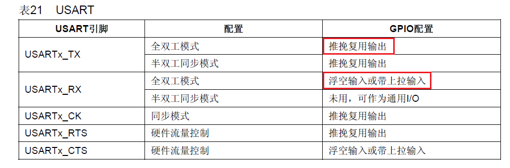

```c
GPIO_InitStructure.GPIO_Pin = GPIO_Pin_9; //PA.9//复用推挽输出
GPIO_InitStructure.GPIO_Speed = GPIO_Speed_50MHz;
GPIO_InitStructure.GPIO_Mode = GPIO_Mode_AF_PP; //复用推挽输出
GPIO_Init(GPIOA, &GPIO_InitStructure);
  
GPIO_InitStructure.GPIO_Pin = GPIO_Pin_10;//PA10 PA.10 浮空输入
GPIO_InitStructure.GPIO_Mode = GPIO_Mode_IN_FLOATING;//浮空输入
GPIO_Init(GPIOA, &GPIO_InitStructure);  
```

这里端口复用就完成了。虽然还是有点疑惑，但是我学习完成后，根据代码，AFIO引脚复用的代码并不是特别的“明显”比如`RCC_APB2PeriphClockCmd(RCC_APB2Periph_USART1, ENABLE);` 在这里库函数已经帮我们配置好了端口复用。


### 2.2.1 AFIO中断引脚选择

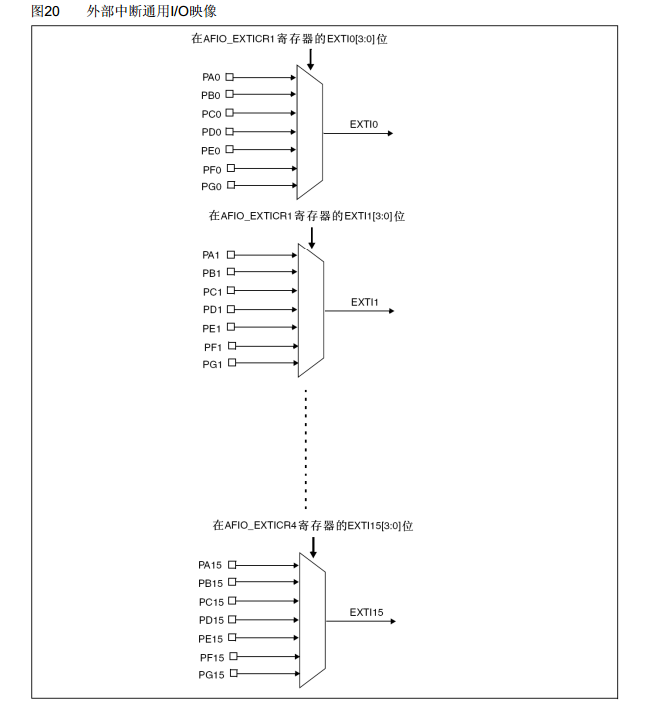

这里就是一系列的数据选择器。 图中的梯形表示数据选择器，每次只选择一位。这个特性就决定了**相同的pin不能同时触发外部中断（在2.3中有讲解）**

另外 AFIO在stm32中主要有两个任务：复用功能引脚重映射、中断引脚选择


## 2.3 外部中断

- EXTI（Extern Interrupt）外部中断
- EXTI可以监测指定GPIO口的电平信号，当其指定的GPIO口产生电平变化时，EXTI将立即向NVIC发出中断申请，经过NVIC裁决后即可中断CPU主程序，使CPU执行EXTI对应的中断程序
- 支持的触发方式：上升沿/下降沿/双边沿/软件触发
- 支持的GPIO口：所有GPIO口，但相同的Pin不能同时触发中断
- 通道数：16个GPIO_Pin，外加PVD输出、RTC闹钟、USB唤醒、以太网唤醒
- 触发响应方式：中断响应/事件响应

<a id="extibase"></a>
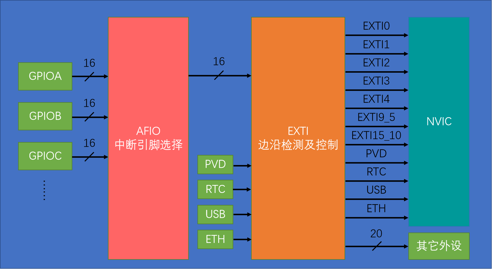

根据上图，外部中断9-5会触发同一个中断函数，15-10也会触发同一个中断函数

<a id="exti">外部中断配置步骤：</a>

根据外部中断基本结构图可知，配置外部中断可分为以下步骤

- 1、配置RCC把涉及到的外设时钟打开，不打开时钟是无法工作的
- 2、配置GPIO，选择我们的端口为输入模式
- 3、配置AFIO选择我们用的某一路GPIO，连接到后面的EXTI
- 4、配置EXTI，选择边沿触发模式和触发响应方式
- 5、配置NVIC给中断选择一个合适的优先级

---

16个GPIO_Pin口加上`PVD输出、RTC闹钟、USB唤醒、以太网唤醒`，总共个20个中断线路。后面这四个其实是“蹭网” 的。

为什么要来外部中断蹭网呢？

因为这个外部中断有个功能，就是从低功耗模式的停止模式下唤醒stm32。比如当PVD电源电压检
测，当电源从电压过低恢复时，PVD就需要借助外部中断退出停止模式。另外三个也是类似的。
如果是事件响应，即选择出发事件，那么外部中断的信号就不会通过cpu了，而是通向其他外设，用
来触发其他外设操作。

- 什么是PIN口，什么是端口

- (1)不同端口、同一pin口，共用一个中断线：如PA1、PB1、PC1共用外部中断线1——
EXTI_Line1；

- (2)不同pin口、同一端口：这个都不用说，PA1、PA2、PA3这些共用的是同一个端口寄存器之类
的；
所以相同的pin不能同时触发中断

### 2.3.1 外部中断（EXTI）基本机构框图

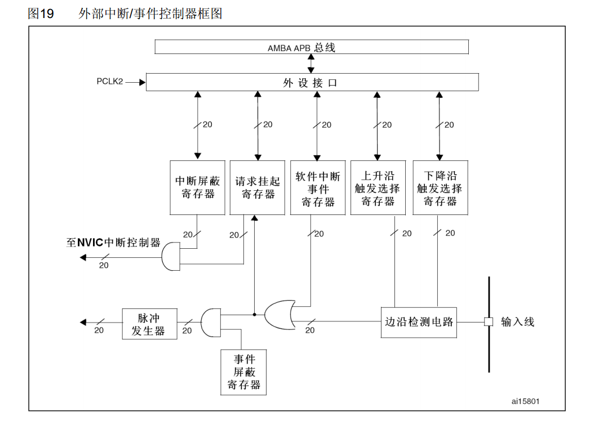

## 2.4 外部中断使用代码

[根据EXTI配置步骤有以下代码](#exti)

第一步：配置RCC把涉及到的外设时钟打开

根据上图可知需要的外设有GPIO 、AFIO、NVIC，但是NVIC是内核外设，所以不需要我们手动开启时钟。
```c
// 开启GPIOB时钟
RCC_APB2PeriphClockCmd(RCC_APB2Periph_GPIOB, ENABLE);
// 开启AFIO时钟
RCC_APB2PeriphClockCmd(RCC_APB2Periph_AFIO, ENABLE);
```
第二步：配置GPIO
```c
GPIO_InitTypeDef GPIO_InitStrctuer;
GPIO_InitStrctuer.GPIO_Mode = GPIO_Mode_IPU; // 上拉输入模式，默认为高电平
GPIO_InitStrctuer.GPIO_Pin = GPIO_Pin_14;
GPIO_InitStrctuer.GPIO_Speed = GPIO_Speed_50MHz;
GPIO_Init(GPIOB, &GPIO_InitStrctuer);
```

第三步：配置AFIO

这个函数虽然是GPIO开头，但是实际上是操作AFIO的寄存器、参数1：选择某个GPIO外设作为中断源、参数2：指定要配置的外部中断线

```c
// AFIO为外部中断引脚选择配置用那个引脚就是GPIO_PinSourceX
GPIO_EXTILineConfig(GPIO_PortSourceGPIOB, GPIO_PinSource14);
```

第四步：配置EXTI

外部中断有中断模式，另外还有事件模式。


代码中的EXTI_Line配置项，就是在[EXTI基本结构图中](#extibase)的EXTI与NVIC连接的部分，不同的pin口对应不同的EXTI_Line。

```c
EXTI_InitTypeDef EXTI_InitStrctur;
EXTI_InitStrctur.EXTI_Line = EXTI_Line14; // 因为我们要用14口 所以选择EXTI_Line14
EXTI_InitStrctur.EXTI_LineCmd = ENABLE; // 开启中断
EXTI_InitStrctur.EXTI_Mode = EXTI_Mode_Interrupt; // 指定外部中断线的模式 我们选择中断模式 --还有事件模式
EXTI_InitStrctur.EXTI_Trigger = EXTI_Trigger_Falling; // 指定有效信号的触发边沿 我们选择下降沿触发
EXTI_Init(&EXTI_InitStrctur);
```

第五步：配置NVIC

在这里要选择中断分组，中断通道，抢占优先级和响应优先级。因为pin口是14 所以选择EXTI15_10_IRQn通道

<font color='yellow'>注意，这个分组方式整个芯片只能用一种， 即第一行的配置。所以按理说第一行的代码整个工程只执行一次就行了，最好放在主函数的开头</font>

[NVIC优先级分组](#nvicgrpou)

```c
NVIC_PriorityGroupConfig(NVIC_PriorityGroup_2); // 我们选择第二个分组
NVIC_InitTypeDef NVIC_InitStrctur;
NVIC_InitStrctur.NVIC_IRQChannel = EXTI15_10_IRQn; // 中断通道
NVIC_InitStrctur.NVIC_IRQChannelCmd = ENABLE; // 选择中断是使能还是失能
NVIC_InitStrctur.NVIC_IRQChannelPreemptionPriority = 1; // 指定抢占优先级 取值参考NVIC优先级分组。 因为是分组2所以取值范围是0-3
NVIC_InitStrctur.NVIC_IRQChannelSubPriority = 1; // 指定响应优先级 取值参考NVIC优先级
分组图
NVIC_Init(&NVIC_InitStrctur);
```
这样经过配置后，外部中断信号通过AFIO中断引脚选择后，通过EXTI判断是否有效，最后通过选
择的中断通道进入指定的中断函数。<font color='yellow'>通过判断标志位，来确定是那个端口产生的外部中断</font>

```c
void EXTI15_10_IRQHandler(void)
{
    // 这个函数 EXTI10 -15 都能进来，所有要判断标志位，是不是我们想要的
    if(EXTI_GetITStatus(EXTI_Line14) == SET)
    {
        // 必须手动清除标志位
        EXTI_ClearITPendingBit(EXTI_Line14);
    }
}
```

### 完整代码

```c
#include "stm32f10x.h" // Device header
// 外部中断配置
// 根据外部中断基本结构图可知，配置外部中断可分为以下步骤
// 1、配置RCC把涉及到的外设时钟打开，不打卡时钟是无法工作的
// 2、配置GPIO，选择我们的端口为输入模式
// 3、配置AFIO选择我们用的这一路GPIO，连接到后面的EXTI
// 4、配置EXTI，选择边沿触发模式和触发响应方式
// 5、配置NVIC给中断选择一个合适的优先级
void Count_Init(void)
{
    /* 第一步配置时钟 */
    // 在stm32中所有外设都挂载在APB2总线上
    // RCC管内核外的外设
    // PCC APB2 外设时钟控制 开启GPIOB的时钟
    RCC_APB2PeriphClockCmd(RCC_APB2Periph_GPIOB, ENABLE);
    // 开启AFIO时钟
    RCC_APB2PeriphClockCmd(RCC_APB2Periph_AFIO, ENABLE);
    // 还有EXIT和NVIC两个外设，这两个外设的时钟是一直开启的，所以不需要我们在开启时钟
    // NVIC是内核外设，所有内核外设都不需要开启时钟
    /* 第二部配置GPIO */
    GPIO_InitTypeDef GPIO_InitStrctuer;
    GPIO_InitStrctuer.GPIO_Mode = GPIO_Mode_IPU; // 上拉输入模式，默认为高电平
    GPIO_InitStrctuer.GPIO_Pin = GPIO_Pin_14;
    GPIO_InitStrctuer.GPIO_Speed = GPIO_Speed_50MHz;
    GPIO_Init(GPIOB, &GPIO_InitStrctuer);
    /* 第三步配置AFIO */
    // AFIO为外部中断引脚选择配置
    GPIO_EXTILineConfig(GPIO_PortSourceGPIOB, GPIO_PinSource14);
    /* 第四步配置EXTI */
    EXTI_InitTypeDef EXTI_InitStrctur;
    EXTI_InitStrctur.EXTI_Line = EXTI_Line14; // 因为我们要用14口 所以选择EXTI_Line14
    EXTI_InitStrctur.EXTI_LineCmd = ENABLE; // 开启中断
    EXTI_InitStrctur.EXTI_Mode = EXTI_Mode_Interrupt; // 指定外部中断线的模式我们选择中断模式 --还有事件模式
    EXTI_InitStrctur.EXTI_Trigger = EXTI_Trigger_Falling; // 指定有效信号的触发边沿 我们选择下降沿触发
    EXTI_Init(&EXTI_InitStrctur);
    /* 第无步配置NVIC */
    // 配置NVIC分组模式
    // !!!! 注意，这个分组方式整个芯片只能用一种， 所有按理说这个代码整个工程只执行一次就行了
    // 最好放在主函数的开头
    NVIC_PriorityGroupConfig(NVIC_PriorityGroup_2); // 我们选择第二个分组
    NVIC_InitTypeDef NVIC_InitStrctur;
    NVIC_InitStrctur.NVIC_IRQChannel = EXTI15_10_IRQn; // 中断通道
    NVIC_InitStrctur.NVIC_IRQChannelCmd = ENABLE; // 选择中断是使能还是失能
    NVIC_InitStrctur.NVIC_IRQChannelPreemptionPriority = 1; // 指定抢占优先级 取值参考NVIC优先级分组 因为是分组2所以是0-3
    NVIC_InitStrctur.NVIC_IRQChannelSubPriority = 1; // 指定响应优先级 取值参考NVIC优先级分组图
    NVIC_Init(&NVIC_InitStrctur);
}
/* 定义中断函数 */
// 在stm32中，中断函数的名字都是固定的，参考启动文件 .s结尾的文件
void EXTI15_10_IRQHandler(void)
{
    // 这个函数 EXTI10 -15 都能进来，所有要判断标志位，是不是我们想要的
    if(EXTI_GetITStatus(EXTI_Line14) == SET)
    {
    // 必须手动清除标志位
    EXTI_ClearITPendingBit(EXTI_Line14);
    }
}
```


# 3. stm32定时器

<font color='yellow'>定时器的最基本功能，就是定时触发中断，定时器就是一个计数器</font>

- 定时器可以对输入的时钟(内部时钟或者外部时钟的脉冲，一个脉冲记一次数)进行计数，并在计数值达到设定值时触发中断。
- <font color='yellow'>16位计数器、16位预分频器、16位自动重装寄存器（存储目标值）</font>的时基单元，在72MHz计数时钟下可以实现最大59.65s的定时。
- 不仅具备基本的定时中断功能，而且还包含内外时钟源选择、输入捕获、输出比较、编码器接口、主从触发模式等多种功能
- 根据复杂度和应用场景分为了高级定时器、通用定时器、基本定时器三种类型


为什么在72MHz计数时钟下可以实现最大59.65s的定时?
72M/ $2^{16}$ / $2^{16}$，得到的是中断频率，然后取倒数，就是59.65秒多，大家可以自己算一下。
详细解释：在定时器中,预分频器和计数器都是16位的,所以它们的最大值是65535,而不是65536。

预分频器的最大值决定了计数时钟的频率,而计数器的最大值决定了定时器的最大计数周期。因此,如果预分频器和计数器的最大值都设置为65535,那么定时器的最大时间就是72MHz/65536/65536，得到的是中断频率，倒数就是中断时间。【最大值是65536，但计数是从0~65535】


> 什么是预分频器：比如现在是72MHz，如果是1分频则还是72MHz，如果是2分频则是72MHz/2=36MHz，以此类推


| 类型       | 编号                   | 总线 | 功能                                                                                                 |
| ---------- | ---------------------- | ---- | ---------------------------------------------------------------------------------------------------- |
| 高级定时器 | TIM1、TIM8             | APB2 | 拥有通用定时器全部功能，并额外具有重复计数器、死区生成、互补输出、刹车输入等功能                     |
| 通用定时器 | TIM2、TIM3、TIM4、TIM5 | APB1 | 拥有基本定时器全部功能，并额外具有内外时钟源选择、输入捕获、输出比较、编码器接口、主从触发模式等功能 |
| 基本定时器 | TIM6、TIM7             | APB1 | 拥有定时中断、主模式触发DAC的功能                                                                    |

## 3.1 基本定时器框图
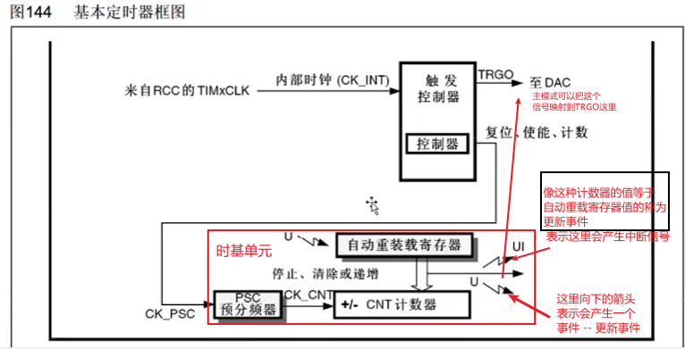

在上图时基单元中：当计数器的值增加到自动重装寄存器的值（我们设置的目标值）时，计数器清0，触发中断信号，计数器自动开始下一次计数

上图中（向上的箭头）产生的中断我们一般叫做“更新中断”。这个更新中断之后就是通往NVIC。

上图中（向下的箭头）产生的事件，我们叫做“更新事件”，更新事件不会触发中断，但可以触发内部其他电路的工作

[主模式就是把更新事件的信号映射到TRGO，这样就可以不用进入中断，自动完成一系列操作。（暂时先了解）](#353-主从触发模式主模式从模式通用定时器和高级定时器才有的)

### 时基单元

这个可编程定时器的主要部分是一个带有自动重装载的16位累加计数器,计数器的时钟通过一个预分频器得到。
软件可以读写计数器、自动重装载寄存器和预分频寄存器,即使计数器运行时也可以操作。时基单元包含：

- 预分频寄存器(TIMx_PSC)

- 预分频可以以系数介于1至65536之间的任意数值对计数器时钟分频,就是对输入的基淮频率提前进行一个分频的操作。它是通过一个16位寄存器(TIMx-PSC)的计数实现分频。因为TIMx-PSC控制寄存器具有缓冲,可以在运行过程中改变它的数值,新的预分频数值将在下一个更新事件时起作用。
假设这个寄存器写0，就是不分频，或者说是1分频，这时候输出频率=输入频率=72MHz；如果预分频器写1，那就是2分频，输出频率=输入频率/2=36MHz,所以预分频器的值和实际的分频系数相差了1，即实际分频系数=预分频器的值+1。

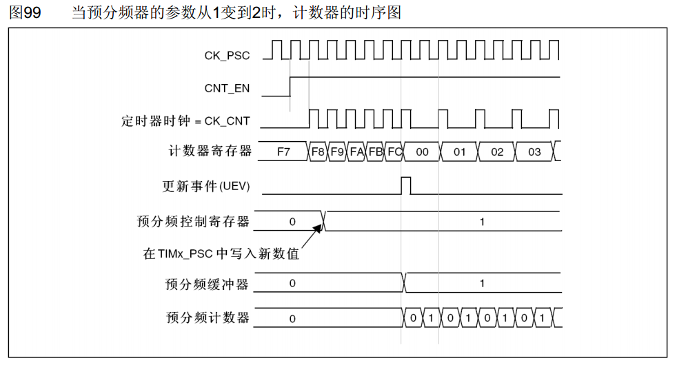

- 计数器计数频率：CK_CNT = CK_PSC / (PSC + 1)
  

<a href='https://www.bilibili.com/video/BV1th411z7sn/?p=13vd_source=ea89d6dd8f9167ceceda04bccc7ea0cb'>时序图讲解</a>

注意：实际的设置计数器使能信号CNT_EN相对于CEN滞后一个时钟周期。

---

- 计数器寄存器(TIMx_CNT)
  

计数器由预分频输出CK_CNT驱动，设置TIMx_CR1寄存器中的计数器使能位(CEN)使能计数器计数。这个计数器可以对预分频后的计数时钟进行计数,计数时钟每来一个上升滑，计数器的值就加1,由于这个计数器也是16位的，所以里面的值可以从0一直加到65535，如果再加的话，计数器就会回到0重新开始。所以计数器的值在计时过程中会不断地自增运行，当自增运行到目标值时，产生中断，那就完成了定时的任务，所以现在还需要一个存储目标值的寄存器，那就是自动重装寄存器了。

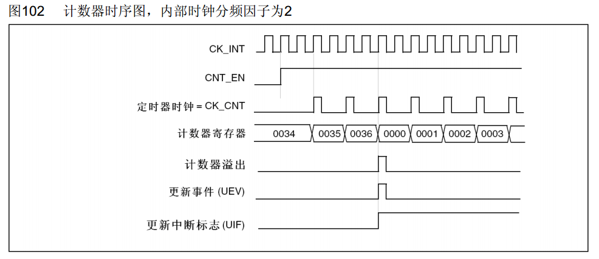

计数器溢出频率：CK_CNT_OV = CK_CNT / (ARR + 1)= CK_PSC / (PSC + 1) / (ARR + 1)


<a href="https://www.bilibili.com/video/BV1th411z7sn?t=2193.3&p=13">实时序讲解</a>

---

- 自动重裝载寄存器(TIMx_ARR)

自动重装载寄存器是预加载的,每次读写自动重装载寄存器时,实际上是通过读写预加载寄存器实现。根据TIMx CR1寄存器中的自动重装载预加载使能位(ARPE),写入预加载寄存器的内容能够立即或在每次更新事件时,传送到它的影子寄存器。当TIMx CR1寄存器的UDIS位为’0’,则每当计数器达到溢出值时,硬件发出更新事件;软件也可以产生更新事件;关于更新事件的产生，随后会有详细的介绍。

- 计数器无预装时序

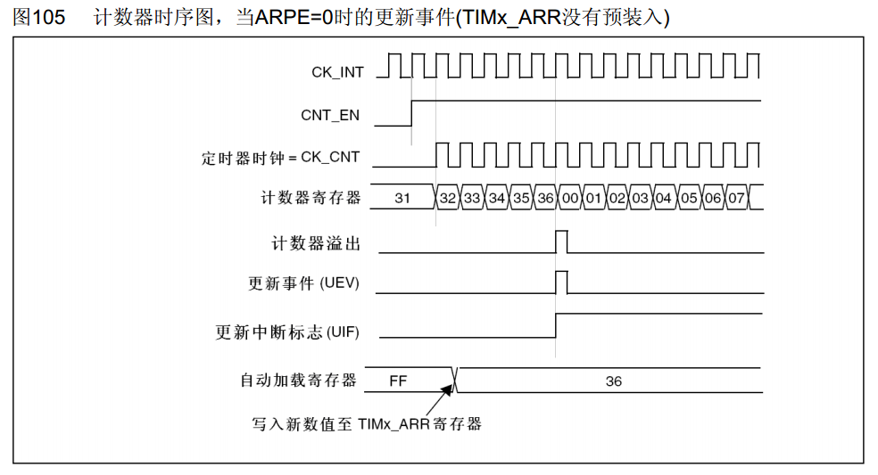

<a href="https://www.bilibili.com/video/BV1th411z7sn?t=2324.4&p=13">实时序讲解</a>

- 计数器有预装时序

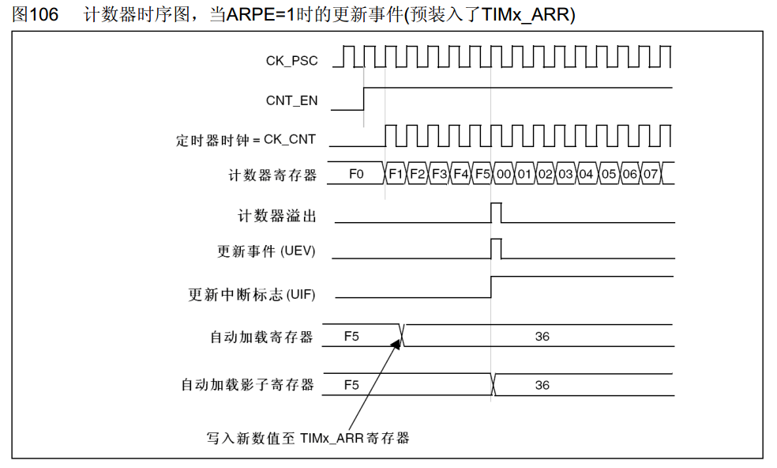

<a href="https://www.bilibili.com/video/BV1th411z7sn?t=2365.0&p=13">实时序讲解</a>

## 3.2 通用定时器 （TIM2、3、4、5）

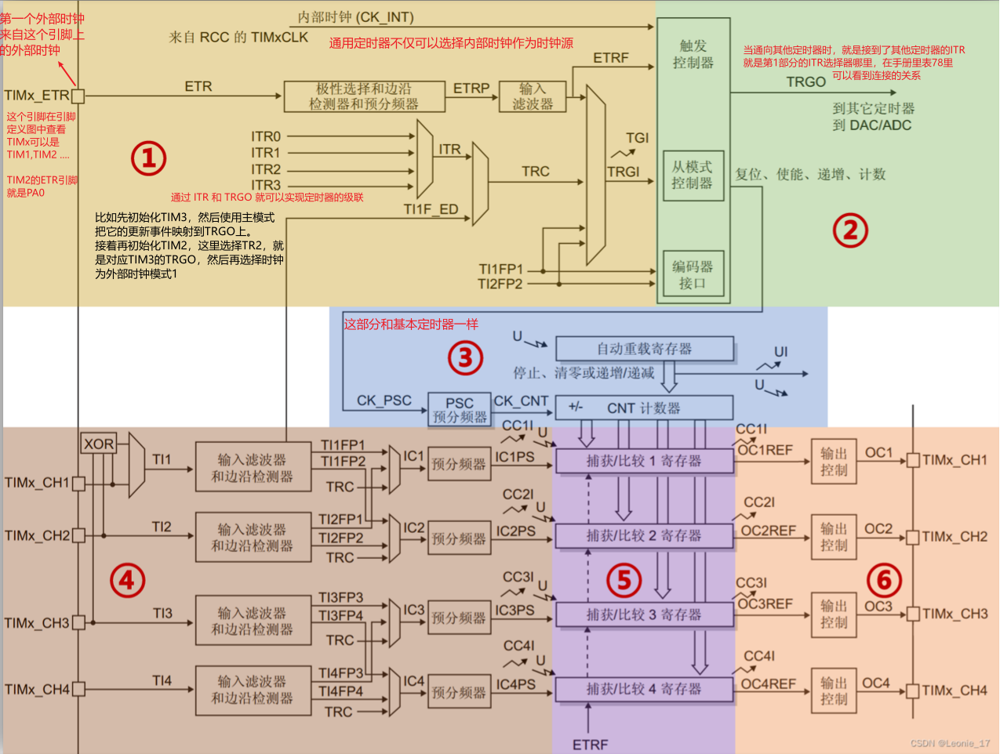

TIM2的CH1和ETR脚都复用在PA0引脚，下面还有CH2、CH3、CH4（CH是通道）和其他定时器的一些引脚的重映射，也都可以在[这里](#sheet)找到。

图中电路1和电路2就是内外时钟源选择和主从触发模式的结构。对于基本定时器而言，只能选择内部时钟（72MHz）。通用定时器可以选择的外部时钟就很多了。比如：TIMx_ETR引脚上[（在引脚定义图查看是哪个pin口）](#sheet)的外部时钟，这就是”外部时钟模式2“

除了ETR引脚可以提供时钟外，还有TRGI可以提供，这个触发输入可以触发定时器的从模式（主从模式在后续会讲解），现在我们讲解的是，这个触发输入作为外部时钟来使用的，暂时可以把TRGI当作外部时钟，这就是”外部时钟模式1“


### 输入捕获/输出比较电路（暂时了解）

现在来看框图的下面部分

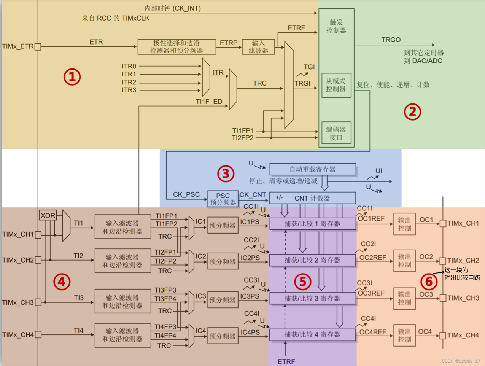


其中第5+6块电路是输出比较电路，一共四个通道，可以用于输出PWM波形，驱动电机
第4+5块电路是输入捕获电路，一共四个通道，可以用于捕获输入信号，用于测量输入信号的频率、占空比等

第5块电路是输入捕获，输出比较电路共用的，但是输入捕获，输出比较 <font color='yellow'>不可以同时使用</font>。这里的寄存器和引脚都是共用的。

### 时钟选择

在3.2中已经粗略讲解可以跳过此章节

<a id="timer"></a>


- 时钟源的输入 —— 时钟源
  

在上图的电路 1 和 2 部分。预分频器之前，连接的就是基准计数时钟的输入，由于基本定时器只能选择内部时钟，所以你可以直接认为时基单元直接连到了输入端，也就是内部时钟CK_INT。内部时钟的来源是RCC_TIMXCLK，这里的频率值一般都是系统的主频72MHz，所以通向时基单元的计数基准频率就是72M。

计数器的时钟由内部时钟(CK_INT)提供。TIMx CR1寄存器的CEN位和TIMx EGR寄存器的UG位是实际的控制位, (除了UG位被自动清除外)只能通过软件改变它们。一旦置CEN位为’1’，内部时钟即向预分频器提供时钟。下图示出控制电路和向上计数器在普通模式下，没有预分频器时的操作。

总结一下就是，外部时钟模式1的输入可以是 ETR 引脚、其他定时器、CH1引脚的边沿、CH1引脚和CH2引脚，一般情况下外部时钟通过ETR引脚就可以了

下面设置这么复杂的输入，不仅仅是为了扩大时钟输入的范围，更多还是为了某些特殊的应用场景而设计的

对于时钟输入而言，最常用的还是内部时钟的72MHz的时钟。如果要使用外部时钟，首选ETR引脚外部时钟模式2的输入（走的是ETRF这一路）

## 3.3 定时中断

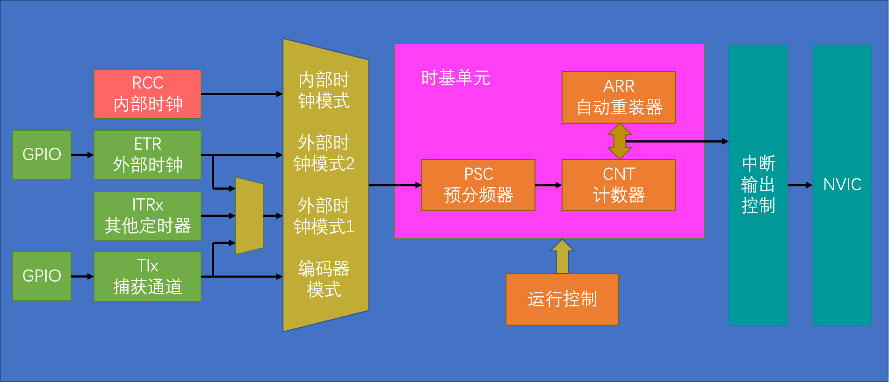

上图中的运行控制，就是控制寄存器的一些位，比如启动停止，向上或者向下计数等等，我们操作这寄存器就可以控制时基单元的运行了。

在时基单元左侧是为时基单元提供时钟的部分。内部时钟模式（选择RCC提供的内部时钟）、外部时钟模式2（选择ETR引脚提供的外部时钟）

当然还可以选择左侧橙色小矩形的 触发输入当作外部时钟，既外部时钟模式1，对应的有ETR外部时钟，ITRx其他定时器，TIx输入捕获通道

编码器模式是编码器独用的模式，这里不讲解

时基单元产生的中断信号，会先在状态寄存器里置一个中断标志位，这个标志位会通过中断输出控制，到NVIC申请中断，为什么会有一个中断输出控制呢？因为定时器模块有很多地方都有申请中断，比如时基单元产生的 ”更新事件“，或者电路1的TRC产生的TGI（向上的箭头），还有输入捕获，输出比较也会申请中断，所以这些中断都要经过中断输出控制，如果需要这个中断，那就允许，不需要就禁止。


### 定时器内部时钟代码实例


上图是整个定时中断的整个框架结构，只需要把这里的每个模块打通，就可以让定时器工作了,大体步骤如下：


第一步：RCC开启定时器时钟，这里打开后，定时器的基准时钟和整个外设的工作时钟就会同时都打开了

```c
RCC_APB1PeriphClockCmd(RCC_APB1Periph_TIM2, ENABLE);
```

第二步：选择时基单元时钟（对于定时中断，我们选择内部时钟）这行代码也可不写，因为定时器上电后默认使用内部时钟 72MHz
```c
// 这样配置TIM2的时基单元由内部时钟驱动
// 
TIM_InternalClockConfig(TIM2);
```

第三步：配置时基单元（预分频器、自动重装器、计数模式等等）

TIM_ClockDivision这个参数的效果是滤波器的采样频率（来自内部72M）分频系数。在[通用定时器框图](#timer)哪里(ETRP)定时器的外部输入引脚有一个滤波器，滤波器可以滤掉信号的抖动干扰。

滤波器具体工作方式是在一个固定的频率f下进行采样，如果连续N个点都为相同的电平，那就代表输入信号稳定，否则有抖动。频率越低滤波效果越好。那么问题来了，这个采样频率f从哪来，手册里写的是可以由内部时钟直接而来，也可以是由内部时钟加一个时钟分频而来，分频多少就由TIM_ClockDivision这个参数配置，可见这个参数个时基单元关系并不大

这个采样频率就是可以是内部时钟而来，也可以是内部时钟加一个分频器。即TIM_ClockDivision，TIM_ClockDivision这个参数就是配置滤波频率的。

[这个代码结合基本定时器看会好点](#31-基本定时器框图)

```c
TIM_TimeBaseInitTypeDef TIM_TimeBaseInitStrcture;
TIM_TimeBaseInitStrcture.TIM_ClockDivision = TIM_CKD_DIV1; // 指定(滤波器，滤波器的时钟来自内部的72M)时钟分频 我们选择1分配 即不分频
TIM_TimeBaseInitStrcture.TIM_CounterMode = TIM_CounterMode_Up; // 选择计数模式，这里我们选择向上计数定时频率=72M/(psc+1)/(ARR+1) 我们配置的定时频率是 1hz 也就是1s计一个数
// 周期 就是ARR自动重装器的值。这个和下面这行决定计时的时间
TIM_TimeBaseInitStrcture.TIM_Period = 10000 -1; // 当CNT计数器计数到ARR自动重装器的值的时候归0
// 在这里相当于对72MHZ进行7200分频--> 10HZ 计10000个数就是1s
TIM_TimeBaseInitStrcture.TIM_Prescaler = 7200 -1; // psc预分频器的值
// 重复计数器的值 高级计数器才有，但是我们这里用不到直接给0
TIM_TimeBaseInitStrcture.TIM_RepetitionCounter = 0;
TIM_TimeBaseInit(TIM2, &TIM_TimeBaseInitStrcture);
TIM_ClearFlag(TIM2, TIM_FLAG_Update); // 清除中断标志位，因为程序在复位时会直接进入中断，不加这一行会直接触发中断函数
```

第四步： 配置输出中断配置，允许更新中断输出到NVIC
```c
TIM_ITConfig(TIM2, TIM_IT_Update, ENABLE);
```

第五步：配置NVIC，在NVIC中打开定时器中断的通道，并分配一个优先级

```c
NVIC_PriorityGroupConfig(NVIC_PriorityGroup_2); // 这行整个项目只能有一个
NVIC_InitTypeDef NVIC_InitStrcture;
NVIC_InitStrcture.NVIC_IRQChannel = TIM2_IRQn;
NVIC_InitStrcture.NVIC_IRQChannelCmd = ENABLE;
NVIC_InitStrcture.NVIC_IRQChannelPreemptionPriority = 2;
NVIC_InitStrcture.NVIC_IRQChannelSubPriority = 1;
NVIC_Init(&NVIC_InitStrcture);

```

在整个模块配置完成后，还需要使能计数器，要不然计数器不会运行。定时器使能后，计数器开始计数，当计数器更新时，触发中断，然后进入中断函数，这样就能定时触发中断函数了。

```c
// 启动定时器
TIM_Cmd(TIM2, ENABLE);
```

中断函数：
```c
void TIM2_IRQHandler(void)
{
// 检查中断标志位
    if(TIM_GetITStatus(TIM2, TIM_IT_Update) == SET)
    {
        Num++;
        // 必须手动清除标志位
        TIM_ClearITPendingBit(TIM2, TIM_IT_Update);
    }
}
```

main.c

```c
#include "stm32f10x.h" // Device header
#include "Delay.h"
#include "OLED.h"
#include "count.h"
#include "timer.h"
uint16_t Num=0;
int main(void)
{
    /*模块初始化*/
    OLED_Init(); //OLED初始化
    Time_Init(); // 初始化定时器
    /*OLED显示*/
    OLED_ShowString(1, 1, "Num:"); //1行3列显示字符串HelloWorld!
    while (1)
    {
        OLED_ShowNum(1, 5, Num, 5);
        OLED_ShowNum(2, 5, TIM_GetCounter(TIM2), 5); // 获取CNT计数器的值
    }
}
```

### 定时器外部时钟代码实例

第一步：RCC开启定时器时钟，这里打开后，定时器的基准时钟和整个外设的工作时钟就会同时都打开了

```c
RCC_APB1PeriphClockCmd(RCC_APB1Periph_TIM2, ENABLE);
```

第二步：选择时基单元时钟（有差别）
```c
// TIM_InternalClockConfig(TIM2); 这行我们不再需要
// 通过ETR引脚的外部时钟模式2配置
TIM_ETRClockMode2Config(TIM2, TIM_ExtTRGPSC_OFF, TIM_ExtTRGPolarity_NonInverted,0x00);
/* 参数：
    2：外部触发预分频器（我们不分频）
    3：外部触发极性，我们选择不反向
    4：外部触发滤波器，这个值就是决定f和N的，对于关系在手册上可以查到，这里我们不用滤波器
*/
```

新增GPIO代码，因为是外部时钟，所以需要GPIO引脚
```c
RCC_APB2PeriphClockCmd(RCC_APB2Periph_GPIOA, ENABLE); // 使能APB2总线和GPIOA
GPIO_InitTypeDef GPIO_InitStrcture;
GPIO_InitStrcture.GPIO_Mode = GPIO_Mode_IPU;
GPIO_InitStrcture.GPIO_Pin = GPIO_Pin_0;
GPIO_InitStrcture.GPIO_Speed = GPIO_Speed_50MHz;
```

第三步：配置时基单元（预分频器、自动重装器、计数模式等等）
```c
TIM_TimeBaseInitTypeDef TIM_TimeBaseInitStrcture;
TIM_TimeBaseInitStrcture.TIM_ClockDivision = TIM_CKD_DIV1; // 指定时钟分频 我们选择1分配 即不分频
TIM_TimeBaseInitStrcture.TIM_CounterMode = TIM_CounterMode_Up; // 选择计数模式，这里我们选择向上计数定时频率=72M/(psc+1)/(ARR+1) 我们配置的定时频率是 1hz 也就是1s计一个数
// 周期 就是ARR自动重装器的值。这个和下面这行决定计时的时间
TIM_TimeBaseInitStrcture.TIM_Period = 10 -1; // 当CNT计数器计数到ARR自动重装器的值的时候归0

TIM_TimeBaseInitStrcture.TIM_Prescaler = 1 -1; // 不分频
// 重复计数器的值 高级计数器才有，但是我们这里用不到直接给0
TIM_TimeBaseInitStrcture.TIM_RepetitionCounter = 0;
TIM_TimeBaseInit(TIM2, &TIM_TimeBaseInitStrcture);
TIM_ClearFlag(TIM2, TIM_FLAG_Update); // 清除中断标志位，因为程序在复位时会直接进入中断，不加这一行会直接触发中断函数
```

第四步： 配置输出中断配置，允许更新中断输出到NVIC
```c
TIM_ITConfig(TIM2, TIM_IT_Update, ENABLE);
```

第五步：配置NVIC，在NVIC中打开定时器中断的通道，并分配一个优先级

```c
NVIC_PriorityGroupConfig(NVIC_PriorityGroup_2); // 这行整个项目只能有一个
NVIC_InitTypeDef NVIC_InitStrcture;
NVIC_InitStrcture.NVIC_IRQChannel = TIM2_IRQn;
NVIC_InitStrcture.NVIC_IRQChannelCmd = ENABLE;
NVIC_InitStrcture.NVIC_IRQChannelPreemptionPriority = 2;
NVIC_InitStrcture.NVIC_IRQChannelSubPriority = 1;
NVIC_Init(&NVIC_InitStrcture);

```
使能定时器
```c
// 启动定时器
TIM_Cmd(TIM2, ENABLE);
```

获取计数器的值
```c
uint16_t Timer_GetCounter(void)
{
    return TIM_GetCounter(TIM2);
}
```

main.c 这个代码的效果就是当GPIOA pin0 口产生上升沿的时候，CNT+1，当CNT加到9时自动清0，触发中断 Num+1

```c
#include "stm32f10x.h" // Device header
#include "OLED.h"
#include "timer.h"
uint16_t Num=0;
int main(void)
{
    /*模块初始化*/
    OLED_Init(); //OLED初始化
    Time_Init(); // 初始化定时器
    /*OLED显示*/
    OLED_ShowString(1, 1, "Num:"); 
    OLED_ShowString(1, 1, "CNT:"); 
    while (1)
    {
        OLED_ShowNum(1, 5, Num, 5);
        OLED_ShowNum(2, 5, Timer_GetCounter(TIM2), 5); // 获取CNT计数器的值
    }
}
```


## 3.4 TIM输出比较
OC（Output Compare）输出比较

- 输出比较可以通过比较CNT与CCR寄存器值的关系，来对输出电平进行置1、置0或翻转的操作，用于输出一定频率和占空比的PWM波形
- 每个高级定时器和通用定时器都拥有4个输出比较通道
- 高级定时器的前3个通道额外拥有死区生成和互补输出的功能

主要用来生成PWM 这个是非常重要的 基本定时器无法生成

名词缩写

- OC (Output Compare) 输出比较
- IC （Input Capture） 输入捕获
- CC ( Capture/Compare ) 一般表示的是输入捕获和输出比较的单元


在上图的电路5，是CCR（捕获/比较寄存器），是输入捕获和输出比较公用的，当使用输入捕获时，他就是捕获寄存器，反之
亦然。

在输出比较这里，这块电路（电路5+6）会比较CNT和CCR的值，CNT计数自增，CCR是我们给定的一个值，当CNT大于CCR、小于CCR或者等于CCR时，CCR对应的输出通道（TIMx_CHx，和CCR在同一行）就会置1、置0、置1、置0，这样就控制了电平的跳变，这是最基本的输出比较。


### 3.4.1 PWM简介

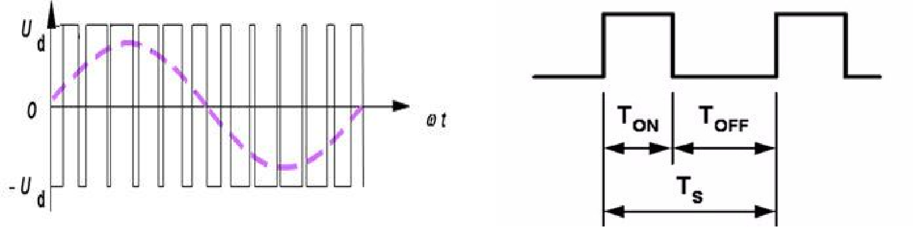
$T_{ON}$ 是高电平时间，$T_S$ 是整个周期时间、$T_{ON}/T_S$ 就是占空比

- PWM（Pulse Width Modulation）脉冲宽度调制
- 在具有惯性的系统中，可以通过对一系列脉冲的宽度进行调制，来等效地获得所需要的模拟参量，常应用于电机控速等领域
- PWM参数：<font color='red'>频率 = 1 / TS 、 占空比 = TON / TS 、 分辨率 = 占空比变化步距</font>

按理说LED只能有完全亮和完全灭两种状态，怎么实现控制亮度大小呢？通过PWM就可以实现，我们让LED不断的点亮、熄灭、点亮、熄灭，当点亮熄灭的频率足够大时，LED就不会闪烁了，而是呈现一个中等亮度。

<font color='yellow'>PWM只有完全导通和完全断开的两种状态，两种状态上都没有功率损耗，所以在直流电机调速这种大功率的应用场景，是比[DAC](#4-adc模数转换器)更好的选择</font>

当我们调节$T_{ON}$和$T_{OFF}$的比例就能让LED呈现出不同的亮度级别。

<font color='red'>当然，PWM的应用场景必须要是一个惯性系统，就是说LED在熄灭的时候，由于余晖和人眼的视觉暂留现象，LED不会立马熄灭，而是有一定的惯性，过一小段时间才熄灭</font>

- 如果占空比是50%的话高电平5v低电平0v，就说明一个周期内高电平的时间和低电平的时间是相同的，等效电压就是1坤伏（2.5V）。

- 分辨率：它等于占空比变化步距。比如有的占空比只能是1%、2%、3%等等这要以1%的步距跳变，那他的分辨率就是1%


### 3.4.2 输出比较模块是怎么输出PWM波形的


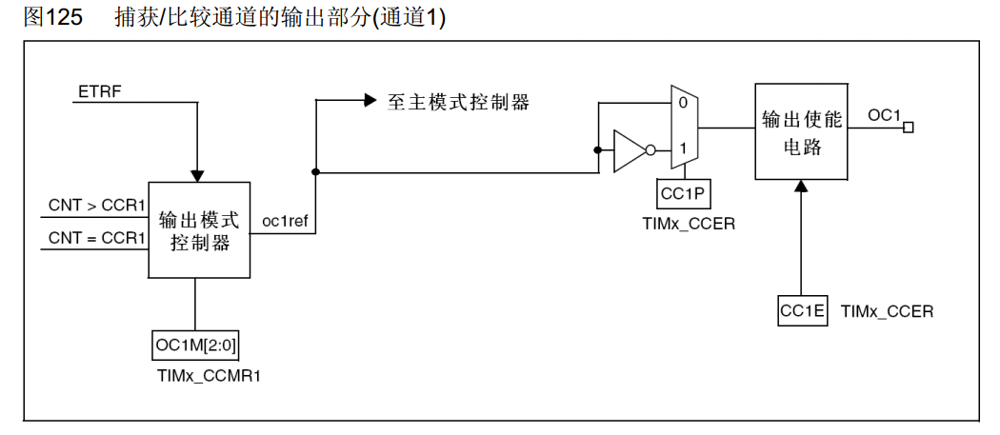

上图是通用定时器的输出比较部分电路，这个电路对应的是下图红色框内的部分

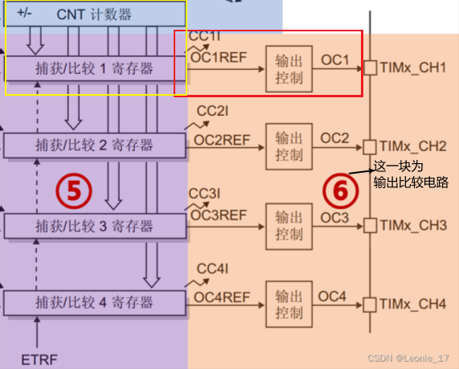


上图中黄色框内的是CNT和CCR比较的结果，它的右边（红色框内的部分）就是输出比较电路，最后通过TIM_CH1输出到GPIO引脚上。那么是哪个GPIO引脚呢？[在这里](#sheet)

然后还有三个通用的单元，分别输出到CH2、CH3、CH4

---

那么我们再来看这个图：


它的左边就是CNT计数器和CCR1第一路的捕获/比较寄存器。（CNT>CCR1|CNT=CCR1）这两个引脚他俩进行比较，当CNT>CCR1，或者CNT=CCR1时，就会给输出模式控制器传递一个信号，然后控制器就会改变它输出OC1REF的高低电平（REF信号实际上就是指这里的高低电平，REF就是reference的缩写，意思是参考信号）。这个信号还可以映射到主模式的TRGO输出上。

后面的TIMx_CCER寄存器就是控制极性的，这个寄存器写0，就是电平信号不反转。最后的OC1就是CH1引脚，在[引脚定义表里](#sheet)就知道CH1是那个GPIO引脚了。

接下来我们还需要看一下这个输出模式控制器（输入是CNT和CCR的大小关系，输出是REF的高低电平），他具体是怎么工作的，什么时候给REF高点哦没什么时候给REF低电平，然后看下表，这就是输出比较的8种模式

- 输出比较模式，输出模式控制器可以选择多个工作模式，这个模式可以通过寄存器来配置，用的最多的是PWM模式1


| 模式             | 描述                       |
| ---------------- | -------------------------- |
| 冻结             | CNT=CCR时，REF保持为原状态 |
| 匹配时置有效电平 | CNT=CCR时，REF置有效电平   |
匹配时置无效电平|	CNT=CCR时，REF置无效电平|
匹配时电平翻转|	CNT=CCR时，REF电平翻转|
强制为无效电平|	CNT与CCR无效，REF强制为无效电平|
强制为有效电平|	CNT与CCR无效，REF强制为有效电平|
PWM模式1	|向上计数：CNT`<`CCR时，REF置有效电平，CNT≥CCR时，REF置无效电平、向下计数：CNT`>`CCR时，REF置无效电平，CNT≤CCR时，REF置有效电平|
PWM模式2|	向上计数：CNT`<`CCR时，REF置无效电平，CNT≥CCR时，REF置有效电平、向下计数：CNT`>`CCR时，REF置有效电平,CNT≤CCR时，REF置无效电平|

### 3.4.3 PWM基本结构*

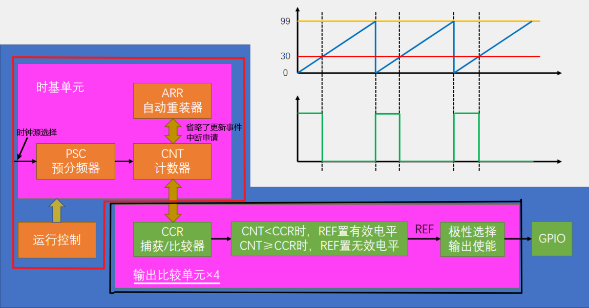

首先看右上角，是时基单元和运行控制部分，在时基单元左边是时钟源选择，这里省略了。这个图中也省略了更新事件中断申请（[这个时基单元和3.1章节的一样](#31-基本定时器框图)），因为PWM不需要中断。配置好时基单元，这里的CNT就可以开始自增运行了。

下面黑色框的部分就是输出比较单元，共有四路。输出比较单元的最开始，是CCR捕获比较寄存器，CCR是我们自己设定的，CNT不断自增运行，同时CNT和CCR还在不断比较，后面的就是`输出模式控制器 图上的是PWM模式1`。随后调节CCR的大小即可调节占空比，进而控制LED亮度。CCR越大占空比越大。


#### 参数计算

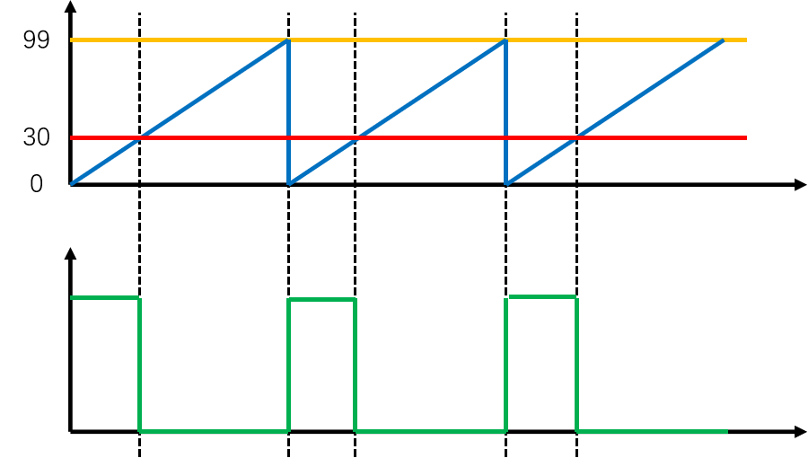

- PWM频率：	Freq = CK_PSC / (PSC + 1) / (ARR + 1)
- PWM占空比：	Duty = CCR / (ARR + 1)
- PWM分辨率：	Reso = 1 / (ARR + 1)

### 3.4.4 PWM呼吸灯代码实例

第一步： RCC开启时钟 ，把我们要用的TIM外设的时钟打开
```c
RCC_APB1PeriphClockCmd(RCC_APB1Periph_TIM2, ENABLE);
```

第二步： 配置时基单元，包括时钟源选择

```c
// 初始化时基单元
TIM_InternalClockConfig(TIM2);  // 内部时钟
TIM_TimeBaseInitTypeDef TIM_TimeBaseInitStrcture;
TIM_TimeBaseInitStrcture.TIM_ClockDivision = TIM_CKD_DIV1; // 指定时钟分频 我们选择1分配 即不分频
TIM_TimeBaseInitStrcture.TIM_CounterMode = TIM_CounterMode_Up; // 选择计数模式，这里我们选择向上计数
TIM_TimeBaseInitStrcture.TIM_Period = 10000 -1; // ARR 周期 这个和下面这行决定计时的时间
// 在这里相当于对72MHZ进行7200分频--> 10HZ 计10000个数就是1s
TIM_TimeBaseInitStrcture.TIM_Prescaler = 7200 -1; // PSC 预分频器
TIM_TimeBaseInitStrcture.TIM_RepetitionCounter = 0; // 重复计数器的值 高级计数器才有，但是我们这里用不到直接给0
TIM_TimeBaseInit(TIM2, &TIM_TimeBaseInitStrcture);

// 使能TIM2
TIM_Cmd(TIM2, ENABLE);
```

**第三步**： 配置输出比较单元 RCC的值 输出比较模式 极性选择 输出使能
```c
/* 配置输出比较通道1，包括时钟源选择 */
TIM_OCInitTypeDef TIM_OCInitStrcture; // 这个结构体有很多都是高级定时器才用的，所以在这里我们没有初始化全部
/*  初始化TIM_OCInitStrcture，为什么要初始化？ 因为TIM_OCInitStrcture在这里是局部变量，
    没有初始化的成员的值是不确定的，当想把高级定时器当作通用定时器时就会一些奇怪
    的问题。
    所以TIM_OCStructInit用这个函数初始化我们在这里没有初始化的结构体成员
*/
TIM_OCStructInit(&TIM_OCInitStrcture);
TIM_OCInitStrcture.TIM_OCMode = TIM_OCMode_PWM1; // 设置输出比较模式 这里我们要PWM1模式 在输出比较模式中有
TIM_OCInitStrcture.TIM_OCNPolarity = TIM_OCPolarity_High; // 设置输出比较极性这里选择高电平有效
TIM_OCInitStrcture.TIM_OutputState = TIM_OutputState_Enable; // 设置输出使能这里设置使能
TIM_OCInitStrcture.TIM_Pulse = 50;// 设置CCR。 PSC ARR 这三个书决定PWM周期和占空比 50% 高电平占比时间50%
TIM_OC1Init(TIM2, &TIM_OCInitStrcture);
```
第四步 配置GPIO 把TIM2输出比较对应的GPIO口初始化为复用推挽输出的配置。[在引脚定义图中查看是哪个GPIO口](#sheet)

```c
RCC_APB2PeriphClockCmd(RCC_APB2Periph_GPIOA, ENABLE);
GPIO_InitTypeDef GPIO_InitStrctuer;
GPIO_InitStrctuer.GPIO_Mode = GPIO_Mode_AF_PP; // 复用推挽输出模式
GPIO_InitStrctuer.GPIO_Pin = GPIO_Pin_0; // 这是特定的pin口或者重映射 在引脚定义表可以查到
GPIO_InitStrctuer.GPIO_Speed = GPIO_Speed_50MHz;
GPIO_Init(GPIOA, &GPIO_InitStrctuer);
```

设置CCR寄存器的值，既更改占空比。
```c
void PWM_SetCompare1(uint16_t Compare)
{
    TIM_SetCompare1(TIM2, Compare); // 设置通道1 设置CCR寄存器的值，这里占空比要和ARR共同计算一下的
}
```

后续（可不看）——如果需要将TIM2的CH1引脚从PA0重映射到PA15引脚上，则需要AFIO，引脚不能随意重映射，需要查看手册，在这里第二行代码就把TIM2的CH1引脚从PA0重映射到PA15引脚上了。这部分代码挺危险，如果没设置好，stlink就可能下载不了程序了。
```c
RCC_APB1PeriphClockCmd(RCC_APB2Periph_AFIO, ENABLE);
GPIO_PinRemapConfig(GPIO_PartialRemap1_TIM2, ENABLE);
// PA15上电后默认复用为了调试端口JTDI，所以如果想让他作为普通的GPIO或者复用定时器的通道，还需要先关闭调试端口的复用。
GPIO_PinRemapConfig(GPIO_Remap_SWJ_JTAGDisable, ENABLE);
```
完整代码

```c
#include "stm32f10x.h" // Device header
void PWM_Init(void)
{
// 根据PWM基本结构体可知步骤如下
/*
第一步 RCC开启时钟 ，把我们要用的TIM外设和GPIO外设的时钟打开
第二部 配置时基单元，包括时钟源选择
第三步 配置输出比较单元 RCC的值 输出比较模式 极性选择 输出使能
第四步 配置GPIO 把PWM对应的GPIO口初始化为复用推挽输出的配置
*/
/* ！！！ 配置GPIO，那么PWM TIM2的输出比较通道（OC1） 对应那个GPIO口呢？在引脚
定义表中有 */
RCC_APB2PeriphClockCmd(RCC_APB2Periph_GPIOA, ENABLE);
// 开启AFIO时钟
RCC_APB2PeriphClockCmd(RCC_APB2Periph_AFIO, ENABLE);
// 还有EXIT和NVIC两个外设，这两个外设的时钟是一直开启的，所以不需要我们在开启时
钟
// NVIC是内核外设，所有内核外设都不需要开启时钟
/* 配置GPIO */
GPIO_InitTypeDef GPIO_InitStrctuer;
GPIO_InitStrctuer.GPIO_Mode = GPIO_Mode_AF_PP; // 复用推挽输出模式
GPIO_InitStrctuer.GPIO_Pin = GPIO_Pin_0; // 这是特定的pin口或者重映射 在引脚定义表可以查到
GPIO_InitStrctuer.GPIO_Speed = GPIO_Speed_50MHz;
GPIO_Init(GPIOB, &GPIO_InitStrctuer);
// 初始化TIM2 也即是通用定时器 TIM2挂载在APB1总线上
/* 第一步 开启APB1时钟 */
RCC_APB1PeriphClockCmd(RCC_APB1Periph_TIM2, ENABLE);
/* 第二部选择时基单元时钟 */
// 这样配置TIM2的时基单元由内部时钟驱动
// 这行代码也可不写，因为定时器上电后默认使用内部时钟
TIM_InternalClockConfig(TIM2);
/* 第三步配置时基单元 */
TIM_TimeBaseInitTypeDef TIM_TimeBaseInitStrcture;
TIM_TimeBaseInitStrcture.TIM_ClockDivision = TIM_CKD_DIV1; // 指定时钟分频 我们选择1分配 即不分频
TIM_TimeBaseInitStrcture.TIM_CounterMode = TIM_CounterMode_Up; // 选择计数模式，这里我们选择向上计数
TIM_TimeBaseInitStrcture.TIM_Period = 10000 -1; // ARR 周期 这个和下面这行决定计时的时间
// 在这里相当于对72MHZ进行7200分频--> 10HZ 计10000个数就是1s
TIM_TimeBaseInitStrcture.TIM_Prescaler = 7200 -1; // PSC 预分频器
TIM_TimeBaseInitStrcture.TIM_RepetitionCounter = 0; // 重复计数器的值 高级计数器才有，但是我们这里用不到直接给0
TIM_TimeBaseInit(TIM2, &TIM_TimeBaseInitStrcture);
/* 配置输出比较通道1，包括时钟源选择 */
TIM_OCInitTypeDef TIM_OCInitStrcture; // 这个结构体有很多都是高级定时器才用的，所以在这里我们没有初始化全部
/* 初始化TIM_OCInitStrcture，为什么要初始化？ 因为TIM_OCInitStrcture在这里时局
部变量，
没有初始化的成员的值是不确定的，当想把高级定时器当作通用定时器时就会一些奇怪
的问题。
所以TIM_OCStructInit用这个函数初始化我们在这里没有初始化的结构体成员
*/
TIM_OCStructInit(&TIM_OCInitStrcture);
TIM_OCInitStrcture.TIM_OCMode = TIM_OCMode_PWM1; // 设置输出比较模式 这里我们要PWM1模式 在输出比较模式图中有
TIM_OCInitStrcture.TIM_OCNPolarity = TIM_OCPolarity_High; // 设置输出比较极性这里选择高电平有效
TIM_OCInitStrcture.TIM_OutputState = TIM_OutputState_Enable; // 设置输出使能这里设置使能
TIM_OCInitStrcture.TIM_Pulse = 50;// 设置CCR PSC ARR 这三个书决定PWM周期和占空比 50% 高电平占比时间50%
TIM_OC1Init(TIM2, &TIM_OCInitStrcture);
// 启动定时器
TIM_Cmd(TIM2, ENABLE);
}
void PWM_SetCompare1(uint16_t Compare)
{
    TIM_SetCompare1(TIM2, Compare); // 设置通道1 设置CCR寄存器的值，这里占空比要和ARR共同计算一下的
}

// main.c
#include "stm32f10x.h" // Device header
#include "Delay.h"
#include "OLED.h"
#include "count.h"
#include "timer.h"
#include "pwm.h"
uint16_t i=0;
int main(void)
{
    /*模块初始化*/
    OLED_Init(); //OLED初始化
    PWM_Init();
    while (1)
    {
        for(i=0;i<=100;i++)
        {
            PWM_SetCompare1(i); // 不断的更改占空比 实现呼吸
        }
    }
}
```

## 3.5 TIM输入捕获

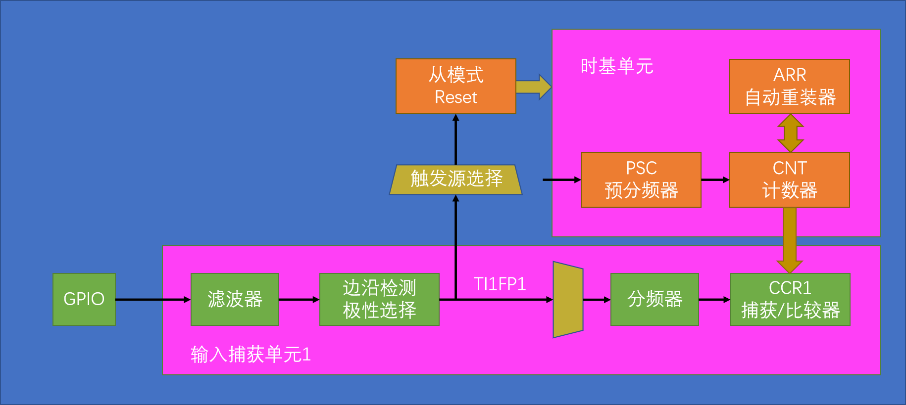

> 在这一章节，我们借用上一小节的代码。先用PWM模块，在PA0端口输出一个频率和占空比可调的波形。然后本节的代码，测量波形的输入口是PA6。目前这个程序还只能测量频率，还不能测量占空比。如果想同时测量占空比和频率，STM32的输入捕获还设计了PWMI模式，既PWM输入模式。


- IC（Input Capture）输入捕获
- 输入捕获模式下，当通道输入引脚出现指定电平跳变时（上升沿或下降沿，通过程序配置），就把当前CNT的值将被锁存（把当前CNT的值读出来，写入到CCR）到CCR中，可用于测量PWM波形的频率、占空比、脉冲间隔、电平持续时间等参数
- 每个高级定时器和通用定时器都拥有4个输入捕获通道
- 可配置为PWMI模式，同时测量频率和占空比
- 可配合主从触发模式，实现硬件全自动测量

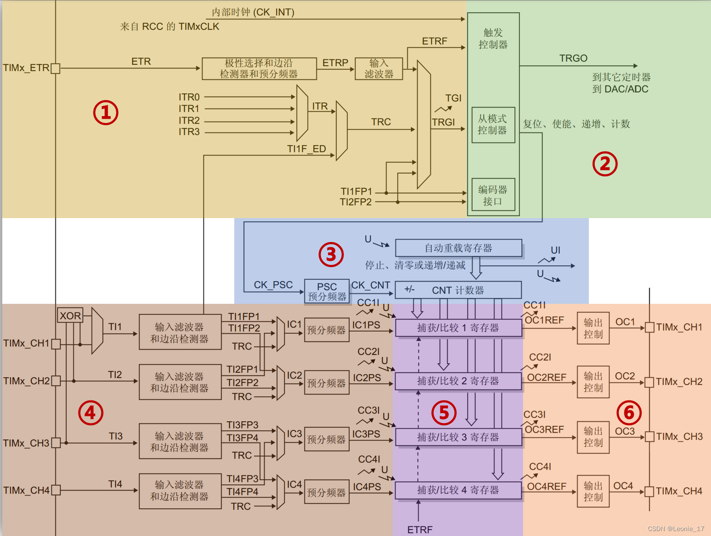

输入捕获对应上图种电路 4 和电路 5 。它的右边（电路5+电路6）是输出比较部分，4个输入捕获和4个输出比较通道，共用4个CCR寄存器。另外它们的TIMx_CHx引脚也是共用的。对于同一个定时器，只能使用输入捕获或者输出比较，两者不可同时使用。

在电路4这里，TI1前的XOR（异或门）是为了三相无刷电机设置的

### 3.5.1 频率测量知识
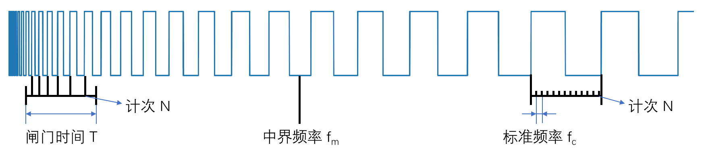

- 测频法：在闸门时间T内，对上升沿计次，得到N，则频率f_x=N / T
- 测周法：两个上升沿内，以标准频率fc计次时钟，得到N ，则频率f_x=f_c / N
- 中界频率：测频法与测周法误差相等的频率点f_m=√f_c / T 【把测频法和测周法的N提出来就得到了这个公式】

对于stm32而言，它只能测量数字信号，如果要测量正弦波信号，那还需要搭建一个信号预处理电路。总之，经过处理之后，最终输入给stm32的信号要是上图中的高低电平信号，高电平3.3V，低电平0V。

#### 频测法

测频法适合测量高频信号，因为在一定时间内，计数次数多一些，有助于减小误差，比如当频率特别低的时候甚至1s内没有一个上升沿，这不能认为频率为0。同时如果频率高，也可能会导致CNT（最大值65535）溢出。

在一定的事件T（这个时间通常设置为1s）内，在1s内，从0开始对上升沿（下降沿也可）计次每来一个上升沿+1得到N。没来一个上升沿，其实就是来了一个周期的信号。那么频率就是取平均值f_x=N / T。


#### 测周法

测周法适合测量低频信号，因为如果待测频率很高，那在一个周期内，定时器计数时钟次数（定时时间）很少，只能计一个数，待测信号频率再高一些，甚至一个数也计不到，这也不能认为频率无穷大。

测周法的基本原理是：周期的倒数就是频率。

我们捕获信号的两个上升沿，然后测量一下这之间持续的时间。但实际上，我们没有一个精度无穷大的秒表测量时间

#### 中界频率

那么什么算高频什么算低频？—— 中界频率

当待测频率大于 中界频率 选择测频法。当待测频率小于 中界频率 选择测周法

### 3.5.2 这个电路如何实现测周法（输入捕获电路详解）

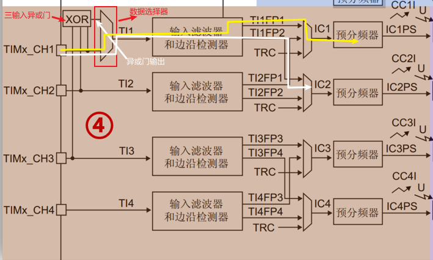

在上图中，从左至右，最左边，是四个通道的引脚参考[引脚定义表](#sheet)，就能知道这个引脚复用到了那个位置。

接着过来后有一个三输入的异或门，三个输入分别接到了通道1,2,3的端口。异或门执行的逻辑是：当三个引脚的任何一个有电平反转时，它的输出引脚就产生一次翻转，之后通过数据选择器，到达输入捕获通道1。如果选择的时异或门的输出，那么输入捕获通道1的输入就是三个引脚的异或值。如果选择的是下面的通道1输入，既异或门没有用，4个通道各用各的引脚。

异或门还是为了三项无刷电机设计的

接着后面的（以通道1为例）【输入滤波器和边沿检测器】 ，这就和外部中断的一样了，可以选择高电平或者低电平触发，当出现指定的电平时，边沿检测电路就会触发后续的电路执行动作。另外在这里，其实设计了两套滤波和边沿检测电路。第一套电路（黄色线），经过滤波和极性选择得到TI1FP1(TI1 Filter Polarity 1) ，输入给通道1后续的电路。第二套电路，经过另一个滤波和极性选择得到TI1FP2(TI1 Filter Polarity 2)，输入给下面通道2后续的电路（白色线）。同理，通道2的信号TI2进来大致也是这样的流程，只不过 TI2FP1(TI2 Filter Polarity 1) 是输入到了通道1的部分。下面的通道3、4也是这样的结构。

<a id='ti1fp1'></a>
在通道1和通道2进来的信号进来，可以各走各的，也可以选择交叉，让CH2引脚输入给通道1，或者CH1的引脚输入给通道2。为什么要有这样一个设计呢：
- 可以灵活切换后续输入捕获电路的输入
- 可以把一个引脚的输入，同时映射到两个捕获单元，这也是PWMI模式的经典结构
- 也可以把两个引脚的输入映射到一个输入捕获单元。

为什么是PWMI的经典模式呢？<font color='red'>因为PWMI是同时测量频率个占空比的。对于测量频率而言（针对测频法），只需要在一定时间内获取到引脚跳变的次数（CCR寄存器的值）将两者相除可得到频率，但是占空比呢？我们不得而知。当然可以使用两个定时器的输入捕获通道（这两个通道不能一样，因为所有定时器的相同通道共用一个引脚）一个上升沿有效用于测量频率，另一个下降沿有效测量占空比，但是这样很耗费资源不是吗。所以就可以把一个引脚的输入，同时映射到两个捕获单元，对于通道1来说，具体情况可以是通道1的CCR寄存器保存上升沿的跳变次数，通道2的CCR寄存器保存下降沿的跳变次数。这样就是实现了同时测量频率和占空比。当然获取CCR寄存器的值后需要清0，可以自动清0（需要主从触发模式），可以手动清0</font> 结合[PWMI章节学习](#354-pwmi模式)

再接着往后，**输入信号经过【滤波和极性选择】后，就来到了预分频器（每个通道各有一个），可以对输入的信号进行分频，分频之后的信号们就可以触发捕获电路工作了，每来一个触发信号，CNT的值，就会向CCR转运一次，转运的同时，会发生一个捕获事件，这个事件会在状态寄存器的标志位，同时也可以产生中断，如果需要在捕获的瞬间，处理一些事情，就可以开启这个捕获中断。每捕获CNT的值都要把CNT清0（手动或者自动），以便于下一次捕获。**

#### 详细的输入捕获电路

.png)

这个图就是上一节电路的细化结构（通道1部分）。图中的TIMx_CCMR1寄存器里的ICF位可以控制滤波器的参数（滤波器具体怎么工作的参考手册）。经过滤波之后的信号，通过边沿检测器，捕获上升沿或者下降沿，用TIMx_CCER寄存器里的CC1P位，就可以极性选择了。最终得到TI1FP1，通过数据选择器进入通道1后续的捕获电路。其实在红色框下面应该还有一套一样的电路，得到TI1FP2触发信号，连通到通道2的后续电路。 

### 3.5.3 主从触发模式（主模式、从模式）通用定时器和高级定时器才有的

在上面我们提到过每捕获CNT的值都要把CNT清0，以便于下一次捕获，那么在这里就可以用电路实现自动清0，怎么实现呢？

.png)

在上图中的TI1FP1信号和TI1F_ED的边沿信号，都能通向从模式控制器。从模式里面，就有电路，可以自动完成清0，所以从模式就是完成自动化操作的利器。

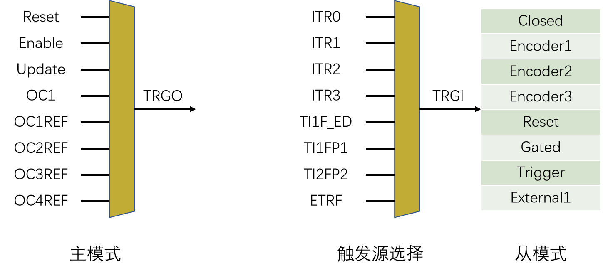

主从触发模式就是主模式、从模式、触发源三个功能的简称。

- 主模式可以将定时器内部的信号，[映射到TRGO引脚](#32-通用定时器-tim2345)，用于触发别的外设，所以这部分叫主模式。

- 从模式就是接受其他外设或自身外设的一些信号，用于控制自身定时器的运行，也就是被别的信号控制
  - 触发源选择就是选择从模式的触发信号源的，可以看成是从模式的一部分 。触发源选择，选择一个指定信号，得到[TRGI](#32-通用定时器-tim2345) ，TRGI去触发从模式，从模式可以在列表里选则一项操作。
  - 如果想完成自动清0的操作，想让TI1FP1信号自动触发CNT清0，那么<font color='yellow'>触发源选择</font>，就可以选中这里的TI1FP1，从模式执行的操作，就可以选择执行Reset操作，这样就实现了自动清 0 CNT
- 有【关主模式和触发源选择】的信号的具体解释，需要参考手册
  

在代码中，这三块东西，对应三个库函数

### 3.5.4 PWMI模式

先看[输入捕获基本结构](#35-tim输入捕获)。在这里我们只使用了一个通道TI1FP1，所以它目前只能测量频率。在图中的从模式触发源选择，在[主从模式图中](#353-主从触发模式主模式从模式通用定时器和高级定时器才有的)可以看到触发源选择只有TI1FP1和TI2FP2，没有TI3和TI4的信号。所以想实现自动清 0 CNT，就只能用通道1和通道2。对于通道3和通道4，就只能开启捕获中断，在中断里手动清0，但是比较消耗软件资源。

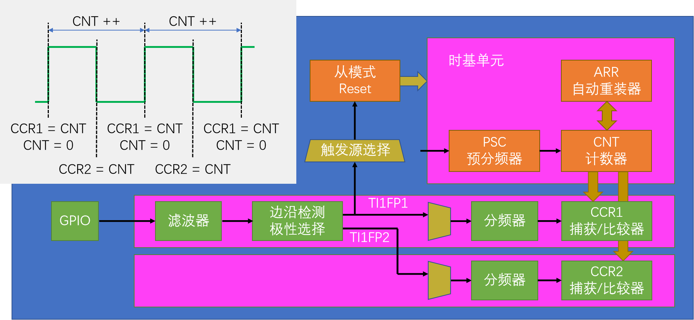

把之前的东西结合起来，得到上图。这个PWMI模式，使用了两个通道同时捕获一个引脚，可以同时测量周期和占空比。这个图就是比[输入捕获基本结构](#35-tim输入捕获)多了下面方块内的电路。


### 3.5.4 输入捕获代码实例

频率测量代码，我们借用上一小节的代码。先用PWM模块，在PA0端口输出一个频率和占空比可调的波形。然后本节的代码，测量波形的输入口是PA6。目前这个程序还只能测量频率，还不能测量占空比。


#### 测量频率代码实例

[初始化TIM2的通道1，产生一个PWM波形，输出引脚是PA0](#344-pwm呼吸灯代码实例)

下面的代码呢，PWM的频率，是在初始化时写好了的，是固定的，运行的时候调节不方便，所以我们在最后加一个函数，用来便捷的调节PWM频率。通过公式$PWM频率 = 72M/(PSC+1)/(ARR+1)$ 可得ARR和PSC都可以调节PWM频率，但是$占空比 = CCR/(ARR+1)$ ,所以通过ARR调节频率，还同时会影响到占空比，而通过PSC调节频率，不会影响占空比，显然比较方便。

所以我们计划是，固定ARR为$100-1$,通过调节PSC来改变PWM频率。<font color='yellow'>另外$ARR=100-1$，CCR的数值就是占空比</font>用起来比较直观。代码如下：

:?: 
> 第三个ReloadMode，就是重装模式，参数解释是：指定定时器预分频器的重装模式。第一个模式：Update，预分频器在更新事件重装、第二个模式：Immediate 立即重装。这里还是影子寄存器的问题
- Update：立刻生效可能会在值改变时产生切断波形的现象。比如PWM周期刚过去一般，立刻生效了，那就立刻切断波形，开始一个新的周期
- 
- Immediate：更新事件生效，就是会有一个缓存器，延迟参数的写入时间（在预分频器产生上升沿或者下降沿后在更新，至于是上升沿还是下降沿则由代码控制）

```c
void PWM_SetPrescaler(uint16_t Prescaler )
{
    TIM_PrescalerConfig(TIM2, Prescaler, TIM_PSCReloadMode_Immediate);
}
```
##### PWM完整代码如下
```c
#include "stm32f10x.h" // Device header
void PWM_Init(void)
{
    RCC_APB2PeriphClockCmd(RCC_APB2Periph_GPIOA, ENABLE);
    RCC_APB2PeriphClockCmd(RCC_APB2Periph_AFIO, ENABLE);

    GPIO_InitTypeDef GPIO_InitStrctuer;
    GPIO_InitStrctuer.GPIO_Mode = GPIO_Mode_AF_PP; // 复用推挽输出模式
    GPIO_InitStrctuer.GPIO_Pin = GPIO_Pin_0; // 这是特定的pin口或者重映射 在引脚定义表可以查到
    GPIO_InitStrctuer.GPIO_Speed = GPIO_Speed_50MHz;
    GPIO_Init(GPIOB, &GPIO_InitStrctuer);

    RCC_APB1PeriphClockCmd(RCC_APB1Periph_TIM2, ENABLE);

    // 这行代码也可不写，因为定时器上电后默认使用内部时钟
    TIM_InternalClockConfig(TIM2);
    /* 第三步配置时基单元 */
    TIM_TimeBaseInitTypeDef TIM_TimeBaseInitStrcture;
    TIM_TimeBaseInitStrcture.TIM_ClockDivision = TIM_CKD_DIV1; 
    TIM_TimeBaseInitStrcture.TIM_CounterMode = TIM_CounterMode_Up; 
    TIM_TimeBaseInitStrcture.TIM_Period = 100 -1; // ARR
    TIM_TimeBaseInitStrcture.TIM_Prescaler = 720 -1;  // PSC
    TIM_TimeBaseInitStrcture.TIM_RepetitionCounter = 0; 
    TIM_TimeBaseInit(TIM2, &TIM_TimeBaseInitStrcture);

    TIM_OCInitTypeDef TIM_OCInitStrcture;
    TIM_OCStructInit(&TIM_OCInitStrcture);
    TIM_OCInitStrcture.TIM_OCMode = TIM_OCMode_PWM1;
    TIM_OCInitStrcture.TIM_OCNPolarity = TIM_OCPolarity_High;
    TIM_OCInitStrcture.TIM_OutputState = TIM_OutputState_Enable; 
    TIM_OCInitStrcture.TIM_Pulse = 50;
    TIM_OC1Init(TIM2, &TIM_OCInitStrcture);

    TIM_Cmd(TIM2, ENABLE);
}
// 调节CCR1寄存器的值，控制PWM占空比
void PWM_SetCompare1(uint16_t Compare)
{
    TIM_SetCompare1(TIM2, Compare); 
}
void PWM_SetPrescaler(uint16_t Prescaler )
{
    TIM_PrescalerConfig(TIM2, Prescaler, TIM_PSCReloadMode_Immediate);
}

// main.c
#include "stm32f10x.h" // Device header
#include "Delay.h"
#include "OLED.h"
#include "count.h"
#include "timer.h"
#include "pwm.h"
uint16_t i=0;
int main(void)
{
    /*模块初始化*/
    OLED_Init(); //OLED初始化
    PWM_Init();
    PWM_SetPrescaler(720 - 1); // Freq = 72M / (PSC + 1) / 100
    PWM_SetCompare1(50);       // Duty = CCR / 100
    while (1)
    {
        for(i=0;i<=100;i++)
        {
            PWM_SetCompare1(i); // 不断的更改占空比 实现呼吸
        }
    }
}
```

##### 输入捕获代码部分
第一步，RCC开启时钟，把GPIO和TIM的时钟打开
```c
RCC_APB2PeriphClockCmd(RCC_APB2Periph_GPIOA, ENABLE);

RCC_APB2PeriphClockCmd(RCC_APB2Periph_TIM3, ENABLE);
```

第二步 GPIO初始化，把GPIO配置成输入模式 一般选择上拉输入或者浮空输入模式
```c
GPIO_InitTypeDef GPIO_InitStrctuer;
GPIO_InitStrctuer.GPIO_Mode = GPIO_Mode_IPU; // 上拉输入
// 因为我们初始化的是TIM3的通道1 对应PA6
GPIO_InitStrctuer.GPIO_Pin = GPIO_Pin_6; // 这只特定的pin口或者重映射 在引脚定义表可以查到
GPIO_InitStrctuer.GPIO_Speed = GPIO_Speed_50MHz;
GPIO_Init(GPIOA, &GPIO_InitStrctuer);
```

第三步，配置时基单元，让CNT计数器在内部时钟的驱动下自增运行
```c
// 这行代码也可不写，因为定时器上电后默认使用内部时钟
TIM_InternalClockConfig(TIM3);

TIM_TimeBaseInitTypeDef TIM_TimeBaseInitStrcture;
TIM_TimeBaseInitStrcture.TIM_ClockDivision = TIM_CKD_DIV1; 
TIM_TimeBaseInitStrcture.TIM_CounterMode = TIM_CounterMode_Up;
// 设置PWM频率 最好设置的大一些设置最大防止溢出
TIM_TimeBaseInitStrcture.TIM_Period = 65536 -1; // ARR 周期 这个和下面这行决定计时的时间
TIM_TimeBaseInitStrcture.TIM_Prescaler = 72 -1; // PSC 预分频器 72m/PSC，就是计数器自增的频率 就是计数频率 这个值决定了测周法的标准频率fc
TIM_TimeBaseInitStrcture.TIM_RepetitionCounter = 0; // 重复计数器的值 高级计数器才有，但是我们这里用不到直接给0
TIM_TimeBaseInit(TIM3, &TIM_TimeBaseInitStrcture);
TIM_Cmd(TIM3, ENABLE);
```

第四步 配置输入捕获单元 包括滤波器、极性、直连通道还是交叉通道、分频器这些参数
```c
TIM_ICInitTypeDef TIM_InitStrcture;
// 因为我们初始化的是TIM3的通道1
TIM_InitStrcture.TIM_Channel = TIM_Channel_1; // 选择通道 在输入捕获电路的左边TIMx_CHx

TIM_InitStrcture.TIM_ICFilter = 0xF; // 这个数值对应的采样频率和采样次数 在参考手册里 滤波器 如果信号有毛刺和噪声 就可以增大滤波器的次数，可以有效避免干扰

TIM_InitStrcture.TIM_ICPolarity = TIM_ICPolarity_Rising; // 选择上升沿触发还是下降沿触发

TIM_InitStrcture.TIM_ICPrescaler = TIM_ICPSC_DIV1; // 触发信号分频器（输入捕获基本结构图） 不分频就是每次触发都有效，2分频就是每个一次有效一次。

TIM_InitStrcture.TIM_ICSelection = TIM_ICSelection_DirectTI; // 选择触发信号从哪个引脚输入 配置数据选择器的 选择直连通道还是交叉通道
TIM_ICInit(TIM3, &TIM_InitStrcture);
```

第五步 选择从模式的触发源 选择为 TI1FP1
```c
// 这个参数在从触发模式图理解
TIM_SelectInputTrigger(TIM3, TIM_TS_TI1FP1); // 触发源选择 (搭配TIM_SlaveMode_Reset 选择从模式使用)

```
第六步选择触发之后执行的操作，执行RESet操作----从模式
```c
// 这里第二个参数对应从触发模式图 的从模式那一列的最后四个
TIM_SelectSlaveMode(TIM3, TIM_SlaveMode_Reset); // 输入捕获框图 选择从模式 自动清理CNT，以便于下一次捕获
```

获取频率函数代码
```c
uint32_t IC_GetFreq(void)
{
    // fx=fc/N TIM_GetCapture1 就是读取的N值(CCR寄存器) fc = 72m/PSC+1
    return 1000000 / (TIM_GetCapture1(TIM3)+1);
}
```

main.c代码

```c
#include "stm32f10x.h" // Device header
#include "Delay.h"
#include "OLED.h"
#include "pwm.h"
#include "ic.h"
uint16_t i=0;
uint16_t Num;
int main(void)
{
    /*模块初始化*/
    OLED_Init(); //OLED初始化
    PWM_Init();
    IC_Init();
    OLED_ShowString(1, 1, "Freq:00000Hz");
    PWM_SetPrescaler(720 - 1); // Freq = 72m / (PSC + 1) / 100 频率
    PWM_SetCompare1(50); // Duty = CCR / 100 占空比
    while (1)
    {
        OLED_ShowNum(1, 6, IC_GetFreq(), 5);
    }
}
```

#### 测量频率和占空比代码实例

[前置知识](#ti1fp1)

第一步，RCC开启时钟，把GPIO和TIM的时钟打开
```c
RCC_APB2PeriphClockCmd(RCC_APB2Periph_GPIOA, ENABLE);

RCC_APB2PeriphClockCmd(RCC_APB2Periph_TIM3, ENABLE);
```

第二步 GPIO初始化，把GPIO配置成输入模式 一般选择上拉输入或者浮空输入模式
```c
GPIO_InitTypeDef GPIO_InitStrctuer;
GPIO_InitStrctuer.GPIO_Mode = GPIO_Mode_IPU; // 上拉输入
// 因为我们初始化的是TIM3的通道1 对应PA6
GPIO_InitStrctuer.GPIO_Pin = GPIO_Pin_6; // 这只特定的pin口或者重映射 在引脚定
义表可以查到
GPIO_InitStrctuer.GPIO_Speed = GPIO_Speed_50MHz;
GPIO_Init(GPIOA, &GPIO_InitStrctuer);
```

第三步，配置时基单元，让CNT计数器在内部时钟的驱动下自增运行
```c
// 这行代码也可不写，因为定时器上电后默认使用内部时钟
TIM_InternalClockConfig(TIM3);

TIM_TimeBaseInitTypeDef TIM_TimeBaseInitStrcture;
TIM_TimeBaseInitStrcture.TIM_ClockDivision = TIM_CKD_DIV1; 
TIM_TimeBaseInitStrcture.TIM_CounterMode = TIM_CounterMode_Up;
// 设置PWM频率 最好设置的大一些设置最大防止溢出
TIM_TimeBaseInitStrcture.TIM_Period = 65536 -1; // ARR 周期 这个和下面这行决定计时的时间
TIM_TimeBaseInitStrcture.TIM_Prescaler = 72 -1; // PSC 预分频器 72m/PSC，就是计数器自增的频率 就是计数频率 这个值决定了测周法的标准频率fc
TIM_TimeBaseInitStrcture.TIM_RepetitionCounter = 0; // 重复计数器的值 高级计数器才有，但是我们这里用不到直接给0
TIM_TimeBaseInit(TIM3, &TIM_TimeBaseInitStrcture);
TIM_Cmd(TIM3, ENABLE);
```

第四步 配置输入捕获单元 包括滤波器、极性、直连通道还是交叉通道、分频器这些参数
```c
TIM_ICInitTypeDef TIM_InitStrcture;
// 因为我们初始化的是TIM3的通道1
TIM_InitStrcture.TIM_Channel = TIM_Channel_1; // 选择通道 在输入捕获电路的左边TIMx_CHx

TIM_InitStrcture.TIM_ICFilter = 0xF; // 这个数值对应的采样频率和采样次数 在参考手册里 滤波器 如果信号有毛刺和噪声 就可以增大滤波器的次数，可以有效避免干扰

TIM_InitStrcture.TIM_ICPolarity = TIM_ICPolarity_Rising; // 选择上升沿触发还是下降沿触发

TIM_InitStrcture.TIM_ICPrescaler = TIM_ICPSC_DIV1; // 触发信号分频器（输入捕获基本结构图） 不分频就是每次触发都有效，2分频就是每个一次有效一次。

TIM_InitStrcture.TIM_ICSelection = TIM_ICSelection_DirectTI; // 选择触发信号从哪个引脚输入 配置数据选择器的 选择直连通道还是交叉通道  这里我们选择直连
TIM_ICInit(TIM3, &TIM_InitStrcture);
```

相较上一节多的代码
```c
TIM_InitStrcture.TIM_Channel = TIM_Channel_2; 
TIM_InitStrcture.TIM_ICFilter = 0xF; 
TIM_InitStrcture.TIM_ICPolarity = TIM_ICPolarity_Falling;  // 下降沿触发
TIM_InitStrcture.TIM_ICPrescaler = TIM_ICPSC_DIV1; 
TIM_InitStrcture.TIM_ICSelection = TIM_ICSelection_IndirectTI; // 选择交叉输入
TIM_ICInit(TIM3, &TIM_InitStrcture);

// 上面的代码已经可以实现效果了，但是ST公司怕我们麻烦，所以下面这行代码就可以替换上面的一大串代码了
// 我们只需要初始化TIM_ICInitTypeDef一个通道的参数就可以了（第四步就是初始化了一个通道），在函数了，会自动把剩下的一个通道初始化成相反的配置
TIM_PWMIConfig(TIM3, &TIM_InitStrcture)
```

第五步 选择从模式的触发源 选择为 TI1FP1
```c
// 这个参数在从触发模式图理解
TIM_SelectInputTrigger(TIM3, TIM_TS_TI1FP1); // 触发源选择 (搭配TIM_SlaveMode_Reset 选择从模式使用)

```
第六步选择触发之后执行的操作，执行RESet操作----从模式
```c
// 这里第二个参数对应从触发模式图 的从模式那一列的最后四个
TIM_SelectSlaveMode(TIM3, TIM_SlaveMode_Reset); // 输入捕获框图 选择从模式
```

获取频率函数代码
```c
uint32_t IC_GetFreq(void)
{
    // fx=fc/N TIM_GetCapture1 就是读取的N值(CCR寄存器) fc = 72m/PSC+1
    return 1000000 / (TIM_GetCapture1(TIM3)+1);
}
```

相较上一节多的代码，获取占空比
```c
uint32_t IC_GetDuty(void)
{
    return (TIM_GetCapture2(TIM3) + 1)* 100 / TIM_GetCapture1(TIM3)
}
```

main.c代码

```c
#include "stm32f10x.h" // Device header
#include "Delay.h"
#include "OLED.h"
#include "pwm.h"
#include "ic.h"
uint16_t i=0;
uint16_t Num;
int main(void)
{
    /*模块初始化*/
    OLED_Init(); //OLED初始化
    PWM_Init();
    IC_Init();
    OLED_ShowString(1, 1, "Freq:00000Hz");
    OLED_ShowString(2, 1, "DUTY:00%");
    PWM_SetPrescaler(720 - 1); // Freq = 72m / (PSC + 1) / 100 频率
    PWM_SetCompare1(50); // Duty = CCR / 100 占空比
    while (1)
    {
        OLED_ShowNum(1, 6, IC_GetFreq(), 5);
        OLED_ShowNum(2, 6, IC_GetDuty(), 2);
    }
}
```

### 3.3.5 编码器接口

这里先留个坑，先把后面的写完再回来

# 4. ADC模数转换器

- ADC（Analog-Digital Converter）模拟-数字转换器
- ADC可以将引脚上连续变化的模拟电压转换为内存中存储的数字变量，建立模拟电路到数字电路的桥梁
- 12位逐次逼近型ADC（12位AD值，它的表示范围就是$0~2^{12}-1$ 既0~4095），1us转换时间（转换频率就是1MHz）
- 输入电压范围：0~3.3V，转换结果范围：0~4095
- 18个输入通道，可测量16个外部（就是16个GPIO口，在引进上直接接模拟信号就行了，不需要任何额外电路，引脚就能直接测电压）和2个内部信号源（是内部温度传感器和内部参考电压，内部参考电压是一个1.2V左右的基准电压，不随外部供电电压变化而变化）。如果芯片的供电不是标准的3.3V ，那测量外部引脚的电压就可能不对，这是读取基准电压进行校准，这样就能得到正确的电压值了
- 规则组和注入组两个转换单元
- <a id='id2'>模拟看门狗自动监测输入电压范围，这个ADC一般用于测量光线强度、温度这些值。经常会有个需求，比如光线高于某个阈值、低于某个阈值时执行某个操作</a>

STM32F103C8T6 ADC资源：ADC1、ADC2，10个外部输入通道，也就是最多只能测量10个外部引进的模拟信号

> DAC，数字模拟转换器，使用DAC就可以将数字变量转换为模拟电压。PWM也可以理解成DAC（暂时了解即可）

STM32主要是数字电路，数字电路只有高低电平，没有几V电压的概念，如果想要读取电压值，就需要借助ADC模数转换器了。ADC读取引脚上的模拟电压，转换为一个数据，存在寄存器里。

## 4.1 ADC0809逐次逼近型ADC

下图不是stm32的ADC内部结构图，是ADC0809的，stm32的ADC原理和这个是一样的

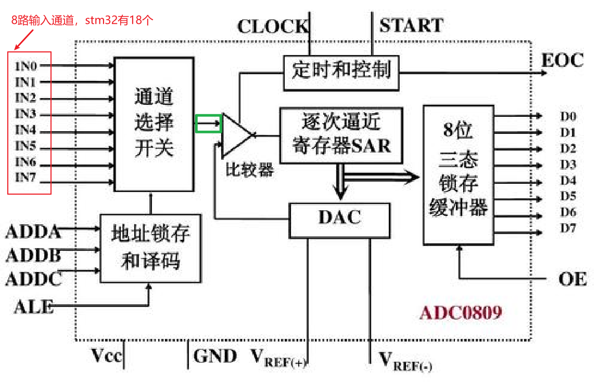

ADC0809它是一个 8 位逐次逼近型ADC芯片

- 输入信号选择
    - 在8路输入通道这里，通过通道选择开关，选中一路，输入到绿色框的地方进行转换。下面的【地址锁存和译码】，就是你想选中那个通道，就把通道信号放在ADDA、ADDB、ADDC这三个引脚上，然后给一个ALE（锁存信号），上面对应的通道选择开关就拨好了。

- 逐次逼近
    - 输入信号选择好以后，到绿色框哪里，怎么才能知道这个电压对应的编码数据是多少呢？这就需要我们用逐次逼近的方法来一一比较了。

    - 在旁边的电压比较器，它可以判断两个输入信号电压的大小关系，输出一个高低电平指示谁大谁小。它的两个输入端，一个是待测电压，另一个是DAC（给DAC一个数据，就可以输出数据对应的电压）的电压输出端。

    - 现在有了DAC的输出电压和待测电压，他俩同时输入到电压比较器，进行大小判断，如果DAC输出的电压比较大，那就调小DAC数据，反之增大DAC数据，直到DAC输出的电压和外部通道输入的电压近似相等，这就是DAC的实现原理。电压调节的过程就是【逐次逼近寄存器SAR】 完成的。为了最块找到未知的电压编码，通常我们会使用二分法进行寻找，比如这里是8位的ADC，那么编码就是0~255，第一次选择128比较然后就是二分查找的步骤。

<a id='id1'></a>

那么AD转换结束后，DAC的输入数据，就是待测电压的编码，通过【8位三态锁存缓冲器】进行输出，8位有8根线，12位就有12根线。然后上面的`START`是<font color='yellow'>开始转换</font>，给一个输入脉冲，开始转换，EOC，转换结束信号，`CLOCK`是ADC时钟，因为内部是一步一步进行判断的，所以需要时钟来推动这个过程。

- 参考电压
    - 最下面的`VREF+`和`VREF-`是DAC的参考电压。比如，给你一个数据，是对应5V还是3V呢？就由这个参考电压决定。这个DAC的参考电压也决定了ADC的输入范围，所以他也是ADC的参考电压。

    - 在旁边的`VCC` `GND` 是整个电路的供电，通常参考电压的正极和VCC是一样的，会接在一起。参考电压的负极和GND也是一样的，也接在一起。
    - 所以一般ADC的输入电压范围就和ADC的供电是一样的。

### 4.1.1 stm32的ADC

这个结构图还是很重要的，需要多花点时间看看


- ADC输入通道
    - 在左边的红色框内的ADC输入通道，包括16个GPIO口，IN0 ~ IN15，两个内部通道（内部温度传感器、VREFINT（V Reference Internal）内部参考电压）。
    - 一共是18个输入通道，然后到右边的矩形这里，这是一个【模拟多路开关】，可以选择我们想选择的通道。右边的【模拟至数字转换器】就是执行[我们刚讲解的逐次比较过程](#41-adc0809逐次逼近型adc)，转换结果就存在<a id='id3'>橙色框内的数据寄存器</a>里，我们读取寄存器就知道ADC转换的结果了。


- 在【模拟多路开关】这里，对于普通的ADC（不是上图的），多路开关一般都是只选中一个的，选择某一个通道，开始转换，等待转换完成，取出结果，这就是普通的ADC转换过程
- 但是在上图中的【模拟多路开关】是很高级的，它可以同时选中多个，而且在转换的时候，还分成了两个组，规则组和注入通道组
  - 规则组：一次性最多选中16个通道
  - 注入通道组：最多选中4个通道
- 但是这有什么用呢？比如你去餐厅点菜，普通ADC是，你指定一个菜，老板做好，然后端给你。
- 在stm32的ADC呢就是可以指定一个菜单，这个菜单最多可以填写16个菜（也可只写一个菜），然后把菜单给老板，老板按照菜单顺序一次做好给你，这样就大大提高了效率。对于这个菜单有两种
  - 规则组菜单：可以同时转换16个通道，但他只有一个数据寄存器，也就是一次只能保存一个通道的结果，如果上16个，那么前15个都会被挤掉，只能得到最后一个，所以使用这个的话，最好和[DMA](#5-dma)配合实现
  - 注入组：它相当于餐厅的VIP座位，在这个座位上，一次性最多点4个菜，并且有4个数据寄存器，可以同时上4个菜，也就是不用担心数据覆盖问题

一般情况下，用规则组就可以了，在配合DMA就能解决数据覆盖问题

#### 外围电路
- 开始转换信号
    - 左下角绿色框内的是[触发控制](#id1)的部分，对于STM32的ADC，开始转换信号有两种：1. 软件触发，既在程序中手动调用一条代码，就可以启动转换了。2. 另外一中是硬件触发，既在蓝色框内的信号是组入组的触发源，在黄色框内的是规则组触发源。
- 上面黑色框内的`VREF+、VREF-`是ADC的参考电压，决定了ADC输入电压的范围。`VSSA、VDDA`是ADC的供电引脚一般情况下要和参考电压引脚连起来，在这个芯片中已经连起来了（3.3V）。

【模拟至数字转换器】左边的ADCCLK是ADC的时钟。【来自ADC预分频器】这个预分频器是来源于RCC的。然后它上面的【DMA请求】是用于触发[DMA](#5-dma)进行数据转运的。

- [模拟看门狗](#id2)（紫色框内的）
  - 它里面可以存阈值高限和阈值低限，如果启动了看门狗，并指定了看门通道。那么看门狗就会关注它看门的通道，一单超过这个阈值，他就会申请模拟看门狗中断，最后通向NVIC

对于规则组而言，转换完成后会有一个EOC转换完成信号、JEOC是注入组完成信号。这两个信号会在状态寄存器里置一个标志位，读取标志位，就能知道转换有没有完成，这两个标志位也可到NVIC，申请中断

## 4.2 ADC基本结构

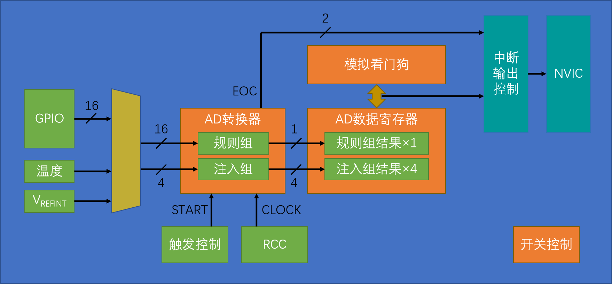

根据前面小结，看这个图，如果看不懂，就说明没搞懂。

### 4.2.1 ADC输入通道

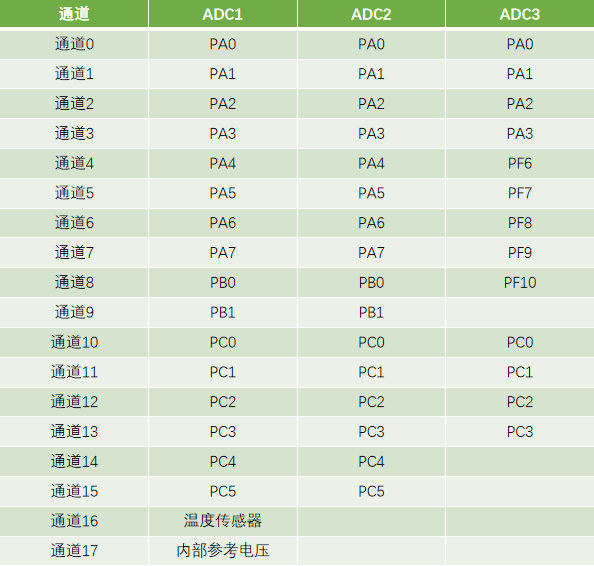

这个就是ADC通道和引脚复用的关系，也可通过[引脚定义图](#sheet)查看

### 4.2.2 转换模式

#### 单次转换，非扫描模式

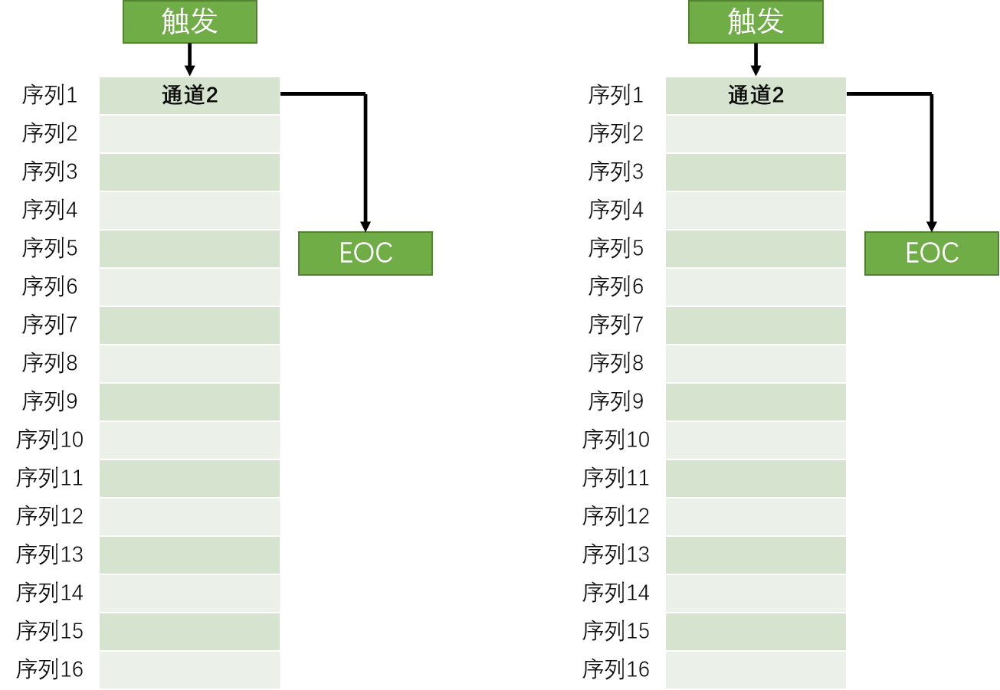

这个是最简单的。在左边呢是一个菜单（不看右边），最多点16个菜，在这里点菜就是写入转换的通道。

非扫描模式下，这个菜单就只有第一个序列1的位置有效，判断EOC是否转换完成，完成后在数据寄存器里读取结果。只转换一次


#### 连续转换，非扫描模式

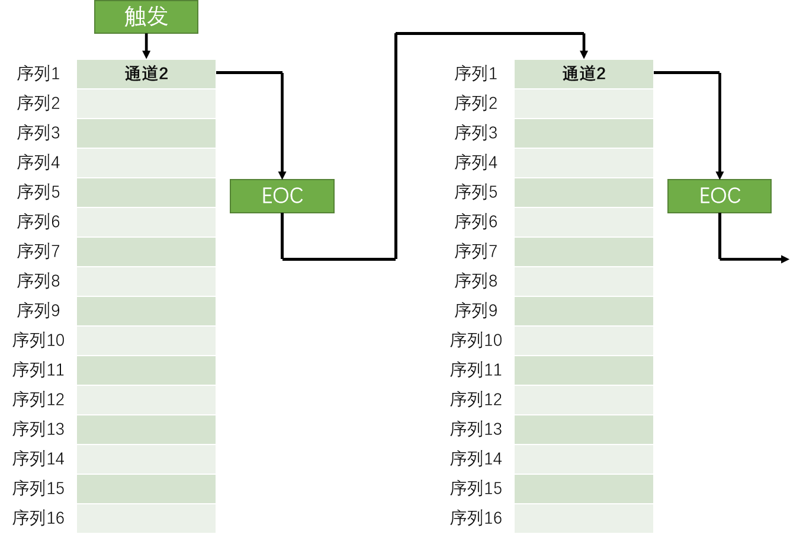

首先他是非扫描模式，也就是菜单列表只用第一个，它与上一个不同的是，它在一次转换结束后不会停止，而是立刻开始下一轮转换，然后一直持续下去。

这样只需要最开始触发一次，之后就可以一直转换了，好处就是不用if判断是否结束，节省开启转换的时间

#### 单次转换，扫描模式

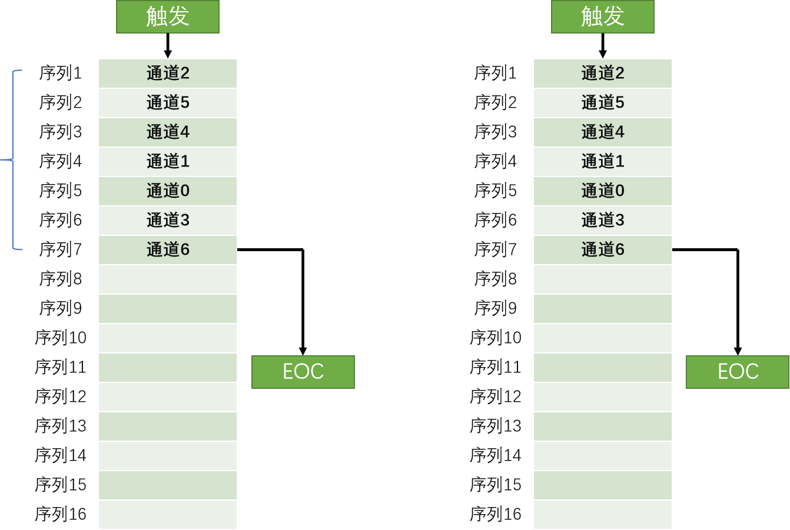

这个模式也是单次转换，所以每触发一次，转换结束后，就会停下来，下次转换就得再触发才能开始。

因为是扫描模式，这就会用的这个菜单了，可以在菜单里点菜，这里每个位置是通到几是可以任意指定的，并且可以重复

因为16个位置用不完，只用前几个，所以配置结构体里有个通道数目参数。

然后就是每次触发之后，他就依次对这前7个位置（对上图来说）进行AD转换，结果都存放在数据寄存器里，为了防止数据被覆盖，就需要DMA即使将数据挪走。7个通道转换完成后，产生EOC信号，转换结束。然后自动转换下一轮。

#### 连续转换，扫描模式

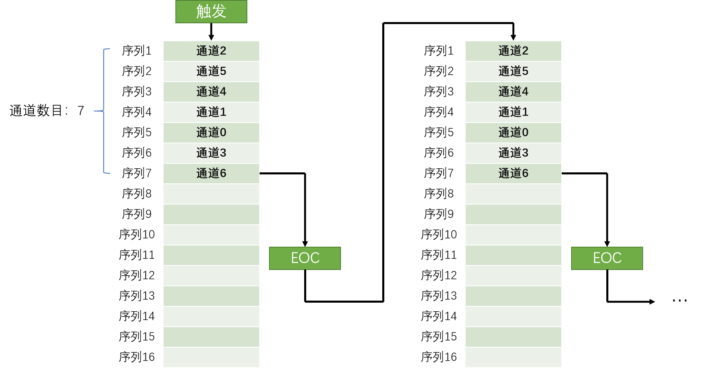

这个按照前几个的套路就明白了。

在扫描模式下，还有一种模式，叫间断模式，作用是:在扫描过程中，每隔几个转换，就暂停一次

### 4.2.3 触发控制

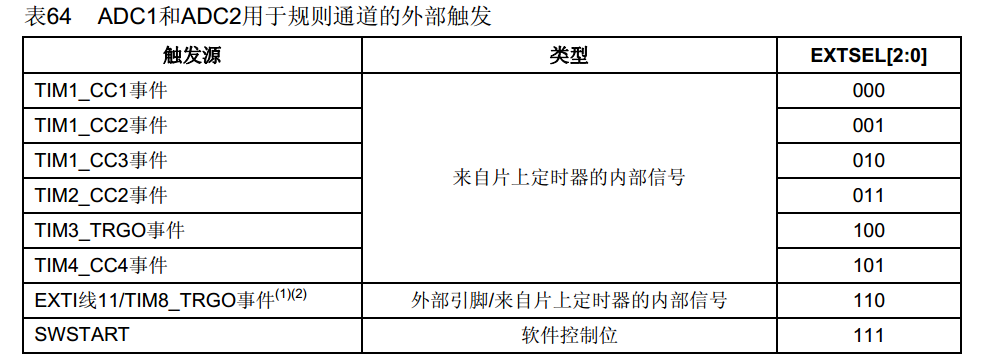

这个表就是规则组的[触发源](#外围电路)

## 4.3 数据对齐

stm32ADC是12位的，他的转换结果是一个12位的数据，但是[数据寄存器](#id3)是16位的,所以存在数据对齐问题。

- 数据右对齐：
  - 就是12位数据向右靠，16位的寄存器高四位补0
- 数据左对齐：
  - 就是12位数据向左靠，16位的寄存器低四位补0

## 4.4 转换时间

- AD转换的步骤：采样，保持，量化，编码。通常采样、保持放一起，量化、编码放一起两个过程。
    - 量化，编码    就是[ADC逐次比较的过程](#41-adc0809逐次逼近型adc)，这需要花一点时间，一般位数越多，时间越长
    - 采样，保持：因为AD转换（量化，编码），是需要一小段时间的，在这个时间里，输入的电压还在不断变化，这样就没法定位输入电压在哪里。所以在量化、编码之前，需要一个采样开关，打开开关收集外部电压，存好之后断开开关，在进行AD转换，在量化编码期间，电压始终保持不变
- STM32 ADC的总转换时间为：
	TCONV = 采样时间（采样，保持） + 12.5个ADC周期

  - 例如：当ADCCLK=14MHz，采样时间为1.5个ADC周期
	TCONV = 1.5 + 12.5 = 14个ADC周期 = 1μs

## 4.5 校准

这个过程是固定的，我们不需要理解

- ADC有一个内置自校准模式。校准可大幅减小因内部电容器组的变化而造成的准精度误差。校准期间，在每个电容器上都会计算出一个误差修正码(数字值)，这个码用于消除在随后的转换中每个电容器上产生的误差

- 建议在每次上电后执行一次校准

- 启动校准前， ADC必须处于关电状态超过至少两个ADC时钟周期

## 4.6 AD单通道代码实例

根据[ADC基本结构图](#42-adc基本结构)，从左至右可知，大致步骤为：

- 1. 开启RCC时钟，包括ADC和GPIO时钟，ADCCLK的分频器
- 2. 配置GPIO，把需要的GPIO配置成模拟输入模式
- 3. 配置多路开关（橙色矩形部分），把左边的通道接入到右边的规则组列表里
- 4. 配置ADC转换器，ADC是单次转换还是连续转换，扫描还是非扫描，有几个通道，触发源是什么，数据对齐是右对齐还是左对齐

1. 开启时钟
```c
RCC_APB2PeriphClockCmd(RCC_APB2Periph_ADC1, ENABLE);	//开启ADC1的时钟
RCC_APB2PeriphClockCmd(RCC_APB2Periph_GPIOA, ENABLE);	//开启GPIOA的时钟
```
设置ADC时钟

```c
RCC_ADCCLKConfig(RCC_PCLK2_Div6);	//选择时钟6分频，ADCCLK = 72MHz / 6 = 12MHz 最大14MHz
```
2. 配置GPIO
```c
GPIO_InitTypeDef GPIO_InitStructure;
GPIO_InitStructure.GPIO_Mode = GPIO_Mode_AIN; // AIN就是ADC的专属模式
GPIO_InitStructure.GPIO_Pin = GPIO_Pin_0;
GPIO_InitStructure.GPIO_Speed = GPIO_Speed_50MHz;
GPIO_Init(GPIOA, &GPIO_InitStructure);	//将PA0引脚初始化为模拟输入
```

3. 选中规则组的输入通道
```c

/*
参数：
    1. 那个ADC外设
    2. 那个通道 我们选则通道0
    3. 那个序列 在转换模式讲解的部分，在图中的”菜单“左侧的”序列“
        由于目前只有PA0（4.2.1 ADC输入通道）一个通道，使用的是非扫描模式，所以指定的通道就放在序列1的位置
    4. 采样时间，需要稳定的转换，就选择大参数
    
*/ 
ADC_RegularChannelConfig(ADC1, ADC_Channel_0, 1, ADC_SampleTime_55Cycles5); //规则组序列1的位置，配置为通道0

// 如果还想继续填充菜单那就如下（采用时间也可不一样）：
ADC_RegularChannelConfig(ADC1, ADC_Channel_0, 2, ADC_SampleTime_55Cycles5);
ADC_RegularChannelConfig(ADC1, ADC_Channel_3, 3, ADC_SampleTime_55Cycles5);
ADC_RegularChannelConfig(ADC1, ADC_Channel_2, 4, ADC_SampleTime_55Cycles5);
```

4. 初始化ADC

```c
/*ADC初始化*/
ADC_InitTypeDef ADC_InitStructure;						//定义结构体变量
ADC_InitStructure.ADC_Mode = ADC_Mode_Independent;		//模式，选择独立模式(还有双ADC模式)，即单独使用ADC1
ADC_InitStructure.ADC_DataAlign = ADC_DataAlign_Right;	//数据对齐，选择右对齐
ADC_InitStructure.ADC_ExternalTrigConv = ADC_ExternalTrigConv_None;	//外部触发，使用软件触发，不需要外部触发
ADC_InitStructure.ADC_ContinuousConvMode = DISABLE;		//连续转换，失能，每转换一次规则组序列后停止
ADC_InitStructure.ADC_ScanConvMode = DISABLE;			//扫描模式，失能，只转换规则组的序列1这一个位置
ADC_InitStructure.ADC_NbrOfChannel = 1;					//通道数，为1，仅在扫描模式下，才需要指定大于1的数，在非扫描模式下，只能是1
ADC_Init(ADC1, &ADC_InitStructure);						//将结构体变量交给ADC_Init，配置ADC1

/*ADC使能*/
ADC_Cmd(ADC1, ENABLE);									//使能ADC1，ADC开始运行
```

5. ADC校准
```c

/*ADC校准*/
ADC_ResetCalibration(ADC1);								//固定流程，内部有电路会自动执行校准
while (ADC_GetResetCalibrationStatus(ADC1) == SET);
ADC_StartCalibration(ADC1);
while (ADC_GetCalibrationStatus(ADC1) == SET);
```

完整代码 单次转换非扫描模式
```c
#include "stm32f10x.h"                  // Device header

/**
  * 函    数：AD初始化
  * 参    数：无
  * 返 回 值：无
  */
void AD_Init(void)
{
	/*开启时钟*/
	RCC_APB2PeriphClockCmd(RCC_APB2Periph_ADC1, ENABLE);	//开启ADC1的时钟
	RCC_APB2PeriphClockCmd(RCC_APB2Periph_GPIOA, ENABLE);	//开启GPIOA的时钟
	
	/*设置ADC时钟*/
	RCC_ADCCLKConfig(RCC_PCLK2_Div6);						//选择时钟6分频，ADCCLK = 72MHz / 6 = 12MHz
	
	/*GPIO初始化*/
	GPIO_InitTypeDef GPIO_InitStructure;
	GPIO_InitStructure.GPIO_Mode = GPIO_Mode_AIN;
	GPIO_InitStructure.GPIO_Pin = GPIO_Pin_0;
	GPIO_InitStructure.GPIO_Speed = GPIO_Speed_50MHz;
	GPIO_Init(GPIOA, &GPIO_InitStructure);					//将PA0引脚初始化为模拟输入
	
	/*规则组通道配置*/
	ADC_RegularChannelConfig(ADC1, ADC_Channel_0, 1, ADC_SampleTime_55Cycles5);		//规则组序列1的位置，配置为通道0
	
	/*ADC初始化*/
	ADC_InitTypeDef ADC_InitStructure;						//定义结构体变量
	ADC_InitStructure.ADC_Mode = ADC_Mode_Independent;		//模式，选择独立模式，即单独使用ADC1
	ADC_InitStructure.ADC_DataAlign = ADC_DataAlign_Right;	//数据对齐，选择右对齐
	ADC_InitStructure.ADC_ExternalTrigConv = ADC_ExternalTrigConv_None;	//外部触发，使用软件触发，不需要外部触发
	ADC_InitStructure.ADC_ContinuousConvMode = DISABLE;		//连续转换，失能，每转换一次规则组序列后停止
	ADC_InitStructure.ADC_ScanConvMode = DISABLE;			//扫描模式，失能，只转换规则组的序列1这一个位置
	ADC_InitStructure.ADC_NbrOfChannel = 1;					//通道数，为1，仅在扫描模式下，才需要指定大于1的数，在非扫描模式下，只能是1
	ADC_Init(ADC1, &ADC_InitStructure);						//将结构体变量交给ADC_Init，配置ADC1
	
	/*ADC使能*/
	ADC_Cmd(ADC1, ENABLE);									//使能ADC1，ADC开始运行
	
	/*ADC校准*/
	ADC_ResetCalibration(ADC1);								//固定流程，内部有电路会自动执行校准
	while (ADC_GetResetCalibrationStatus(ADC1) == SET);
	ADC_StartCalibration(ADC1);
	while (ADC_GetCalibrationStatus(ADC1) == SET);
}

/**
  * 函    数：获取AD转换的值
  * 参    数：无
  * 返 回 值：AD转换的值，范围：0~4095
  */
uint16_t AD_GetValue(void)
{
	ADC_SoftwareStartConvCmd(ADC1, ENABLE);					//软件触发AD转换一次
	while (ADC_GetFlagStatus(ADC1, ADC_FLAG_EOC) == RESET);	//等待EOC标志位，即等待AD转换结束(读取后自动清除EOC标志位)
	return ADC_GetConversionValue(ADC1);					//读数据寄存器，得到AD转换的结果
}

// main.c
#include "stm32f10x.h"                  // Device header
#include "Delay.h"
#include "OLED.h"
#include "AD.h"

uint16_t ADValue;			//定义AD值变量
float Voltage;				//定义电压变量

int main(void)
{
	/*模块初始化*/
	OLED_Init();			//OLED初始化
	AD_Init();				//AD初始化
	
	/*显示静态字符串*/
	OLED_ShowString(1, 1, "ADValue:");
	OLED_ShowString(2, 1, "Voltage:0.00V");
	
	while (1)
	{
		ADValue = AD_GetValue();					//获取AD转换的值
		Voltage = (float)ADValue / 4095 * 3.3;		//将AD值线性变换到0~3.3的范围，表示电压
		
		OLED_ShowNum(1, 9, ADValue, 4);				//显示AD值
		OLED_ShowNum(2, 9, Voltage, 1);				//显示电压值的整数部分
		OLED_ShowNum(2, 11, (uint16_t)(Voltage * 100) % 100, 2);	//显示电压值的小数部分
		
		Delay_ms(100);			//延时100ms，手动增加一些转换的间隔时间
	}
}


```

完整代码：连续转换，非扫描模式
```c
void AD_Init(void)
{
	RCC_APB2PeriphClockCmd(RCC_APB2Periph_ADC1, ENABLE);	
	RCC_APB2PeriphClockCmd(RCC_APB2Periph_GPIOA, ENABLE);	//开启GPIOA的时钟
	RCC_ADCCLKConfig(RCC_PCLK2_Div6);
	GPIO_InitTypeDef GPIO_InitStructure;
	GPIO_InitStructure.GPIO_Mode = GPIO_Mode_AIN;
	GPIO_InitStructure.GPIO_Pin = GPIO_Pin_0;
	GPIO_InitStructure.GPIO_Speed = GPIO_Speed_50MHz;
	GPIO_Init(GPIOA, &GPIO_InitStructure);					//将PA0引脚初始化为模拟输入

	ADC_RegularChannelConfig(ADC1, ADC_Channel_0, 1, ADC_SampleTime_55Cycles5);	

	ADC_InitTypeDef ADC_InitStructure;						
	ADC_InitStructure.ADC_Mode = ADC_Mode_Independent;		
	ADC_InitStructure.ADC_DataAlign = ADC_DataAlign_Right;	
	ADC_InitStructure.ADC_ExternalTrigConv = ADC_ExternalTrigConv_None;	
	ADC_InitStructure.ADC_ContinuousConvMode = ENABLE;		// ** 代码修改的地方
	ADC_InitStructure.ADC_ScanConvMode = DISABLE;			
	ADC_InitStructure.ADC_NbrOfChannel = 1;					
	ADC_Init(ADC1, &ADC_InitStructure);						
	/*ADC使能*/
	ADC_Cmd(ADC1, ENABLE);									//使能ADC1，ADC开始运行
	
	/*ADC校准*/
	ADC_ResetCalibration(ADC1);								//固定流程，内部有电路会自动执行校准
	while (ADC_GetResetCalibrationStatus(ADC1) == SET);
	ADC_StartCalibration(ADC1);
	while (ADC_GetCalibrationStatus(ADC1) == SET);
    ADC_SoftwareStartConvCmd(ADC1, ENABLE);	// ** 修改的地方，只需触发一次，后续就自动连续转换，数据寄存器会不断的刷新数据
}

/**
  * 函    数：获取AD转换的值
  * 参    数：无
  * 返 回 值：AD转换的值，范围：0~4095
  */
uint16_t AD_GetValue(void)
{
	
	while (ADC_GetFlagStatus(ADC1, ADC_FLAG_EOC) == RESET);	//等待EOC标志位，即等待AD转换结束(读取后自动清除EOC标志位)
	return ADC_GetConversionValue(ADC1);					//读数据寄存器，得到AD转换的结果
}

// main.c
#include "stm32f10x.h"                  // Device header
#include "Delay.h"
#include "OLED.h"
#include "AD.h"

uint16_t ADValue;			//定义AD值变量
float Voltage;				//定义电压变量

int main(void)
{
	/*模块初始化*/
	OLED_Init();			//OLED初始化
	AD_Init();				//AD初始化
	
	/*显示静态字符串*/
	OLED_ShowString(1, 1, "ADValue:");
	OLED_ShowString(2, 1, "Voltage:0.00V");
	
	while (1)
	{
		ADValue = AD_GetValue();					//获取AD转换的值
		Voltage = (float)ADValue / 4095 * 3.3;		//将AD值线性变换到0~3.3的范围，表示电压
		
		OLED_ShowNum(1, 9, ADValue, 4);				//显示AD值
		OLED_ShowNum(2, 9, Voltage, 1);				//显示电压值的整数部分
		OLED_ShowNum(2, 11, (uint16_t)(Voltage * 100) % 100, 2);	//显示电压值的小数部分
		
		Delay_ms(100);			//延时100ms，手动增加一些转换的间隔时间
	}
}
```

## 4.7 AD多通道代码实例
由于没有DMA，所以在扫描模式下，转运数据是很难的，因为AD转换很快。

所以我们使用间断模式，每转换一个通道就暂停一次，等我们把数据转走后在开始下一个。但是由于单个通道转换完成后，没有标志位，所以需要延时。所以不推荐。

我们可以使用单次转换、非扫描模式来实现多通道，每次触发之前，手动更改一下列表中第一个位置的通道就行了

```c
#include "stm32f10x.h"                  // Device header

void AD_Init(void)
{
	/*开启时钟*/
	RCC_APB2PeriphClockCmd(RCC_APB2Periph_ADC1, ENABLE);	//开启ADC1的时钟
	RCC_APB2PeriphClockCmd(RCC_APB2Periph_GPIOA, ENABLE);	//开启GPIOA的时钟
	
	/*设置ADC时钟*/
	RCC_ADCCLKConfig(RCC_PCLK2_Div6);						//选择时钟6分频，ADCCLK = 72MHz / 6 = 12MHz
	
	/*GPIO初始化*/
	GPIO_InitTypeDef GPIO_InitStructure;
	GPIO_InitStructure.GPIO_Mode = GPIO_Mode_AIN;
	GPIO_InitStructure.GPIO_Pin = GPIO_Pin_0 | GPIO_Pin_1 | GPIO_Pin_2 | GPIO_Pin_3;
	GPIO_InitStructure.GPIO_Speed = GPIO_Speed_50MHz;
	GPIO_Init(GPIOA, &GPIO_InitStructure);					//将PA0、PA1、PA2和PA3引脚初始化为模拟输入
	
	/*不在此处配置规则组序列，而是在每次AD转换前配置，这样可以灵活更改AD转换的通道*/
	
	/*ADC初始化*/
	ADC_InitTypeDef ADC_InitStructure;						//定义结构体变量
	ADC_InitStructure.ADC_Mode = ADC_Mode_Independent;		//模式，选择独立模式，即单独使用ADC1
	ADC_InitStructure.ADC_DataAlign = ADC_DataAlign_Right;	//数据对齐，选择右对齐
	ADC_InitStructure.ADC_ExternalTrigConv = ADC_ExternalTrigConv_None;	//外部触发，使用软件触发，不需要外部触发
	ADC_InitStructure.ADC_ContinuousConvMode = DISABLE;		//连续转换，失能，每转换一次规则组序列后停止
	ADC_InitStructure.ADC_ScanConvMode = DISABLE;			//扫描模式，失能，只转换规则组的序列1这一个位置
	ADC_InitStructure.ADC_NbrOfChannel = 1;					//通道数，为1，仅在扫描模式下，才需要指定大于1的数，在非扫描模式下，只能是1
	ADC_Init(ADC1, &ADC_InitStructure);						//将结构体变量交给ADC_Init，配置ADC1
	
	/*ADC使能*/
	ADC_Cmd(ADC1, ENABLE);									//使能ADC1，ADC开始运行
	
	/*ADC校准*/
	ADC_ResetCalibration(ADC1);								//固定流程，内部有电路会自动执行校准
	while (ADC_GetResetCalibrationStatus(ADC1) == SET);
	ADC_StartCalibration(ADC1);
	while (ADC_GetCalibrationStatus(ADC1) == SET);
}

/**
  * 函    数：获取AD转换的值
  * 参    数：ADC_Channel 指定AD转换的通道，范围：ADC_Channel_x，其中x可以是0/1/2/3
  * 返 回 值：AD转换的值，范围：0~4095
  */
uint16_t AD_GetValue(uint8_t ADC_Channel)
{
	ADC_RegularChannelConfig(ADC1, ADC_Channel, 1, ADC_SampleTime_55Cycles5);	//在每次转换前，根据函数形参灵活更改规则组的通道1
	ADC_SoftwareStartConvCmd(ADC1, ENABLE);					//软件触发AD转换一次
	while (ADC_GetFlagStatus(ADC1, ADC_FLAG_EOC) == RESET);	//等待EOC标志位，即等待AD转换结束
	return ADC_GetConversionValue(ADC1);					//读数据寄存器，得到AD转换的结果
}


// main.c
#include "stm32f10x.h"                  // Device header
#include "Delay.h"
#include "OLED.h"
#include "AD.h"

uint16_t AD0, AD1, AD2, AD3;	//定义AD值变量

int main(void)
{
	/*模块初始化*/
	OLED_Init();				//OLED初始化
	AD_Init();					//AD初始化
	
	/*显示静态字符串*/
	OLED_ShowString(1, 1, "AD0:");
	OLED_ShowString(2, 1, "AD1:");
	OLED_ShowString(3, 1, "AD2:");
	OLED_ShowString(4, 1, "AD3:");
	
	while (1)
	{
		AD0 = AD_GetValue(ADC_Channel_0);		//单次启动ADC，转换通道0
		AD1 = AD_GetValue(ADC_Channel_1);		//单次启动ADC，转换通道1
		AD2 = AD_GetValue(ADC_Channel_2);		//单次启动ADC，转换通道2
		AD3 = AD_GetValue(ADC_Channel_3);		//单次启动ADC，转换通道3
		
		OLED_ShowNum(1, 5, AD0, 4);				//显示通道0的转换结果AD0
		OLED_ShowNum(2, 5, AD1, 4);				//显示通道1的转换结果AD1
		OLED_ShowNum(3, 5, AD2, 4);				//显示通道2的转换结果AD2
		OLED_ShowNum(4, 5, AD3, 4);				//显示通道3的转换结果AD3
		
		Delay_ms(100);			//延时100ms，手动增加一些转换的间隔时间
	}
}


```


# 5. DMA

- DMA(Direct Memory Access) 直接存储器存取。DMA可以提供外设和存储器或者存储器和存储器之间的高速数据传输，**无需CPU干预**， 节省了CPU的资源。 


- 12个独立可配置的通道： DMA1（7个通道）， DMA2（5个通道）
- 每个通道都支持软件触发和特定的硬件触发

STM32F103C8T6 DMA资源：DMA1（7个通道）


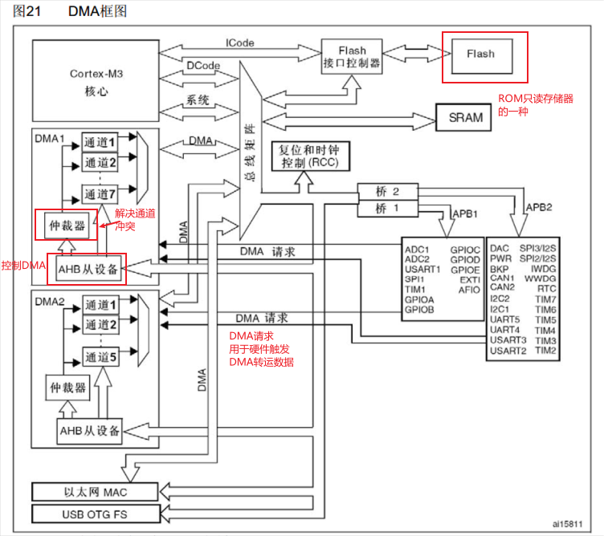

上图中除了右上角的`核心` 部分，其他的都可以看成是存储器。FLash是主闪存，SRAM是运行内存。各个外设也可以看成是寄存器，也是一中SRAM存储器。

CPU可以对寄存器进行读写，就像读写运行内存一样。寄存器的每一位背后，都连接了一根导线，这些导线可以用于控制外设电路的状态（设置引脚高低电平，导通断开开关，切换数据选择器，或者多位组合起来，当作计数器，数据寄存器等等）。寄存器就是软件和硬件的桥梁

虽然DMA有7个通道可以独立转运数据，但是DMA总线只有一条，所有通道，都只能分时复用这一条DMA总线，所以设计了仲裁器。如果产生了冲突，那就会由仲裁器，根据通道优先级决定谁先用

在左边DMA1框内，下面有一个【AHB从设备】，也就是DMA自身的寄存器。因为DMA作为一个外设，它自己也会有相应的配置寄存器。这个寄存器连接到了【AHB总线】上。所以DMA是总线矩阵的主动单元，可以读写各种寄存器，也是AHB总线上的被动单元（被cpu控制）。

另外右上角的Flash是ROM只读存储器的一种，都是只能读不能写入的，如果DMA的目的地址填了Flash的区域，那转运时就会出错。当然flash也不是不可写入，可以通过【Flash接口控制器】对Flash进行写入。（CPU和DMA不能直接写入）

const 是定义的常量是存储在Flash里的

## 5.1 存储器映像


计算机主要由，运算器、控制器、存储器、输入设备、和输出设备。其中运算器和控制器一般会合在一起，叫做CPU。计算机的核心关键部分就是cpu和存储器

<table>
    <thead>
        <tr>
            <th>类型</th><th>起始地址</th><th>存储器</th><th>用途</th>
        </tr>
    </thead>
    <tbody>
        <tr>
            <td rowspan="3">ROM</td><td>0x0800 0000</td><td>程序存储器Flash</td><td>存储C语言编译后的代码</td>
        </tr>
        <tr>
            <td>0x1FFF F000</td><td>系统存储器</td><td>存储BootLoader，用于串口下载</td>
        </tr>
        <tr>
            <td>0x1FFF F800</td><td>选项字节</td><td>存储一些独立于程序代码的配置参数</td>
        </tr>
        <tr>
            <td rowspan="3">RAM</td><td>0x2000 0000</td><td>运行内存SRAM</td><td>存储程序运行过程中的临时变量</td>
        </tr>
        <tr>
            <td>0x4000 0000</td><td>外设寄存器</td><td>存储各个外设的配置参数</td>
        </tr>
        <tr>
            <td>0xE000 0000</td><td>内核外设寄存器</td><td>存储内核各个外设的配置参数</td>
        </tr>
    </tbody>
</table>


## 5.2 DMA基本结构

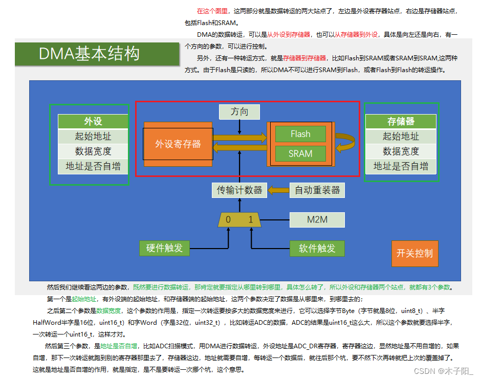


传输计数器，是一个自减计数器，如果写5，那么DMA就只能进行5次数据转运，另外，它减到0后，之前自增的地址也会恢复到起始位置，以方便之后DMA开始新一轮的转运。


循环模式：计数器旁边的自动重装器，作用是当计数器减到0之后，是否自动恢复到计数器最初的值

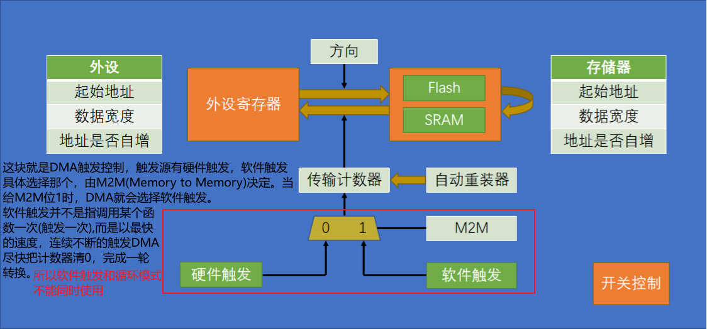

软件触发：一般使用于存储器到存储器的转运，因为存储器到存储器的转运是软件触发，不需要特定的时机，

硬件触发：可以选择ADC，串口，定时器等等

<font color='red'>写传输寄存器的时候，必须关闭DMA</font>

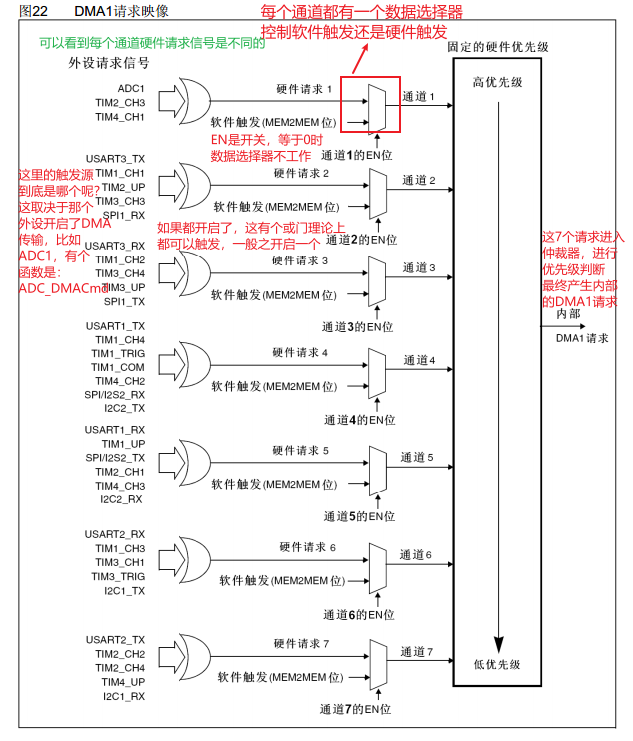
每个通道的硬件触发源是不同的，软件可以随意选择通道触发


## 5.3 数据宽度

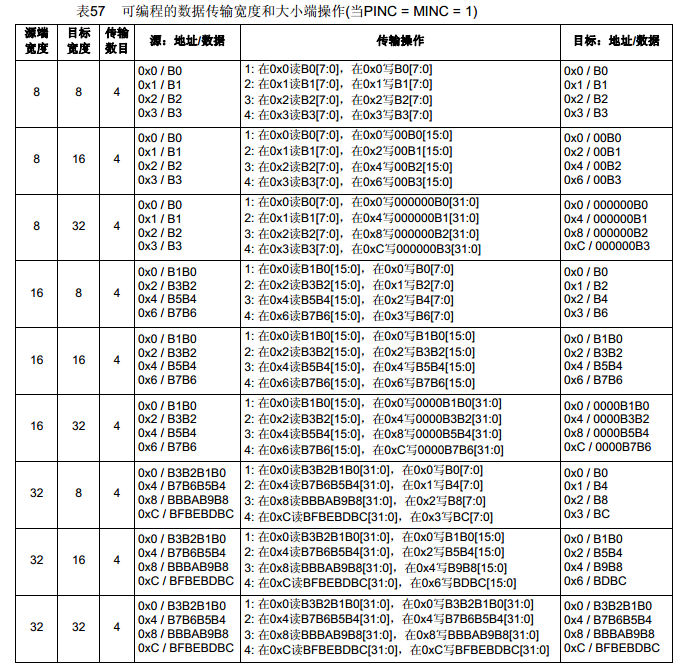

[这里的数据转运两个站点](#52-dma基本结构)，都有一个数据宽度的参数，如果数据宽度一样，那就是正常的一个个转运。如果不一样呢？上图就是说明这给问题的。

第一列是源端宽度，第二列是目标宽度，第三列是传输数目。

- 源端和目标都是8位（看第一行）

转运第一步：在源端的0位置，读取数据B0，就是把这个B0，从左边挪到右边。之后的步骤就是，把B1从左边挪到右边接着B2，B3，这是源端和目标都是8位的情况

- 源端8位和目标16位（看第二行），源端数据宽度小于目标数据宽度

它的操作就是在源端读取B0，在目标写00B0之后是B1写00B1等等。意思就是目标的数据宽度，比源端的数据宽度大，那就在目标数据前面多出的空位补0。后面的8位转32位也一样

- 源端16位和目标8位（看第四行），源端数据宽度大于目标数据宽度
  
现象是，读取B1B0，只写入B0，读取B3B2只写入B2，就是把高位舍弃。


> 总的来说就是把大的数据转到小的里面去，高位就会舍弃，反之舍弃地位。数据宽度一样就没事

## 5.4 DMA数组转运代码实例

代码任务：把DataA转运到DataB中

定义转运的数组：
```c
uint8_t DataA[] = {0x01, 0x02, 0x03, 0x04};	//定义测试数组DataA，为数据源
uint8_t DataB[] = {0, 0, 0, 0};				//定义测试数组DataB，为数据目的地
```

配置DMA：

第一步：RCC开启DMA时钟


第二步调用DMA_Init，初始化[各个参数](#5-dma),包括存储器起始地址，数据宽度，地址是否自增


完整DMA代码：
代码中的外设和存储器，这个其实没啥的外设只是起了一个名字，两个没啥差别，根据地址来就可以


```c
#include "stm32f10x.h"                  // Device header

uint16_t MyDMA_Size;					//定义全局变量，用于记住Init函数的Size，供Transfer函数使用

/**
  * 函    数：DMA初始化
  * 参    数：AddrA 原数组的首地址
  * 参    数：AddrB 目的数组的首地址
  * 参    数：Size 转运的数据大小（转运次数）
  * 返 回 值：无
  */
void MyDMA_Init(uint32_t AddrA, uint32_t AddrB, uint16_t Size)
{
	MyDMA_Size = Size;					//将Size写入到全局变量，记住参数Size
	
	/*开启时钟*/
	RCC_AHBPeriphClockCmd(RCC_AHBPeriph_DMA1, ENABLE);						//开启DMA的时钟
	
	/*DMA初始化*/
	DMA_InitTypeDef DMA_InitStructure;										//定义结构体变量

    // 外设站点的地址（在DMA基本结构图中）  外设配置
	DMA_InitStructure.DMA_PeripheralBaseAddr = AddrA;						//外设基地址，给定形参AddrA
	DMA_InitStructure.DMA_PeripheralDataSize = DMA_PeripheralDataSize_Byte;	//外设数据宽度，选择字节
	DMA_InitStructure.DMA_PeripheralInc = DMA_PeripheralInc_Enable;			//外设地址自增，选择使能
	// 存储器配置
    DMA_InitStructure.DMA_MemoryBaseAddr = AddrB;							//存储器基地址，给定形参AddrB
	DMA_InitStructure.DMA_MemoryDataSize = DMA_MemoryDataSize_Byte;			//存储器数据宽度，选择字节
	DMA_InitStructure.DMA_MemoryInc = DMA_MemoryInc_Enable;					//存储器地址自增，选择使能
	
    // 外设，存储器就是指上面的配置
    DMA_InitStructure.DMA_DIR = DMA_DIR_PeripheralSRC;						//数据传输方向，选择由外设到存储器
	DMA_InitStructure.DMA_BufferSize = Size;								//转运的数据大小（转运次数）
	// 正常模式：传输计数器不自动重装，到0就停下来
    DMA_InitStructure.DMA_Mode = DMA_Mode_Normal;							//模式，选择正常模式
	//存储器到存储器就是软件触发
    DMA_InitStructure.DMA_M2M = DMA_M2M_Enable;								//存储器到存储器，选择使能
	DMA_InitStructure.DMA_Priority = DMA_Priority_Medium;					//优先级，选择中等
	//  选择通道
    DMA_Init(DMA1_Channel1, &DMA_InitStructure);							//将结构体变量交给DMA_Init，配置DMA1的通道1
	
	/*DMA使能 */
	DMA_Cmd(DMA1_Channel1, DISABLE);	//这里先不给使能，初始化后不会立刻工作，等后续调用MyDMA_Transfer后，再开始
}

/**
  * 函    数：启动DMA数据转运
  * 参    数：无
  * 返 回 值：无
  */
void MyDMA_Transfer(void)
{
	DMA_Cmd(DMA1_Channel1, DISABLE);					//DMA失能，在写入传输计数器之前，需要DMA暂停工作
	DMA_SetCurrDataCounter(DMA1_Channel1, MyDMA_Size);	//写入传输计数器，指定将要转运的次数
	DMA_Cmd(DMA1_Channel1, ENABLE);						//DMA使能，开始工作
	
	while (DMA_GetFlagStatus(DMA1_FLAG_TC1) == RESET);	//等待DMA工作完成
	DMA_ClearFlag(DMA1_FLAG_TC1);						//清除工作完成标志位
}

// main.c
#include "stm32f10x.h"                  // Device header
#include "Delay.h"
#include "OLED.h"
#include "MyDMA.h"

uint8_t DataA[] = {0x01, 0x02, 0x03, 0x04};				//定义测试数组DataA，为数据源
uint8_t DataB[] = {0, 0, 0, 0};							//定义测试数组DataB，为数据目的地

int main(void)
{
	/*模块初始化*/
	OLED_Init();				//OLED初始化
	
	MyDMA_Init((uint32_t)DataA, (uint32_t)DataB, 4);	//DMA初始化，把源数组和目的数组的地址传入
	
	/*显示静态字符串*/
	OLED_ShowString(1, 1, "DataA");
	OLED_ShowString(3, 1, "DataB");
	
	/*显示数组的首地址*/
	OLED_ShowHexNum(1, 8, (uint32_t)DataA, 8);
	OLED_ShowHexNum(3, 8, (uint32_t)DataB, 8);
		
	while (1)
	{
		DataA[0] ++;		//变换测试数据
		DataA[1] ++;
		DataA[2] ++;
		DataA[3] ++;
		
		OLED_ShowHexNum(2, 1, DataA[0], 2);		//显示数组DataA
		OLED_ShowHexNum(2, 4, DataA[1], 2);
		OLED_ShowHexNum(2, 7, DataA[2], 2);
		OLED_ShowHexNum(2, 10, DataA[3], 2);
		OLED_ShowHexNum(4, 1, DataB[0], 2);		//显示数组DataB
		OLED_ShowHexNum(4, 4, DataB[1], 2);
		OLED_ShowHexNum(4, 7, DataB[2], 2);
		OLED_ShowHexNum(4, 10, DataB[3], 2);
		
		Delay_ms(1000);		//延时1s，观察转运前的现象
		
		MyDMA_Transfer();	//使用DMA转运数组，从DataA转运到DataB
		
		OLED_ShowHexNum(2, 1, DataA[0], 2);		//显示数组DataA
		OLED_ShowHexNum(2, 4, DataA[1], 2);
		OLED_ShowHexNum(2, 7, DataA[2], 2);
		OLED_ShowHexNum(2, 10, DataA[3], 2);
		OLED_ShowHexNum(4, 1, DataB[0], 2);		//显示数组DataB
		OLED_ShowHexNum(4, 4, DataB[1], 2);
		OLED_ShowHexNum(4, 7, DataB[2], 2);
		OLED_ShowHexNum(4, 10, DataB[3], 2);

		Delay_ms(1000);		//延时1s，观察转运后的现象
	}
}

```

## 5.5 DMA+ADC多通道代码实例

多次转换，扫描模式

```c
#include "stm32f10x.h"                  // Device header

uint16_t AD_Value[4];					//定义用于存放AD转换结果的全局数组

/**
  * 函    数：AD初始化
  * 参    数：无
  * 返 回 值：无
  */
void AD_Init(void)
{
	/*开启时钟*/
	RCC_APB2PeriphClockCmd(RCC_APB2Periph_ADC1, ENABLE);	//开启ADC1的时钟
	RCC_APB2PeriphClockCmd(RCC_APB2Periph_GPIOA, ENABLE);	//开启GPIOA的时钟
	RCC_AHBPeriphClockCmd(RCC_AHBPeriph_DMA1, ENABLE);		//开启DMA1的时钟
	
	/*设置ADC时钟*/
	RCC_ADCCLKConfig(RCC_PCLK2_Div6);						//选择时钟6分频，ADCCLK = 72MHz / 6 = 12MHz
	
	/*GPIO初始化*/
	GPIO_InitTypeDef GPIO_InitStructure;
	GPIO_InitStructure.GPIO_Mode = GPIO_Mode_AIN;
	GPIO_InitStructure.GPIO_Pin = GPIO_Pin_0 | GPIO_Pin_1 | GPIO_Pin_2 | GPIO_Pin_3;
	GPIO_InitStructure.GPIO_Speed = GPIO_Speed_50MHz;
	GPIO_Init(GPIOA, &GPIO_InitStructure);					//将PA0、PA1、PA2和PA3引脚初始化为模拟输入
	
	/*规则组通道配置*/
	ADC_RegularChannelConfig(ADC1, ADC_Channel_0, 1, ADC_SampleTime_55Cycles5);	//规则组序列1的位置，配置为通道0
	ADC_RegularChannelConfig(ADC1, ADC_Channel_1, 2, ADC_SampleTime_55Cycles5);	//规则组序列2的位置，配置为通道1
	ADC_RegularChannelConfig(ADC1, ADC_Channel_2, 3, ADC_SampleTime_55Cycles5);	//规则组序列3的位置，配置为通道2
	ADC_RegularChannelConfig(ADC1, ADC_Channel_3, 4, ADC_SampleTime_55Cycles5);	//规则组序列4的位置，配置为通道3
	
	/*ADC初始化*/
	ADC_InitTypeDef ADC_InitStructure;											//定义结构体变量
	ADC_InitStructure.ADC_Mode = ADC_Mode_Independent;							//模式，选择独立模式，即单独使用ADC1
	ADC_InitStructure.ADC_DataAlign = ADC_DataAlign_Right;						//数据对齐，选择右对齐
	ADC_InitStructure.ADC_ExternalTrigConv = ADC_ExternalTrigConv_None;			//外部触发，使用软件触发，不需要外部触发
	ADC_InitStructure.ADC_ContinuousConvMode = ENABLE;							//连续转换，使能，每转换一次规则组序列后立刻开始下一次转换
	ADC_InitStructure.ADC_ScanConvMode = ENABLE;								//扫描模式，使能，扫描规则组的序列，扫描数量由ADC_NbrOfChannel确定
	ADC_InitStructure.ADC_NbrOfChannel = 4;										//通道数，为4，扫描规则组的前4个通道
	ADC_Init(ADC1, &ADC_InitStructure);											//将结构体变量交给ADC_Init，配置ADC1
	
	/*DMA初始化*/
	DMA_InitTypeDef DMA_InitStructure;											//定义结构体变量
	DMA_InitStructure.DMA_PeripheralBaseAddr = (uint32_t)&ADC1->DR;				//外设基地址，给定形参AddrA
	DMA_InitStructure.DMA_PeripheralDataSize = DMA_PeripheralDataSize_HalfWord;	//外设数据宽度，选择半字，对应16为的ADC数据寄存器
	DMA_InitStructure.DMA_PeripheralInc = DMA_PeripheralInc_Disable;			//外设地址自增，选择失能，始终以ADC数据寄存器为源
	DMA_InitStructure.DMA_MemoryBaseAddr = (uint32_t)AD_Value;					//存储器基地址，给定存放AD转换结果的全局数组AD_Value
	DMA_InitStructure.DMA_MemoryDataSize = DMA_MemoryDataSize_HalfWord;			//存储器数据宽度，选择半字，与源数据宽度对应
	DMA_InitStructure.DMA_MemoryInc = DMA_MemoryInc_Enable;						//存储器地址自增，选择使能，每次转运后，数组移到下一个位置
	DMA_InitStructure.DMA_DIR = DMA_DIR_PeripheralSRC;							//数据传输方向，选择由外设到存储器，ADC数据寄存器转到数组
	DMA_InitStructure.DMA_BufferSize = 4;										//转运的数据大小（转运次数），与ADC通道数一致
	DMA_InitStructure.DMA_Mode = DMA_Mode_Circular;								//模式，选择循环模式，与ADC的连续转换一致
	DMA_InitStructure.DMA_M2M = DMA_M2M_Disable;								//存储器到存储器，选择失能，数据由ADC外设触发转运到存储器
	DMA_InitStructure.DMA_Priority = DMA_Priority_Medium;						//优先级，选择中等
	DMA_Init(DMA1_Channel1, &DMA_InitStructure);								//将结构体变量交给DMA_Init，配置DMA1的通道1
	
	/*DMA和ADC使能*/
	DMA_Cmd(DMA1_Channel1, ENABLE);							//DMA1的通道1使能
	ADC_DMACmd(ADC1, ENABLE);								//ADC1触发DMA1的信号使能
	ADC_Cmd(ADC1, ENABLE);									//ADC1使能
	
	/*ADC校准*/
	ADC_ResetCalibration(ADC1);								//固定流程，内部有电路会自动执行校准
	while (ADC_GetResetCalibrationStatus(ADC1) == SET);
	ADC_StartCalibration(ADC1);
	while (ADC_GetCalibrationStatus(ADC1) == SET);
	
	/*ADC触发*/
	ADC_SoftwareStartConvCmd(ADC1, ENABLE);	//软件触发ADC开始工作，由于ADC处于连续转换模式，故触发一次后ADC就可以一直连续不断地工作
}

```
main.c
```c
#include "stm32f10x.h"                  // Device header
#include "Delay.h"
#include "OLED.h"
#include "AD.h"

int main(void)
{
	/*模块初始化*/
	OLED_Init();				//OLED初始化
	AD_Init();					//AD初始化
	
	/*显示静态字符串*/
	OLED_ShowString(1, 1, "AD0:");
	OLED_ShowString(2, 1, "AD1:");
	OLED_ShowString(3, 1, "AD2:");
	OLED_ShowString(4, 1, "AD3:");
	
	while (1)
	{
		OLED_ShowNum(1, 5, AD_Value[0], 4);		//显示转换结果第0个数据
		OLED_ShowNum(2, 5, AD_Value[1], 4);		//显示转换结果第1个数据
		OLED_ShowNum(3, 5, AD_Value[2], 4);		//显示转换结果第2个数据
		OLED_ShowNum(4, 5, AD_Value[3], 4);		//显示转换结果第3个数据
		
		Delay_ms(100);							//延时100ms，手动增加一些转换的间隔时间
	}
}

```

# 6 通信协议

- 通信的目的：将一个设备的数据传送到另一个设备，扩展硬件系统
- 通信协议：制定通信的规则，通信双方按照协议规则进行数据收发

| **名称** | **引脚**             | **双工** | **时钟** | **电平** | **设备** |
| -------- | -------------------- | -------- | -------- | -------- | -------- |
| USART    | TX、RX               | 全双工   | 异步     | 单端     | 点对点   |
| I2C      | SCL、SDA             | 半双工   | 同步     | 单端     | 多设备   |
| SPI      | SCLK、MOSI、MISO、CS | 全双工   | 同步     | 单端     | 多设备   |
| CAN      | CAN_H、CAN_L         | 半双工   | 异步     | 差分     | 多设备   |
| USB      | DP、DM               | 半双工   | 异步     | 差分     | 点对点   |


- 全双工：指通信双方能够同时进行双向通信，一般来说全双工有两根数据线，一根接收一根发送。

- 单工：数据只能从一个设备到另一个设备，不能反着来。

- 点对点，仅支持两个设备间的通信

两个器件之间的电压的标准要一样（要共地）。


## 6.1 串口通信协议

- 串口是一种应用十分广泛的通讯接口，串口成本低、容易使用、通信线路简单，可实现两个设备的互相通信
- 单片机的串口可以使单片机与单片机、单片机与电脑、单片机与各式各样的模块互相通信，极大地扩展了单片机的应用范围，增强了单片机系统的硬件实力


- 简单双向串口通信有两根通信线（发送端TX和接收端RX）
- TX与RX要交叉连接
- 当只需单向的数据传输时，可以只接一根通信线
- 当电平标准不一致时，需要加电平转换芯片

串口也是有很多电平标准的，像这种直接从控制器里出来的信号，一般都是TTL电平。

TTL电平就是指适合于ttl电路工作的电平。TTL的电源工作电压是5V，那么5V就可为高电平，0V为

低电平。但ttl传送数据高低电平有标准规定要求，输入高电平>=2.0V，输入低电平<=0.8V。

### 6.1.1 串口参数及时序

- 波特率：串口通信的速率，串口一般是异步通信，没有时钟线控制，所以需要双方确定一个通信速率（波特率）。 
- 起始位：标志一个数据帧的开始，固定为低电平。（空闲状态为高电平）
- 数据位：数据帧的有效载荷，1为高电平，0为低电平，低位先行（数据从低位到高位发送）
- 校验位：用于数据验证，根据数据位计算得来，串口用的是奇偶校验法（无校验，奇校验，偶校验）
  - 奇校验：如果传输的数据是0000 1111 共4个1，是偶数个，那么校验位就需要在补一个1，保证1的个数为奇数
  - 偶校验：如果传输的数据是0000 1111 共4个1，是奇数个，那么校验位就需要在补一个0，保证1的个数为偶数
- 停止位：用于数据帧间隔，固定为高电平

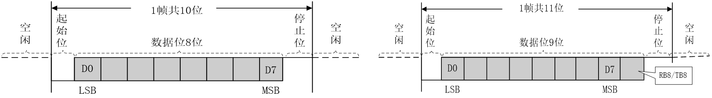

图中每一位的发送时间间隔是固定的
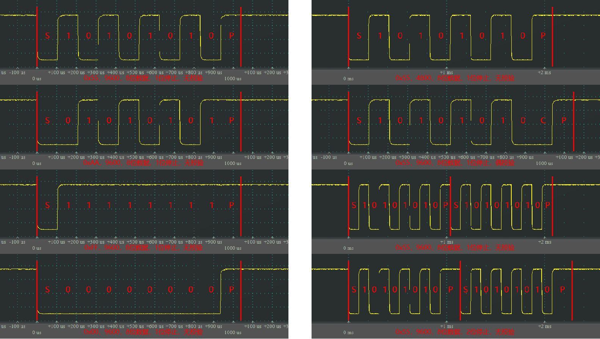
### 6.1.2 串口外设

- USART（Universal Synchronous/Asynchronous Receiver/Transmitter）通用同步/异步收发器
- USART是STM32内部集成的硬件外设，可根据数据寄存器的一个字节数据自动生成数据帧时序，从TX引脚发送出去，也可自动接收- RX引脚的数据帧时序，拼接为一个字节数据，存放在数据寄存器里
- 自带波特率发生器（分频器），最高达4.5Mbits/s
- 可配置数据位长度（8/9）、停止位长度（0.5/1/1.5/2）
- 可选校验位（无校验/奇校验/偶校验）
- 支持同步模式、硬件流控制（类似IIC时钟线）、DMA、智能卡、IrDA、LIN

STM32F103C8T6 USART资源： USART1、 USART2、 USART3

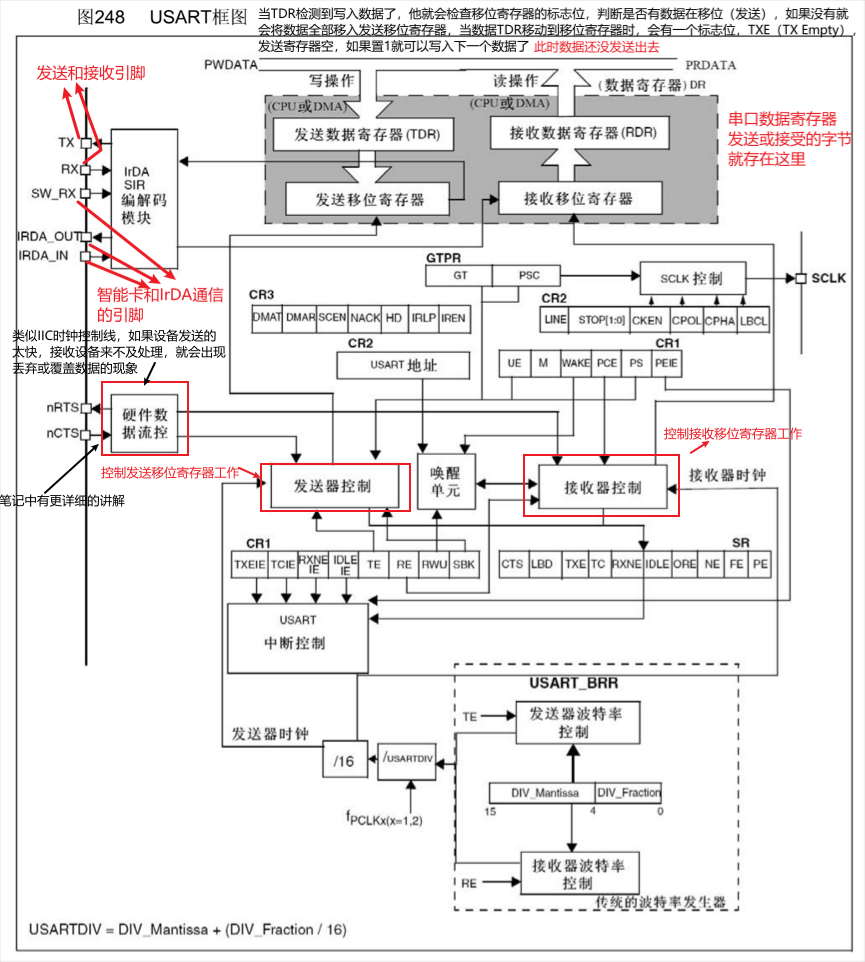

再看接收寄存器，数据从RX引脚，通向接收移位寄存器，在【接收器控制】的驱动下，一位一位的读取电平。之后当一个字节移位完后，这一个字节的数据就会整体的，一下子转移到【接收是数据寄存器RDR】里，在转移的过程中，也会置一个标志位，叫RXNE（RX Not Empty），接收数据寄存器非空，当检测到EXNE为1时，就可以把数据读走了

总的来说，UASRT外设主要是数据寄存器和移位寄存器，数据通过发送移位寄存器和TX引脚，按照波特率，将数据一位一位的发送出去。接收数据通过RX引脚，经过接收移位寄存器，一位一位接收数据，当一个字节数据接收完后，将数据整体移入数据寄存器。

---

【硬件数据流控】有两个引脚，一个是nRTS，一个是nCTS(Request To Send)请求发送，是输出脚，也就是告诉别人，我当前能不能接收。nCTS(Clear To Send)是清除发送，是输入脚，用于接收其他设备的nRTS信号的。（前面的n的意思是低电平有效）

具体工作方式是：找到另外一个支持流控的串口，他的TX接收自己的RX，然后我的RTS要输出一个能不能接收的反馈信号，接收到对方的CTS。当自己需要接收的时候，RTS置低电平，请求对方发送，对方的CTS收到后，就可以一直发。当自己处理不过来时，RTS就会置高电平，对方收到后就会暂停发送，直到数据处理完。

图中右侧的SCLK（时钟控制线），这部分电路用于产生同比的时钟信号，配合发送移位寄存器输出的，发送数据寄存器每移位一次，SCLK就跳变一个周期，时钟告诉对方我移除去一位数据了，你看要不要让我这个时钟信号来指导你接收一下？，当然这个时钟只支持输出，不支持输入，所以两个USART间，不能实现同步的串口通信。另外一个用途就是，兼容别的协议，比如串口加上时钟，就跟SPI协议很像。另外也可以用作自适应波特率，比如接收设备不确定发送设备的波特率，就可以测量这个时钟周期，计算得到波特率

### 6.1.2 USART基本结构

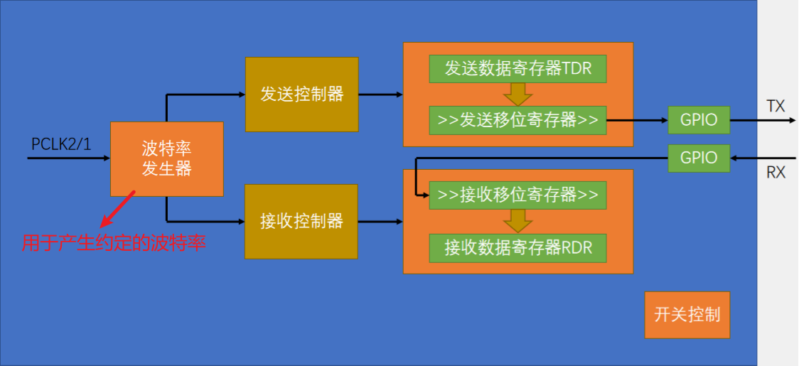

通过GPIO口的复用输出，输出到TX引脚

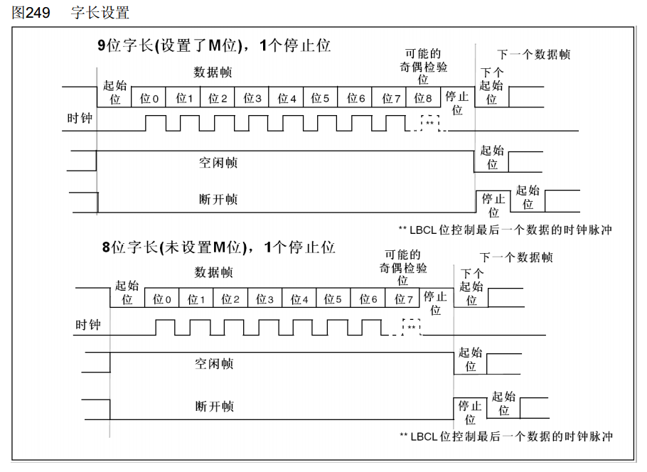

### 串口发送接收代码实例

#### 串口发送代码实例
```c
#include "stm32f10x.h"                  // Device header
#include <stdio.h>
#include <stdarg.h>

/**
  * 函    数：串口初始化
  * 参    数：无
  * 返 回 值：无
  */
void Serial_Init(void)
{
	/*开启时钟*/
	RCC_APB2PeriphClockCmd(RCC_APB2Periph_USART1, ENABLE);	//开启USART1的时钟
	RCC_APB2PeriphClockCmd(RCC_APB2Periph_GPIOA, ENABLE);	//开启GPIOA的时钟(因为复用了io口)
	
	/*GPIO初始化*/
	GPIO_InitTypeDef GPIO_InitStructure;
	GPIO_InitStructure.GPIO_Mode = GPIO_Mode_AF_PP;
	GPIO_InitStructure.GPIO_Pin = GPIO_Pin_9;
	GPIO_InitStructure.GPIO_Speed = GPIO_Speed_50MHz;
	GPIO_Init(GPIOA, &GPIO_InitStructure);					//将PA9引脚初始化为复用推挽输出
	
	/*USART初始化*/
	USART_InitTypeDef USART_InitStructure;					//定义结构体变量
	USART_InitStructure.USART_BaudRate = 9600;				//波特率
	USART_InitStructure.USART_HardwareFlowControl = USART_HardwareFlowControl_None;	//硬件流控制，不需要
	USART_InitStructure.USART_Mode = USART_Mode_Tx;			//模式，选择为发送模式
	USART_InitStructure.USART_Parity = USART_Parity_No;		//奇偶校验，在这里不需要校验
	USART_InitStructure.USART_StopBits = USART_StopBits_1;	//停止位，选择1位
	USART_InitStructure.USART_WordLength = USART_WordLength_8b;		//字长，选择8位
	USART_Init(USART1, &USART_InitStructure);				//将结构体变量交给USART_Init，配置USART1
	
	/*USART使能*/
	USART_Cmd(USART1, ENABLE);								//使能USART1，串口开始运行
}

/**
  * 函    数：串口发送一个字节
  * 参    数：Byte 要发送的一个字节
  * 返 回 值：无
  */
void Serial_SendByte(uint8_t Byte)
{
	USART_SendData(USART1, Byte);		//将字节数据写入数据寄存器，写入后USART自动生成时序波形
	while (USART_GetFlagStatus(USART1, USART_FLAG_TXE) == RESET);	//等待发送完成
	/*下次写入数据寄存器会自动清除发送完成标志位，故此循环后，无需清除标志位*/
}

/**
  * 函    数：串口发送一个数组
  * 参    数：Array 要发送数组的首地址
  * 参    数：Length 要发送数组的长度
  * 返 回 值：无
  */
void Serial_SendArray(uint8_t *Array, uint16_t Length)
{
	uint16_t i;
	for (i = 0; i < Length; i ++)		//遍历数组
	{
		Serial_SendByte(Array[i]);		//依次调用Serial_SendByte发送每个字节数据
	}
}

/**
  * 函    数：串口发送一个字符串
  * 参    数：String 要发送字符串的首地址
  * 返 回 值：无
  */
void Serial_SendString(char *String)
{
	uint8_t i;
	for (i = 0; String[i] != '\0'; i ++)//遍历字符数组（字符串），遇到字符串结束标志位后停止
	{
		Serial_SendByte(String[i]);		//依次调用Serial_SendByte发送每个字节数据
	}
}

/**
  * 函    数：次方函数（内部使用）
  * 返 回 值：返回值等于X的Y次方
  */
uint32_t Serial_Pow(uint32_t X, uint32_t Y)
{
	uint32_t Result = 1;	//设置结果初值为1
	while (Y --)			//执行Y次
	{
		Result *= X;		//将X累乘到结果
	}
	return Result;
}

/**
  * 函    数：串口发送数字
  * 参    数：Number 要发送的数字，范围：0~4294967295
  * 参    数：Length 要发送数字的长度，范围：0~10
  * 返 回 值：无
  */
void Serial_SendNumber(uint32_t Number, uint8_t Length)
{
	uint8_t i;
	for (i = 0; i < Length; i ++)		//根据数字长度遍历数字的每一位
	{
		Serial_SendByte(Number / Serial_Pow(10, Length - i - 1) % 10 + '0');	//依次调用Serial_SendByte发送每位数字
	}
}

/**
  * 函    数：使用printf需要重定向的底层函数
  * 参    数：保持原始格式即可，无需变动
  * 返 回 值：保持原始格式即可，无需变动
  */
int fputc(int ch, FILE *f)
{
	Serial_SendByte(ch);			//将printf的底层重定向到自己的发送字节函数
	return ch;
}

/**
  * 函    数：自己封装的prinf函数
  * 参    数：format 格式化字符串
  * 参    数：... 可变的参数列表
  * 返 回 值：无
  */
void Serial_Printf(char *format, ...)
{
	char String[100];				//定义字符数组
	va_list arg;					//定义可变参数列表数据类型的变量arg
	va_start(arg, format);			//从format开始，接收参数列表到arg变量
	vsprintf(String, format, arg);	//使用vsprintf打印格式化字符串和参数列表到字符数组中
	va_end(arg);					//结束变量arg
	Serial_SendString(String);		//串口发送字符数组（字符串）
}

// main.c
#include "stm32f10x.h"                  // Device header
#include "Delay.h"
#include "OLED.h"
#include "Serial.h"

int main(void)
{
	/*模块初始化*/
	OLED_Init();						//OLED初始化
	
	Serial_Init();						//串口初始化
	
	/*串口基本函数*/
	Serial_SendByte(0x41);				//串口发送一个字节数据0x41
	
	uint8_t MyArray[] = {0x42, 0x43, 0x44, 0x45};	//定义数组
	Serial_SendArray(MyArray, 4);		//串口发送一个数组
	
	Serial_SendString("\r\nNum1=");		//串口发送字符串
	
	Serial_SendNumber(111, 3);			//串口发送数字
	
	/*下述3种方法可实现printf的效果*/
	
	/*方法1：直接重定向printf，但printf函数只有一个，此方法不能在多处使用*/
	printf("\r\nNum2=%d", 222);			//串口发送printf打印的格式化字符串
										//需要重定向fputc函数，并在工程选项里勾选Use MicroLIB
	
	/*方法2：使用sprintf打印到字符数组，再用串口发送字符数组，此方法打印到字符数组，之后想怎么处理都可以，可在多处使用*/
	char String[100];					//定义字符数组
	sprintf(String, "\r\nNum3=%d", 333);//使用sprintf，把格式化字符串打印到字符数组
	Serial_SendString(String);			//串口发送字符数组（字符串）
	
	/*方法3：将sprintf函数封装起来，实现专用的printf，此方法就是把方法2封装起来，更加简洁实用，可在多处使用*/
	Serial_Printf("\r\nNum4=%d", 444);	//串口打印字符串，使用自己封装的函数实现printf的效果
	Serial_Printf("\r\n");
	
	while (1)
	{
		
	}
}


```
#### 串口接收发送代码实例

```c
#include "stm32f10x.h"                  // Device header
#include <stdio.h>
#include <stdarg.h>

uint8_t Serial_RxData;		//定义串口接收的数据变量
uint8_t Serial_RxFlag;		//定义串口接收的标志位变量

/**
  * 函    数：串口初始化
  * 参    数：无
  * 返 回 值：无
  */
void Serial_Init(void)
{
	/*开启时钟*/
	RCC_APB2PeriphClockCmd(RCC_APB2Periph_USART1, ENABLE);	//开启USART1的时钟
	RCC_APB2PeriphClockCmd(RCC_APB2Periph_GPIOA, ENABLE);	//开启GPIOA的时钟
	
	/*GPIO初始化*/
	GPIO_InitTypeDef GPIO_InitStructure;
	GPIO_InitStructure.GPIO_Mode = GPIO_Mode_AF_PP;
	GPIO_InitStructure.GPIO_Pin = GPIO_Pin_9;
	GPIO_InitStructure.GPIO_Speed = GPIO_Speed_50MHz;
	GPIO_Init(GPIOA, &GPIO_InitStructure);					//将PA9引脚初始化为复用推挽输出
	
	GPIO_InitStructure.GPIO_Mode = GPIO_Mode_IPU;
	GPIO_InitStructure.GPIO_Pin = GPIO_Pin_10;
	GPIO_InitStructure.GPIO_Speed = GPIO_Speed_50MHz;
	GPIO_Init(GPIOA, &GPIO_InitStructure);					//将PA10引脚初始化为上拉输入
	
	/*USART初始化*/
	USART_InitTypeDef USART_InitStructure;					//定义结构体变量
	USART_InitStructure.USART_BaudRate = 9600;				//波特率
	USART_InitStructure.USART_HardwareFlowControl = USART_HardwareFlowControl_None;	//硬件流控制，不需要
	USART_InitStructure.USART_Mode = USART_Mode_Tx | USART_Mode_Rx;	//模式，发送模式和接收模式均选择
	USART_InitStructure.USART_Parity = USART_Parity_No;		//奇偶校验，不需要
	USART_InitStructure.USART_StopBits = USART_StopBits_1;	//停止位，选择1位
	USART_InitStructure.USART_WordLength = USART_WordLength_8b;		//字长，选择8位
	USART_Init(USART1, &USART_InitStructure);				//将结构体变量交给USART_Init，配置USART1
	
	/*中断输出配置*/
	USART_ITConfig(USART1, USART_IT_RXNE, ENABLE);			//开启串口接收数据的中断
	
	/*NVIC中断分组*/
	NVIC_PriorityGroupConfig(NVIC_PriorityGroup_2);			//配置NVIC为分组2
	
	/*NVIC配置*/
	NVIC_InitTypeDef NVIC_InitStructure;					//定义结构体变量
	NVIC_InitStructure.NVIC_IRQChannel = USART1_IRQn;		//选择配置NVIC的USART1线
	NVIC_InitStructure.NVIC_IRQChannelCmd = ENABLE;			//指定NVIC线路使能
	NVIC_InitStructure.NVIC_IRQChannelPreemptionPriority = 1;		//指定NVIC线路的抢占优先级为1
	NVIC_InitStructure.NVIC_IRQChannelSubPriority = 1;		//指定NVIC线路的响应优先级为1
	NVIC_Init(&NVIC_InitStructure);							//将结构体变量交给NVIC_Init，配置NVIC外设
	
	/*USART使能*/
	USART_Cmd(USART1, ENABLE);								//使能USART1，串口开始运行
}

/**
  * 函    数：串口发送一个字节
  * 参    数：Byte 要发送的一个字节
  * 返 回 值：无
  */
void Serial_SendByte(uint8_t Byte)
{
	USART_SendData(USART1, Byte);		//将字节数据写入数据寄存器，写入后USART自动生成时序波形
	while (USART_GetFlagStatus(USART1, USART_FLAG_TXE) == RESET);	//等待发送完成
	/*下次写入数据寄存器会自动清除发送完成标志位，故此循环后，无需清除标志位*/
}

/**
  * 函    数：串口发送一个数组
  * 参    数：Array 要发送数组的首地址
  * 参    数：Length 要发送数组的长度
  * 返 回 值：无
  */
void Serial_SendArray(uint8_t *Array, uint16_t Length)
{
	uint16_t i;
	for (i = 0; i < Length; i ++)		//遍历数组
	{
		Serial_SendByte(Array[i]);		//依次调用Serial_SendByte发送每个字节数据
	}
}

/**
  * 函    数：串口发送一个字符串
  * 参    数：String 要发送字符串的首地址
  * 返 回 值：无
  */
void Serial_SendString(char *String)
{
	uint8_t i;
	for (i = 0; String[i] != '\0'; i ++)//遍历字符数组（字符串），遇到字符串结束标志位后停止
	{
		Serial_SendByte(String[i]);		//依次调用Serial_SendByte发送每个字节数据
	}
}

/**
  * 函    数：次方函数（内部使用）
  * 返 回 值：返回值等于X的Y次方
  */
uint32_t Serial_Pow(uint32_t X, uint32_t Y)
{
	uint32_t Result = 1;	//设置结果初值为1
	while (Y --)			//执行Y次
	{
		Result *= X;		//将X累乘到结果
	}
	return Result;
}

/**
  * 函    数：串口发送数字
  * 参    数：Number 要发送的数字，范围：0~4294967295
  * 参    数：Length 要发送数字的长度，范围：0~10
  * 返 回 值：无
  */
void Serial_SendNumber(uint32_t Number, uint8_t Length)
{
	uint8_t i;
	for (i = 0; i < Length; i ++)		//根据数字长度遍历数字的每一位
	{
		Serial_SendByte(Number / Serial_Pow(10, Length - i - 1) % 10 + '0');	//依次调用Serial_SendByte发送每位数字
	}
}

/**
  * 函    数：使用printf需要重定向的底层函数
  * 参    数：保持原始格式即可，无需变动
  * 返 回 值：保持原始格式即可，无需变动
  */
int fputc(int ch, FILE *f)
{
	Serial_SendByte(ch);			//将printf的底层重定向到自己的发送字节函数
	return ch;
}

/**
  * 函    数：自己封装的prinf函数
  * 参    数：format 格式化字符串
  * 参    数：... 可变的参数列表
  * 返 回 值：无
  */
void Serial_Printf(char *format, ...)
{
	char String[100];				//定义字符数组
	va_list arg;					//定义可变参数列表数据类型的变量arg
	va_start(arg, format);			//从format开始，接收参数列表到arg变量
	vsprintf(String, format, arg);	//使用vsprintf打印格式化字符串和参数列表到字符数组中
	va_end(arg);					//结束变量arg
	Serial_SendString(String);		//串口发送字符数组（字符串）
}

/**
  * 函    数：获取串口接收标志位
  * 参    数：无
  * 返 回 值：串口接收标志位，范围：0~1，接收到数据后，标志位置1，读取后标志位自动清零
  */
uint8_t Serial_GetRxFlag(void)
{
	if (Serial_RxFlag == 1)			//如果标志位为1
	{
		Serial_RxFlag = 0;
		return 1;					//则返回1，并自动清零标志位
	}
	return 0;						//如果标志位为0，则返回0
}

/**
  * 函    数：获取串口接收的数据
  * 参    数：无
  * 返 回 值：接收的数据，范围：0~255
  */
uint8_t Serial_GetRxData(void)
{
	return Serial_RxData;			//返回接收的数据变量
}

/**
  * 函    数：USART1中断函数
  * 参    数：无
  * 返 回 值：无
  * 注意事项：此函数为中断函数，无需调用，中断触发后自动执行
  *           函数名为预留的指定名称，可以从启动文件复制
  *           请确保函数名正确，不能有任何差异，否则中断函数将不能进入
  */
void USART1_IRQHandler(void)
{
	if (USART_GetITStatus(USART1, USART_IT_RXNE) == SET)		//判断是否是USART1的接收事件触发的中断
	{
		Serial_RxData = USART_ReceiveData(USART1);				//读取数据寄存器，存放在接收的数据变量
		Serial_RxFlag = 1;										//置接收标志位变量为1
		USART_ClearITPendingBit(USART1, USART_IT_RXNE);			//清除USART1的RXNE标志位
																//读取数据寄存器会自动清除此标志位
																//如果已经读取了数据寄存器，也可以不执行此代码
	}
}
// main.c

#include "stm32f10x.h"                  // Device header
#include "Delay.h"
#include "OLED.h"
#include "Serial.h"

uint8_t RxData;			//定义用于接收串口数据的变量

int main(void)
{
	/*模块初始化*/
	OLED_Init();		//OLED初始化
	
	/*显示静态字符串*/
	OLED_ShowString(1, 1, "RxData:");
	
	/*串口初始化*/
	Serial_Init();		//串口初始化
	
	while (1)
	{
		if (Serial_GetRxFlag() == 1)			//检查串口接收数据的标志位
		{
			RxData = Serial_GetRxData();		//获取串口接收的数据
			Serial_SendByte(RxData);			//串口将收到的数据回传回去，用于测试
			OLED_ShowHexNum(1, 8, RxData, 2);	//显示串口接收的数据
		}
	}
}

```
后面还有点东西没有写，实在是不想写了QAQ。

## 6.2 IIC通信协议

- I2C（Inter IC Bus）是由Philips公司开发的一种通用数据总线
- 两根通信线：SCL（Serial Clock）、SDA（Serial Data）
- 同步，半双工
- 带数据应答
- 支持总线挂载多设备（一主多从、多主多从）

### 6.2.1 硬件电路

- 所有I2C设备的SCL连在一起，SDA连在一起
- 设备的SCL和SDA均要配置成开漏输出模式
- SCL和SDA各添加一个上拉电阻，阻值一般为4.7KΩ左右

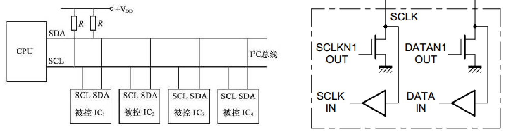

### 6.2.2 I2C时序基本单元

#### 起始终止条件
- 起始条件：SCL高电平期间，SDA从高电平切换到低电平
- 终止条件：SCL高电平期间，SDA从低电平切换到高电平
  
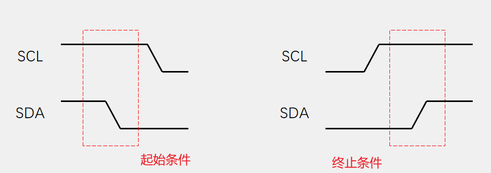

#### 发送一个字节
- 发送一个字节：SCL低电平期间，主机将数据位依次放到SDA线上（高位先行），然后释放SCL，从机将在SCL高电平期间读取数据位，所以SCL高电平期间SDA不允许有数据变化，依次循环上述过程8次，即可发送一个字节


#### 接收一个字节

- 接收一个字节：SCL低电平期间，从机将数据位依次放到SDA线上（高位先行），然后释放SCL，主机将在SCL高电平期间读取数据位，所以SCL高电平期间SDA不允许有数据变化，依次循环上述过程8次，即可接收一个字节（主机在接收之前，需要释放SDA）


#### 发送接收应答位

- 发送应答：主机在接收完一个字节之后，在下一个时钟发送一位数据，数据0表示应答，数据1表示非应答
- 接收应答：主机在发送完一个字节之后，在下一个时钟接收一位数据，判断从机是否应答，数据0表示应答，数据1表示非应答（主机在接收之前，需要释放SDA）


### 6.2.3 硬件I2C
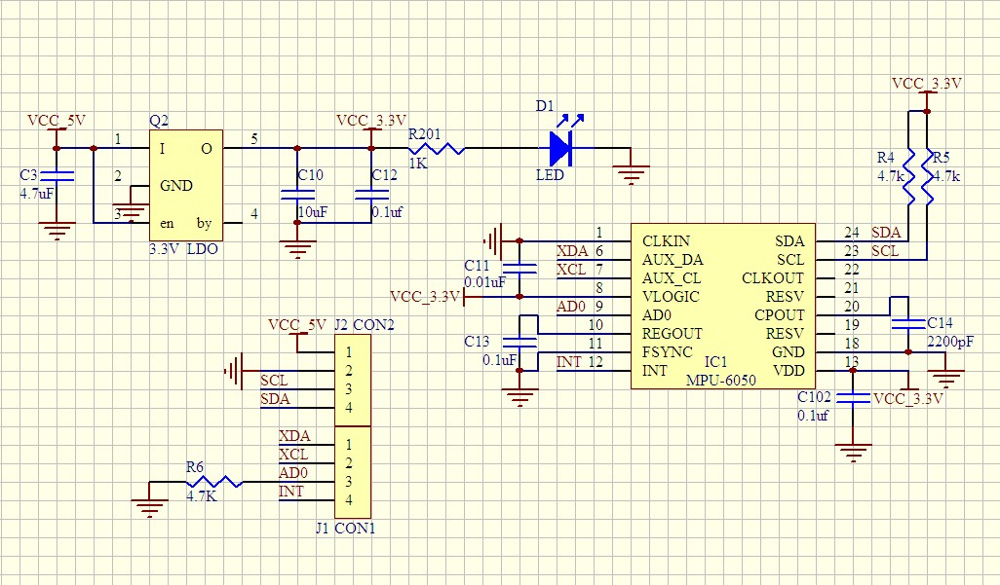

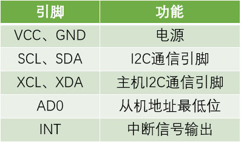

### 6.2.4 软件模拟I2C代码实例

```c
#include "stm32f10x.h" // Device header
#include "delay.h"
// 软件模拟IIC
#define SCL GPIO_Pin_10
#define SDA GPIO_Pin_11
// 写
void MyI2C_W_SCL(uint8_t BitValue)
{
	GPIO_WriteBit(GPIOB, SCL, (BitAction)BitValue);
	// 如果单片机主频较快，这里可以适当的加入延时函数
	Delay_us(10);
}
// 写
void MyI2C_W_SDA(uint8_t BitValue)
{
	GPIO_WriteBit(GPIOB, SDA, (BitAction)BitValue);
	// 如果单片机主频较快，这里可以适当的加入延时函数
	Delay_us(10);
}
// 读
uint8_t MyI2C_R_SDA(void)
{
	uint8_t BitValue;
	BitValue = GPIO_ReadInputDataBit(GPIOB, SDA);
	return BitValue;
}
void MyI2C_Init(void)
{
	/*
	* 初始化GPIO
	*/
	RCC_APB2PeriphClockCmd(RCC_APB2Periph_GPIOB, ENABLE);
	GPIO_InitTypeDef GPIO_InitStrcture;
	GPIO_InitStrcture.GPIO_Mode = GPIO_Mode_Out_OD; // 设置开漏输出模式
	GPIO_InitStrcture.GPIO_Pin = SCL|SDA;
	GPIO_InitStrcture.GPIO_Speed = GPIO_Speed_50MHz;
	GPIO_Init(GPIOB, &GPIO_InitStrcture);
	// 设置两个都为高电平，此时IIC总线处于空闲状态
	GPIO_SetBits(GPIOB, SCL|SDA);
}

void MyI2C_Start(void)
{
	// 先把SCL，SDA都释放，也就是都置1
	MyI2C_W_SDA(1);
	MyI2C_W_SCL(1);
	// 起始条件逻辑
	MyI2C_W_SDA(0);
	MyI2C_W_SCL(0);
}
void MyI2C_Stop(void)
{
	MyI2C_W_SDA(0);
	MyI2C_W_SCL(1);
	MyI2C_W_SDA(1);
}
// 除了终止条件SCL为高电平结束外，其他的单元SCL都以低电平结束，这样方便每个单元的拼接
// 发送一个字节 先发高位再发低位
void MyI2C_SendByte(uint8_t Byte)
{
	uint8_t i;
	for(i=0; i<8; i++)
	{
		// 此时SCL为低电平，所以可以写数据
		MyI2C_W_SDA(Byte & (0x80 >> i));
		// 恢复到高电平，保持数据稳定
		MyI2C_W_SCL(1); // 高电平，从机读取数据
		MyI2C_W_SCL(0);
	}
}
uint8_t MyI2c_ReceiveByte(void)
{
	uint8_t i, Byte = 0x00;
	// ?
	MyI2C_W_SDA(1);
	for(i=0; i<8; i++)
	{
		MyI2C_W_SCL(1);
		if(MyI2C_R_SDA()==1) // 如果数据位0，那么就不用按位与了，因为Byte本身就是全0
		{
			Byte |= (0x80 >> i);
		}
		MyI2C_W_SCL(0);
	}
	return Byte;
}
// 发送应答
void MyI2C_SendACK(uint8_t AckBit)
{
	// 此时SCL为低电平，所以可以写数据
	MyI2C_W_SDA(AckBit);
	// 恢复到高电平，保持数据稳定
	MyI2C_W_SCL(1); // 高电平，从机读取数据
	MyI2C_W_SCL(0); // 低电平，进入下一个时序
}
// 接收应答
uint8_t MyI2c_ReceiveACK(void)
{
	// 函数进入时SCL低电平
	uint8_t AckBit = 0x00;
	MyI2C_W_SDA(1); // 主机释放SDA，防止干扰从机
	MyI2C_W_SCL(1); // SCL高电平 主机置1，并不是强制SDA为高电平，而是释放SDA
	AckBit = MyI2C_R_SDA(); // SCL高电平，主机读取应答位
	MyI2C_W_SCL(0); // SCL低电平，进入下一个时序
	return AckBit;
}
```

## 6.3 SPI通信协议