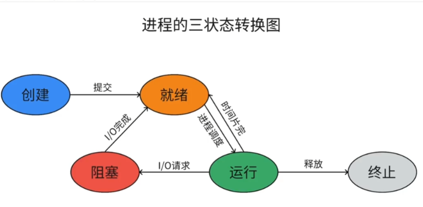
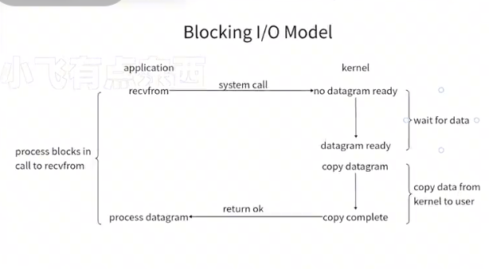
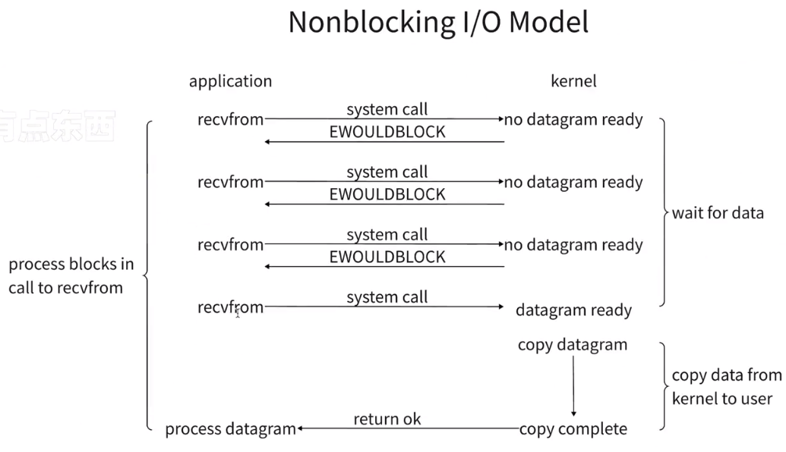
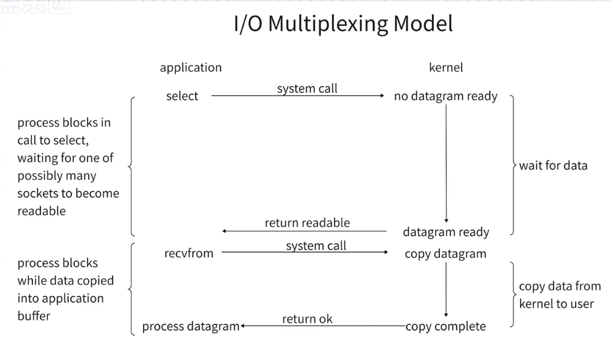
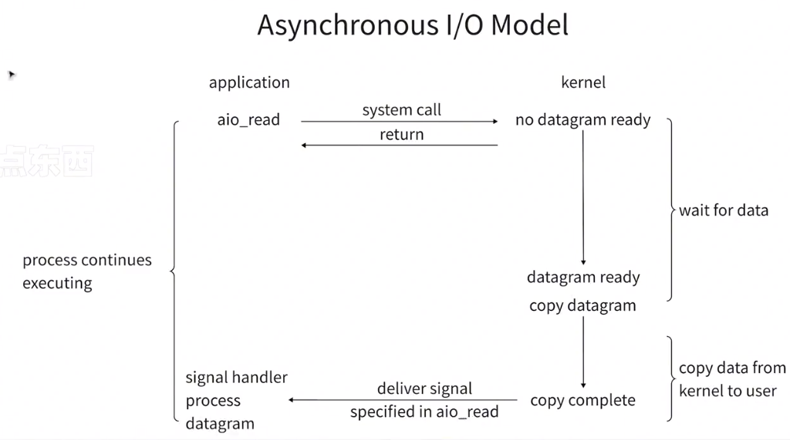

# 并发
看起来是同时运行的

# 并行
真正意义上的同时执行

----
# 多道
有了多道才有了操作系统的概念
## 目的
让单核cpu实现并发效果
## 原理
允许多个应用程序同时进入内存，并且cpu交替执行
## 核心
cpu切换+保存程序状态

### cpu切换分两种情况

#### 1.当一个程序遇到I/O操作时，操作系统会剥夺该程序cpu的执行权限

比如当我们用with open()：打开一个文件时，cpu是没有工作的，那么操作系统就会把cpu拿来执行其他程序，等I/O操作完以后，操作系统再把cpu调回去继续执行

##### 2.当一个程序长时间占用cpu的时候，操作系统也会剥夺该程序cpu的执行权限

---
# 进程和程序

## 程序

存在硬盘里的一堆代码

## 进程

表示程序在执行的过程

## 进程调度

### 最开始的-先来先服务调度算法

顾名思义，那个进程先来就先服务那个进程但是有缺点，比如
3s,  3h  ,3s , 3s  一个执行时长3h的程序只需等待3秒，后面的短时任务则会等待很长时间，所以这个算法对长作业友好

### 短作业优先调度算法

和上面的差不多，优先服务短时间作业，但是如果短时间作业太多，长时间作业则会等待很长时间,对短作业友好

### 时间片轮转法+多级反馈队列
[调度算法:时间片轮转、优先级、多级反馈队列的详细图解_时间片轮转调度算法例题详解_HelloBytes的博客-CSDN博客](https://blog.csdn.net/weixin_46354996/article/details/106977601)

---

# 进程三状态图




# 同步异步
---
用来描述任务的提交方式
- 同步：任务提交后，原地等待任务的返回结果，等待的过程中不做任何事情
- 异步：任务提交后，不在原地等待任务的返回结果，而是直接去做其他事情

# 阻塞和非阻塞
---
描述进程的运行状态
- 阻塞：即上图的阻塞态
- 非阻塞：就绪态，运行态

同步阻塞，同步非阻塞，异步阻塞，**异步非阻塞**，异步非阻塞效率最高

# 创建进程
---
## 关于进程的相关操作都是调用操作系统的接口，比如：p.statr()这里不会立即运行子进程，而是向操作系统提交请求，具体什么时候运行，由操作系统绝定

## 方式一
```python
import multiprocessing import process
import time

def func(name):
	print(f'{name}任务开始')
	time.sleep(5)
	print(f'{name}任务结束')

if __name__ =='__main__':
	p = process(target=func, args=("name", ))
	# 创建子进程
	p.start()
	print("主进程")
```

这里windows系统必须写`if __name__ =='__main__'`这句话 因为win系统不支持 fork


## 方式二

```python
import multiprocessing import process
import time

class MyProcess(process):
	def __init__(self, name):
		super().__init__()
		self.task_name = name
		
	def run(self):
		print(f'{self.task_name}任务开始')
		time.sleep(5)
		print(f'{self.task_name}任务结束')

if __name__ == '__main__':
	p = MyProcess('name')
	p.start()
	
```

###  fork
fork模式创建多进程会将当前任务的代码，以及当前任务的数据集（变量）都拷贝一下

### spawn

spawn模式创建多线程会像导包一样，在子进程里导入模块，如果不加 `if __name__ =='__main__':`就会死循环

### 总结
创建进程就是在内存中申请一块内存空间，然后把需要运行的代码放进去，多个进程的内存空间，他们是彼此隔离的，进程与进程之间的庶数据是没办法直接交互的，如果想要交换，则可以借助第三方工具/模块

## join()方法

让主进程等待子进程运行结束之后在继续执行
```python
import multiprocessing import process
import time

def func(name):
	print(f'{name}任务开始')
	time.sleep(5)
	print(f'{name}任务结束')

if __name__ =='__main__':
	p = process(target=func, args=("name", ))
	# 创建子进程
	p.start()
	p.join()
	print("主进程")

```

## 进程号
每一个进程多有一个进程号
```python
import os
from multiprocess import Process, current_process

获取PIID
os.getpid()
current_process.pid()
获取父进程PID
os.getppid()


```


## 僵尸进程和孤儿进程
---

- 僵尸进程
```
子进程结束后，还会有一些资源占用（进程号，进程运行状态，运行时间等），等待父进程通过系统调用回收（收尸）
除了init进程之外，所有的进程，最后都会步入僵尸进程
危害：
	子进程退出以后，父进程没有及时处理，僵尸进程就会一直占用计算机资源
	如果产生了大量的减少僵尸进程，资源过度占用，系统就没有可用的进程号，导致系统不能产生新的进程
```

- 孤儿进程
```
子进程处于存活状态，但父进程意外死亡
操作系统会开设一个”孤儿院“（init进程），用来管理孤儿进程
```

## 守护进程
相当于win的服务进程
主进程死亡，守护进程也没有必要启动了
```python
import multiprocessing import process
import time

def func(name):
	print(f'{name}任务开始')
	time.sleep(5)
	print(f'{name}任务结束')

if __name__ =='__main__':
	p = process(target=func, args=("name", ))
	# 创建守护进程
	p.daemon()
	p.start()
	print("主进程")
```

## 互斥锁

就是经典的卖票程序会遇到买的车票数与设定的不一样，这时就需要互斥锁
当多个进程操作同一份数据的时候，会出现数据错乱的问题，解决方法就是加锁处理：
把并发编程穿行，虽然牺牲了运行效率，但是保证了数据安全

```python
import multiprocessing import process, Lock
import time
import json

# 查票
def serach_ticket(name):
	#读取文件，查询数量
	with open('tickets', 'r', encoding='utf-8')as f:
		dic = json.load(f)
	print(f'用户{name}查询数量{dic.get('num')}')

# 买票

def buy_ticket(name):
	with open('tickets', 'r', encoding='utf-8')as f:
		dic = json.load(f)
	# 模拟网络延迟
	time.sleep(random.randint(1, 5))
	if dic.get('num') > 0:
		dic['num'] -= 1
		with open('tickets', 'w', encoding='utf-8')as f:
			json.dump(dic, f)
		print(f"{name} 买票成功")
	else:
		print(f"{name} 买票失败")

def task(name, mutex):
	
	search_ticket(name)
	# 枪锁
	mutex.acquire()
	buy_ticket(name)
	# 释放锁
	mutex.release()

if __name__ == '__main__':
	mutex = Lock()
	for i in range(1, 9):
		p = Process(task, (i, mutex))
		p.start()
```

ps：行锁，表锁

## 消息队列

```python
import queue
queue.Queue

from multiprocessing import queues
queues.Queue()

from multiprocessing import Queue
# 创建一个大小为6的队列
q = Queue(6)
# 存数据
q.put('a')
# 取数据
q.get()


# 当数据存满的时候在进行put时会进行阻塞，此时可以这样
# 这里会直接报错
q.put_nowait('a')
# 这里会等待3秒
q.put('a', timeout=3)


# 当数据为空的时候在进行put时会进行阻塞，此时可以这样
# 这里会直接报错
q.get_nowait('a')
# 这里会等待3秒
q.get(timeout=3)

q.put_nowait()
q.get_nowait()
q.full()
q.empty()
```

## 进程直接通过队列和管道进行通讯（IPC机制）

### 队列
其实队列就是管道+锁

```python

from multiprocessing import Queue

def task1(q):
	q.put("name")

def task2(q):
	q.get()
if __name__ == "__main__":
	q = Queue()
	p = process(task1, q)
	p1 = process(task2, q)
	p.start()
	p2.start()
```

### 管道
这个用的很少

# 生成消费者模型
---
生成者（厨师）：生产或者制造数据的

消费者（顾客）：消费或者处理数据的

媒介（桌子）：消息队列


# 问题：python的多线程好像没什么用？无法利用多核优势，即便有多个核，一次也只能用一个
---

问题：python的多线程好像没什么用？无法利用多核优势，即便有多个核，一次也只能用一个

这是分情况的：
 - 单核（现在的计算机已经没有单核了所以不考虑这个情况）
     - 10个人物任务（计算密集型 / io密集型）
 - 多核
      - 10个任务（计算密集型 / io密集型）


**多核**
 - 计算密集型 每一个任务都需要10s, cpu 10个核心
	 - 多线程 需要时间100+
	 - 多进程 需要时间10+ **效率高**
- IO密集型（尽管可以使用多个核，但是大部分时间还是在IO，cpu在IO情况下是没有工作的）
	- 多线程 **节省资源**
	- 多进程 浪费资源

## 总结

- 多进程和多线程都有各自的优势，以后些项目的时候，通常可以多进程下开多线程

# 死锁

```python
from threading import Thread, Lock, current_thread  
import time  
  
mutex1 = Lock()  
mutex2 = Lock()  
  
  
def task():  
    mutex1.acquire()  
    print(current_thread().name, "抢到锁1")  
    mutex2.acquire()  
    print(current_thread().name, "抢到锁2")  
    mutex2.release()  
    mutex1.release()  
  
    mutex2.acquire()  
    print(current_thread().name, "抢到锁2")  
    time.sleep(1)  
    mutex1.acquire()  
    print(current_thread().name, "抢到锁1")  
    mutex1.release()  
    mutex2.release()  
  
  
if __name__ == '__main__':  
    for _ in range(8):  
        t = Thread(target=task)  
        t.start()
```

```python
当线程1抢到锁1的时候，其他七个线程都在等，然后线程1抢锁2，然后释放锁2，但是其他进程还是因为锁1而无法执行代码，在线程1释放锁2后其他进程抢锁1，线程1抢锁2，接下来线程1抢锁1，由于锁1已经被其他线程抢到并无法释放，所以造成了死锁
```

# 递归锁（Re-entry lock 可重入锁）
---
递归锁内部有一个计数器，每acquire一次计数器就+1，每release一次计数器就会-1，只要计数器不为0，其他人就不能抢到这把锁

源代码中的注释
```python
"""Factory function that returns a new reentrant lock.  
  
A reentrant lock must be released by the thread that acquired it. Once a  
thread has acquired a reentrant lock, the same thread may acquire it again  
without blocking; the thread must release it once for each time it has  
acquired it.  
返回一个新的可重入锁的工厂函数。
可重入锁必须由获得它的线程释放。一旦一个线程获得了可重入锁，同一个线程可以再次获得它而不阻塞;线程必须在每次获取它时释放它一次。
"""
```

```python
from threading import Thread, Lock, current_thread, RLock  
import time  

# 这里的两个递归锁是同一把锁，只在这里修改代码，其他的不用改
mutex1 = RLock()  
mutex2 = mutex1  
  
  
def task():  
    mutex1.acquire()  
    print(current_thread().name, "抢到锁1")  
    mutex2.acquire()  
    print(current_thread().name, "抢到锁2")  
    mutex2.release()  
    mutex1.release()  
  
    mutex2.acquire()  
    print(current_thread().name, "抢到锁2")  
    time.sleep(1)  
    mutex1.acquire()  
    print(current_thread().name, "抢到锁1")  
    mutex1.release()  
    mutex2.release()  
  
  
if __name__ == '__main__':  
    for _ in range(8):  
        t = Thread(target=task)  
        t.start()
```

# 信号量
---
信号量在不同的阶段，可能会对应不同的技术点，对应并发编程来说，它指的是“锁”
它可以用来控制同时访问特定资源的线程数量，通常用于某些资源有明确访问数量限制的场景，简单说就是用于**限流**，比如数据库连接池

例子：停车场
```python
"""
 互斥锁：停车场只有一个车位
 信号量：停车场可以有多个车位
"""
```

信号量Semaphore类源代码注释
```python
class Semaphore:  
"""This class implements semaphore objects.  
  
Semaphores manage a counter representing the number of release() calls minus    the number of acquire() calls, plus an initial value. The acquire() method    blocks if necessary until it can return without making the counter    negative. If not given, value defaults to 1. 

这个类实现信号量对象。
信号量管理一个计数器，该计数器表示release()调用的次数减去acquire()调用的次数，再加上一个初始值。acquire()方法在必要时阻塞，直到它可以返回而不使计数器为负。如果没有给出，value默认为1。
"""  
    # After Tim Peters' semaphore class, but not quite the same (no maximum)  
  
    def __init__(self, value=1):  
        if value < 0:  
            raise ValueError("semaphore initial value must be >= 0")  
        self._cond = Condition(Lock())  
        self._value = value
```

代码例子：
```python
import random  
import time  
from threading import Thread, Semaphore  
  
sp = Semaphore(5)  
  
  
def task(name):  
    # 抢锁  
    sp.acquire()  
    print(name, '抢到车位')  
    # 停车随机时间  
    time.sleep(random.randint(3, 5))  
    sp.release()  
  
  
if __name__ == '__main__':  
    for i in range(25):  
        t = Thread(target=task, args=(f'宝马{i + 1}号',))  
        t.start()
```

# Event事件
---
前面学进程和线程的时候我们知道，主线程或主进程可以通过**join**方法，等待子进程或子线程运行完毕在继续。

但是子进程和子进程之间，或者子线程和子线程之间，它们是不能等待对方运行完毕的，如果我们要实现一个子进程或子线程，等待另外一个子进程或子线程运行完毕再继续的话，就需要用到**Event**事件

**并发的时候print打印会异常 可以用log模块**

```python
from threading import Thread, Event  
import time  
  
event = Event()  
  
  
def bus():  
    print('公交车即将到站')  
    time.sleep(2)  
    print('公交车已经到达')  
    # 告诉等公交的人，可以上车了  
    event.set()  # 发射信号，车来了  
  
  
def passenger(name):  
    print(name, '正在等车')  
    event.wait()  # 等待信号  
    print(name, '上车出发')  
  
  
if __name__ == '__main__':  
    t = Thread(target=bus)  
    t.start()  
  
    for i in range(10):  
        t = Thread(target=passenger, args=(f'乘客{i}',))  
        t.start()
```

# 池
---
池是用来保证计算机硬件安全的情况下，最大限度的利用计算机资源，降低了程序运行效率，但是保证了计算机硬件的安全

## 线程池的使用

**线程池中的进程是固定的，不会销毁然后重新创建**

当线程池中的线程处于等待状态时，它们会不断地从任务队列中取出任务并执行。线程池中的任务队列是一个先进先出的队列，新提交的任务会被放到队列的末尾，等待线程池中的线程来执行。当一个线程完成了当前任务后，它会从任务队列中取出下一个任务并执行，直到线程池被关闭或者程序结束。因此，线程池中的线程在等待状态下也可以执行提交的任务，只要任务队列中有任务等待执行即可。

```python
from concurrent.futures import ThreadPoolExecutor  
import time  
  
pool = ThreadPoolExecutor(10)  # 不传参树，默认为cpu核心数*5  
  
  
def task(name):  
    print(name)  
    time.sleep(3)  
  
  
for i in range(50):  
    pool.submit(task, f'{i}')  # 传入函数)  

# 这里是异步提交任务，因此会先打印此语句
print("主线程")
```

线程池与信号量之间的差异
- 信号量：信号量指的是”锁“，线程是我们自己创建的，创建多少都可以。信号量可以控制其他进程的阻塞，运行
- 线程池：线程是由线程池创建的，它控制的是线程的数量

## 获取异步提交的线程的结果（不推荐）

```python
from concurrent.futures import ThreadPoolExecutor  
import time  
  
pool = ThreadPoolExecutor(10)  # 不传参树，默认为cpu核心数*5  
  
  
def task(name):  
    print(name)  
    time.sleep(3)  
  
  
for i in range(50):  
    future = pool.submit(task, f'{i}')  # 传入函数)  
    '''在使用线程池时，submit方法会返回一个Future对象，该对象代表了一个尚未完成的任务。  
    调用Future对象的result方法会阻塞当前线程，直到任务完成并返回结果。因此，当您在循环中使用future.result()方法时，  
    程序会等待每个任务完成后才会继续执行下一个任务，这就不是异步执行了。'''  
    print(future.result())  
print("主线程")
```

这样获取结果，代码就会串行执行，怎么解决呢

```python
from concurrent.futures import ThreadPoolExecutor  
import time  
  
pool = ThreadPoolExecutor(10)  # 不传参树，默认为cpu核心数*5  
  
  
def task(name):  
    print(name)  
    time.sleep(3)  
    return name + 10  
  
  
f = []  
for i in range(50):  
    future = pool.submit(task, i)  # 传入函数)  
    f.append(future)  
# 这行代码可以让所有的任务完成后获取结果  
pool.shutdown()  # 关闭线程池，并等待所有线程运行完毕  
for i in f:  
    print('任务结果', i.result())  
print("主线程")
```

## 进程池

**进程池中的进程是固定的，不会销毁然后重新创建**

和线程池的用法是一样的
```python
from concurrent.futures import ProcessPoolExecutor  
import time  
import os  
  
pool = ProcessPoolExecutor(3)  # 不传参，默认为cpu核心数  
  
  
def task(name):  
    print(name, os.getpid())  
    time.sleep(3)  
    return name + 10  
  
if __name__ == '__main__':  
    f = []  
    for i in range(10):  
        future = pool.submit(task, i)  # 传入函数)  
        f.append(future)  
  
    pool.shutdown()  # 关闭线程池，并等待所有线程运行完毕  
    for i in f:  
        print('任务结果', i.result())  
    print("主线程")
```

## 异步回调机制（获取进程/线程结果）

```python
from concurrent.futures import ProcessPoolExecutor  
import time  
import os  
  
pool = ProcessPoolExecutor(3)  # 不传参，默认为cpu核心数  
  
  
def task(name):  
    print(name, os.getpid())  
    time.sleep(3)  
    return name + 10  
  
  
def call_back(res):  
    print('call_back')  
    print(res.result())  
  
  
if __name__ == '__main__':  
    for i in range(10):  
	    # 这里会自动的获取结果
        pool.submit(task, i).add_done_callback(call_back)  # 传入函数)  
  
    print("主线程")
```

# 协程
---
协程也可称之为微线程，它是一种用户态内的上下文切换技术，简单说就是在单线程下实现并发效果
```python
 """
 进程：资源执行单位
 线程：执行单位
 协程：程序员人为创造出来的，不存在（切换+保存状态）

 当程序遇到IO的时候，通过我们写的代码，让我们的代码自动完成切换
 也就是我们通过监听IO，一旦程序遇到IO，就在代码层面上自动切换，给cpu的感觉就是我们的程序没有IO，换句话说就是，我们欺骗了cpu
 """
```

注意：切换不一定提升效率，还有可能降低效率
- 遇到IO切换，就会提升效率
- 对应计算密集型任务来说，切换反而会降低效率

## gevent模块—检测程序IO

```python
import time

def da():
	for _ in range(3):
		print("哒")
		time.sleep(2)

def mie():
	for _ in range(3):
		print("咩")
		time.sleep(2)

"串行运行时间12秒多"
```

```python
import time
from gevent import spawn
from gevent import monkey
# 打一个猴子补丁
monkey.patch_all()
def da():
	for _ in range(3):
		print("哒")
		time.sleep(2)

def mie():
	for _ in range(3):
		print("咩")
		time.sleep(2)
start = time.time()
g1 = spawn(da)
g2 = spawn(mie)
g1.join()
g2.join()
end = time.time()

"运行时间6s多"
```

## IO模型

这里我们研究网络IO，非网络IO我们不考虑

下面是网络IO过程，应用程序无法直接发送数据，需要先提交给操作系统，由操作系统调用硬件，通过OSI七层协议发送


## 阻塞IO模型



## 非阻塞IO模型

缺点：cpu空转（服务端一直查询是否由客户连接，不会做其他操作，但是没有阻塞而一直占用cpu）


## IO多路复用

对应IO多路复用，如果只监管一个对象，那么IO多路复用的效率比阻塞IO还要低


监管机制(操作系统提供)：
  - select (windows，linux) 32位机器上最大支持1024，64 位机器上最大支持2048
  - poll ( linux )：监管对象比select多得多，没有限制

poll缺点：当监管对象多的时候，会出现极大的延迟响应（假如现在轮询到第十个，但是没有数据，然后轮询下一个，这时第十个刚好来了数据）

  - epoll（linux）它给每一个监管对象都绑定了一个**回调机制**，一旦有响应回调机制就会把可读对象放入就绪链表，epoll只需要判断就绪链表是否为空，不需要每次都把所有的监管对象都遍历一遍，节省了cpu大量的时间，性能也得到了提升

以上机制都有对应的问题，但是兼容性怎么办？有人解决了：python selectors模块

## 异步IO模型



# 异步迭代器

实现了 `__aiter__` 和 `__anext__` 方法的对象，可以用 `async for` 来遍历

```python
import asyncio

class AsyncRange:
    def __init__(self, start, end):
        self.start = start
        self.end = end

    def __aiter__(self):
        self.current = self.start
        return self

    async def __anext__(self):
        if self.current >= self.end:
            raise StopAsyncIteration
        await asyncio.sleep(0.1)
        self.current += 1
        return self.current - 1

async def main():
    async for num in AsyncRange(1, 5):
        print(num)

asyncio.run(main())
```

也可以用 `async generator` 简写：

```python
import asyncio

async def async_range(start, end):
    for i in range(start, end):
        await asyncio.sleep(0.1)
        yield i

async def main():
    async for num in async_range(1, 5):
        print(num)

asyncio.run(main())
```

# 异步上下文管理器

实现了 `__aenter__` 和 `__aexit__` 方法的对象，可以用 `async with` 来管理资源

```python
import asyncio

class AsyncFile:
    def __init__(self, filename):
        self.filename = filename

    async def __aenter__(self):
        print(f"打开文件 {self.filename}")
        await asyncio.sleep(0.1)
        return self

    async def __aexit__(self, exc_type, exc_val, exc_tb):
        print(f"关闭文件 {self.filename}")
        await asyncio.sleep(0.1)

async def main():
    async with AsyncFile("test.txt") as f:
        print("正在读写文件")

asyncio.run(main())
```

也可以用 `contextlib` 配合 `asynccontextmanager` 装饰器简写：

```python
import asyncio
from contextlib import asynccontextmanager

@asynccontextmanager
async def async_file(filename):
    print(f"打开文件 {filename}")
    await asyncio.sleep(0.1)
    yield
    print(f"关闭文件 {filename}")
    await asyncio.sleep(0.1)

async def main():
    async with async_file("test.txt"):
        print("正在读写文件")

asyncio.run(main())
```

搞懂了异步迭代器和异步上下文管理器，再看 `aiohttp`、`aiomysql` 这些异步库的源码就不会懵了，它们本质上就是这些协议的封装。