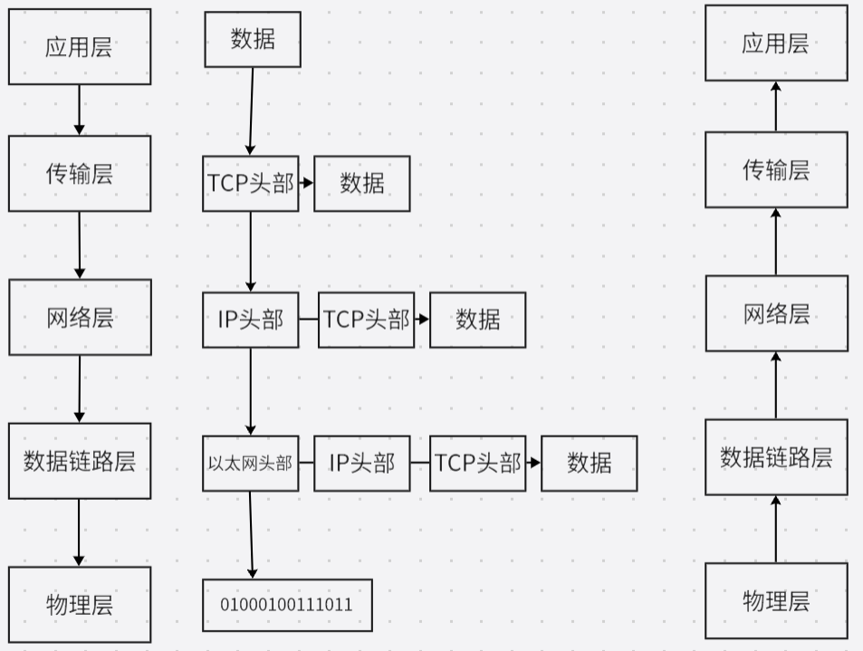
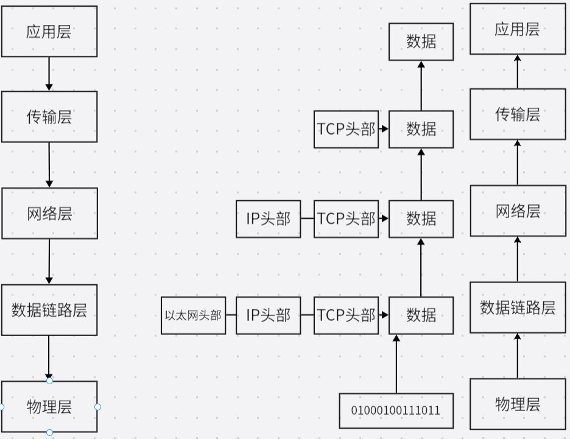
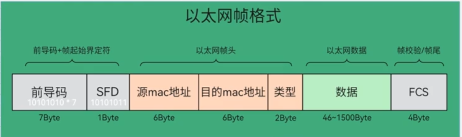
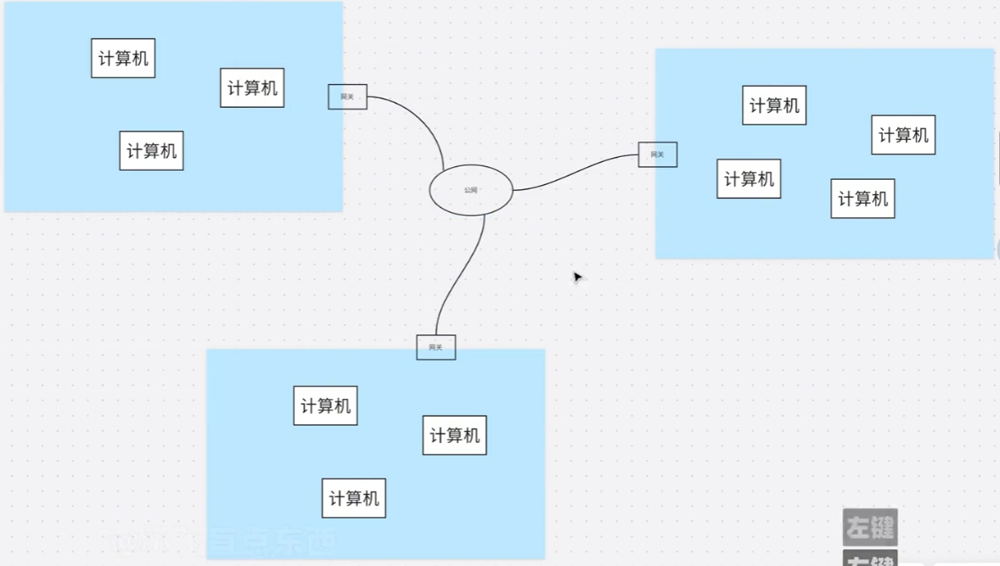
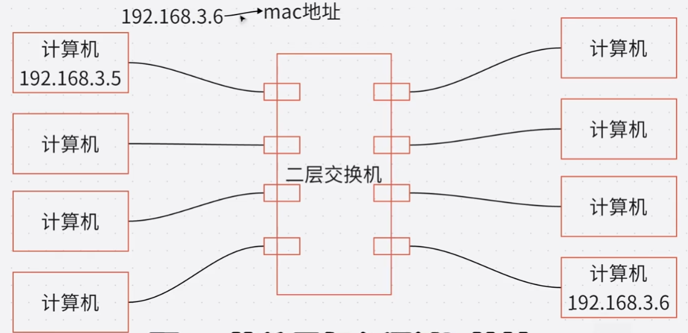
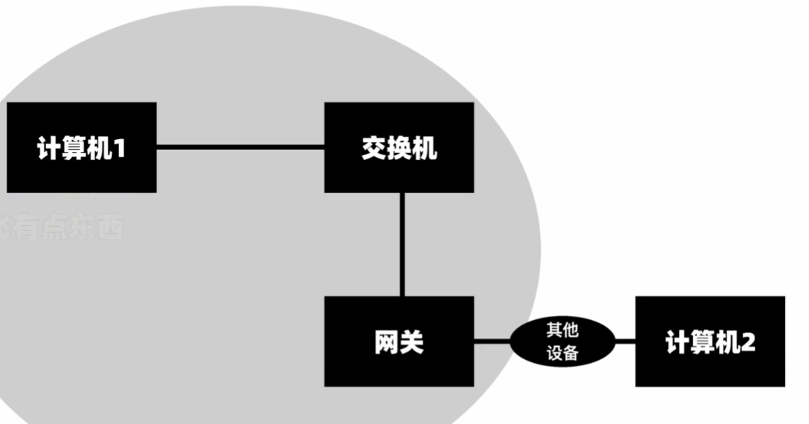


# osi七层模型
---


<font color=yellow>有时候会把最后三层合并成一层既 会话层-表示层-应用层--> 应用层</font>

## 物理层

解决信号转换问题
信号转换   010101--电信号（光信号）

## 数据链路层

解决发给谁问题
依靠mac地址发送到用户  公网-->公网ip --> 私网 --> mac地址 --> 用户


## 网络层

主要内容是ip地址 解决**发到哪里的问题**
公网ip    全世界唯一     相当于快递地址
私网ip    局域网唯一     相当于房间号

## 传输层

解决用什么方式法的问题

tcp    可靠，速度慢      长距离传输

udp   不可靠，速度快   短距离传输

### 端口

电脑里有很多软件需要发送数据，这里就需要使用端口分清那个数据是那个软件发出来的。
发送的时候将数据加上端口，发送到服务端时依靠端口解包

## 会话层

绝定什么时候开始发，什么时候断开

## 表示层

描述发送文件的类型

## 应用层

就是应用程序
微信 qq  浏览器

# 解包



# 封包




# 数据帧
---

## 主要形式
局域网通讯：
(源mac，目标mac)  (源IP, 目标IP) 数据
以太网头部                  TCP头部
网络层                          传输层

夸局域网通讯：
(源mac，网关mac)  (源IP, 目标IP) 数据
以太网头部                  TCP头部
网络层                          传输层
<font color=yellow >五层模型</font>

## 物理层

一组数据称之为一个bit流

## 数据链路层


遵守以太网协议 Ethernet，协议内容：

一组数据称之为一个数据帧，一个数据中分为两部分

(发送者mac，接收者mac，类型)+(数据)
这里的发送者和接收者就可理解为mac地址

<font color=yellow >以太网的工作方式是广播</font>
做有以下例子：
老师让张三打扫卫生，那么数据格式如下(省略类似等其他部分)：
(老师，张三)+(打扫卫生)

以上数据发送以后既老师吼了一嗓子，这就是广播。
但是只有张三会做出反应

到这里理论上就可以实现全球通讯了，前提是都需要在一个广播域下

<font color=red >广播包的特点:</font> 会发给广播域的所有计算机，这就是黑客的原因

如果将全世界都放到一个广播域，则会产生广播风暴，所以需要把全世界的计算机放到一个个的“小房间里”，这时就需要网络层了


### 以太网帧格式



## 网络层

使用IP协议
一组数据称之为一个数据包，一个数据中分为两部分

(发送者ip，接收者ip，类型)+(数据：传输层所有内容)

两个不在同一局域网的计算机要通信，就需要通过网关发送到公网，公网通过设备进行转发，在通过网关发送到某个局域网的所有计算机。


### IP地址
地址范围

00000000.00000000.00000000.00000000 ==> 0.0.0.0
11111111.11111111.11111111.11111111 ==>255.255.255.255

#### IP地址不够用：

##### 方案一：
将一部分ip地址可以重复使用，这里用到了nat (网络地址转换) 技术。
既每一个内网都可以使用这些ip。
发送数据时通过nat将内网ip转换为<font color=red>网关</font>的公网IP

###### nat技术
供重复使用的内网IP段

10.0.0.0 ~ 10.255.255.255

172.16.0.0 ~ 172.31.255.255

192.168.0.0 ~ 192.168.255.255

127.0.0.0 ~ 127.255.255.255   保留地址，一般用来测试

其他的都是公网IP

##### 方案二：
IPv6

### 子网掩码

<font color=red>IP地址要和子网掩码搭配使用,为了区分广播域（局域网）</font>
子网掩码就是固定网络位的，全1的不能变
192.168.3.88/255.255.255.0
255.255.255.0 => 11111111.11111111.11111111.00000000

192.168.3.88 => 11000000.10101000.00000011 .  01011000
                        【               网络位                    】【主机位】

#### 思考
192.168.3.125/25
192.168.3.130/25
以上两个可以通信吗：
不能因为：25表示前25位为网络位
192.168.3.125/25
11000000.10101000.00000011 .  01111101

192.168.3.130/25
11000000.10101000.00000011 .  10000010
可以看到以上两个前25位并不相同

以上两个通过和子网掩码按位与：
11000000.10101000.00000011.01111101
11111111.11111111.11111111.10000000
结果：
11000000.10101000.00000011.00000000

---
11000000.10101000.00000011.10000010
11111111.11111111.11111111.10000000
结果：
11000000.10101000.00000011.10000000

可以看到两个的结果不一致，所以不在同一个网段

### ARP协议
两个计算机需要通讯就需要知道对方的IP
这里提一个小点：网址==>IP 由dns解析



二层交换机：只将数据包解析到第二层既数据链路层，这层的头部就是mac地址，刚开始交换机不知道计算机的mac地址，通讯过一次后会记录IP对应的mac

如上图所示：两个计算机通信，可以通过广播，但是私密性的数据不能用广播

ARP协议工作在第二层和第三层直间，作用就是  IP地址 ==> mac地址

##### ARP解析原理

###### ARP广播
上面需要通讯时，因为只知道IP地址，这时交换机会发一个广播：“谁是192.168.3.6？把你的mac地址给192.168.3.5“

### 跨局域网通讯


如上所示，需要通过ARP协议找到对方的网关mac地址
<font color = yellow>跨局域网才会用到网关</font>

### SNAT (源网络地址转换)

当内网设备访问外网时，将数据包的**源IP地址**（私网IP）替换为网关的公网IP。
- 内网设备（192.168.1.100）→ 访问百度
- 路由器将源IP改为自己的公网IP（如 120.xxx.xxx.xxx）
- 百度返回数据时，路由器再根据记录将数据转发给内网设备
- 依赖 **端口映射** 区分不同内网设备（NAPT技术）

### DNAT (目的网络地址转换)

当外网访问内网服务器时，将数据包的**目的IP地址**（公网IP）转换为内网服务器的私网IP。
- 用户访问网关公网IP:80（你的公网地址）
- 路由器将目的IP改为内网Web服务器（192.168.1.10:80）
- 常用于**端口映射**、内网服务器对外发布

| 类型 | 转换对象 | 方向 | 典型场景 |
|------|---------|------|---------|
| SNAT | 源IP | 内→外 | 内网上网 |
| DNAT | 目的IP | 外→内 | 外网访问内网服务器 |

## 传输层
---

## 主要协议
TCP / UDP

### TCP (传输控制协议)

**面向连接、可靠、基于字节流**

#### 三次握手（建立连接）
1. 客户端 → 服务端：SYN (seq=x)
2. 服务端 → 客户端：SYN+ACK (seq=y, ack=x+1)
3. 客户端 → 服务端：ACK (seq=x+1, ack=y+1)

#### 四次挥手（断开连接）
1. 客户端 → 服务端：FIN
2. 服务端 → 客户端：ACK
3. 服务端 → 客户端：FIN
4. 客户端 → 服务端：ACK

#### 可靠传输机制
- **确认应答**（ACK）：接收方收到数据后回复确认
- **超时重传**：发送方等待一段时间未收到ACK则重发
- **流量控制**：通过滑动窗口控制发送速度
- **拥塞控制**：慢开始、拥塞避免、快重传、快恢复

#### TCP报文段结构
```
| 源端口(2B) | 目的端口(2B) | 序号(4B) | 确认号(4B) |
| 首部长度 | 保留 | 标志位 | 窗口大小(2B) |
| 校验和(2B) | 紧急指针(2B) | 选项(可变) | 数据 |
```

### UDP (用户数据报协议)

**无连接、不可靠、面向报文**
- 无需建立连接，发送速度快
- 不保证可靠交付
- 首部开销小（仅8字节）
- 适用场景：视频直播、DNS查询、在线游戏

| 特性 | TCP | UDP |
|------|-----|-----|
| 连接 | 面向连接 | 无连接 |
| 可靠性 | 可靠传输 | 不可靠 |
| 速度 | 慢 | 快 |
| 首部大小 | 20~60字节 | 8字节 |
| 应用场景 | 文件传输、网页浏览 | 音视频、DNS |

## 应用层
---

应用层为应用程序提供网络服务，常见协议：

| 协议 | 端口 | 作用 |
|------|------|------|
| HTTP | 80 | 网页访问 |
| HTTPS | 443 | 加密网页访问 |
| DNS | 53 | 域名解析（网址→IP） |
| DHCP | 67/68 | 自动分配IP地址 |
| FTP | 20/21 | 文件传输 |
| SMTP | 25 | 邮件发送 |
| POP3/IMAP | 110/143 | 邮件接收 |
| SSH | 22 | 远程登录 |
| Telnet | 23 | 远程登录（明文） |

### DNS解析流程
1. 浏览器查询本地DNS缓存
2. 未命中则请求本地DNS服务器（递归查询）
3. 本地DNS服务器依次请求：根DNS → 顶级域DNS → 权威DNS
4. 返回IP地址给客户端

### HTTP请求流程
1. DNS解析域名获取IP
2. 与服务器建立TCP连接（三次握手）
3. 发送HTTP请求（GET/POST等）
4. 服务器响应HTTP报文
5. 浏览器解析渲染页面
6. 关闭TCP连接（四次挥手）

### DHCP工作流程
1. 客户端广播 **DHCP Discover**
2. DHCP服务器响应 **DHCP Offer**
3. 客户端发送 **DHCP Request**
4. 服务器确认 **DHCP ACK**
